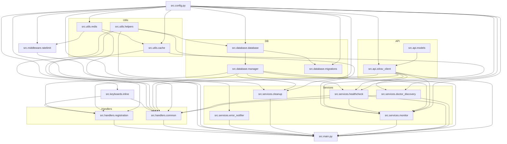

# ARCHITECTURE.md — lenreg_ticket_bot

> **ВНИМАНИЕ:** Этот документ описывает строго физическую структуру кодовой базы (дерево директорий, зависимости модулей, зоны ответственности пакетов).
> Единым источником истины (SSOT) для структур данных, бизнес-правил, схем БД и внешних интеграций является `docs/openapi.yaml`.

## Дерево директорий

```text
zdrav.lenreg/                          # Корень проекта (только конфигурационные файлы)
├── src/                               # Весь исходный код приложения
│   ├── __init__.py
│   ├── config.py                      # Настройки (pydantic-settings, .env)
│   ├── main.py                        # Точка входа: сборка бота, запуск фоновых задач
│   ├── api/
│   │   ├── __init__.py
│   │   ├── models.py                  # Pydantic-модели ответов API zdrav.lenreg.ru
│   │   └── zdrav_client.py           # HTTP-клиент для API zdrav.lenreg.ru
│   ├── database/
│   │   ├── __init__.py
│   │   ├── database.py                # SQLite-движок: соединение, таблицы, CRUD
│   │   ├── manager.py                 # DatabaseManager — адаптер с in-memory кэшем
│   │   └── migrations.py             # Миграции схемы БД (versioned)
│   ├── handlers/
│   │   ├── __init__.py
│   │   ├── common.py                  # Основные обработчики: /start, выбор пациента/клиники/врача, toggle
│   │   └── registration.py           # FSM-сценарий регистрации пациента (ФИО → дата → псевдоним)
│   ├── assets/
│   │   ├── __init__.py
│   │   ├── README.md                  # Правила именования и использования изображений
│   │   └── images/                    # PNG-изображения для заголовков сообщений
│   │       └── .gitkeep
│   ├── keyboards/
│   │   ├── __init__.py
│   │   └── inline.py                 # Inline-клавиатуры Telegram (пациенты, города, клиники, врачи)
│   ├── middleware/
│   │   ├── __init__.py
│   │   └── ratelimit.py             # Per-user rate limiting middleware (sliding window, TTLCache)
│   ├── services/
│   │   ├── __init__.py
│   │   ├── cleanup.py                # Фоновый цикл автоудаления старых сообщений (TTL)
│   │   ├── doctor_discovery.py       # Фоновый цикл discovery врачей из API → БД
│   │   ├── error_notifier.py         # ErrorNotifier: NTFY + Sentry (singleton)
│   │   ├── healthcheck.py            # HealthMetrics + healthcheck_loop + /status report
│   │   └── monitor.py               # Фоновый цикл мониторинга слотов + классификация изменений
│   └── utils/
│       ├── __init__.py
│       ├── cache.py                  # Кэш мониторинга (Redis) + spam-защита (Redis SET NX)
│       ├── helpers.py                # Форматирование ФИО, специальностей, extract_msg_id, is_child, is_cabinet
│       └── redis.py                  # Singleton-клиент Redis (aioredis, пул соединений)
├── tests/                             # Тесты
│   ├── conftest.py
│   ├── test_cache.py
│   ├── test_database_manager.py
│   ├── test_doctor_discovery.py
│   ├── test_keyboards.py
│   ├── test_monitor_classify.py
│   ├── test_monitor_full.py
│   └── test_zdrav_client.py
├── scripts/                           # Утилитарные скрипты
│   ├── apply_city_heuristic.py
│   ├── apply_heuristic_types.py
│   └── run_tests.py
├── docs/                              # Документация
│   ├── GEMINI.md                      # Agent-agnostic bridge (инструкции для AI-агентов)
│   ├── agents/                        # Агентские файлы
│   │   ├── AGENT_TASKS.md             # Бэклог задач
│   │   ├── SESSION_LOG.md             # Лог сессий (шаблон)
│   │   ├── CODE_REVIEW.md             # Отчёт код-ревью (2026-05-11)
│   │   └── formatting_experiments.md  # Эксперименты с оформлением сообщений
│   └── knowledge/                     # База знаний API
│       ├── _INDEX.md
│       ├── appointment_list.md
│       ├── check_patient.md
│       ├── doctor_list.md
│       └── speciality_list.md
├── .roo/                              # Правила AI-агентов
│   └── rules/
│       ├── system_standards.md        # CRITICAL: стандарты Python + Markdown
│       ├── coding.md                  # Стандарты кодирования
│       ├── env.md                     # Правила .env / .env.example
│       ├── ignore.md                  # Игнорируемые файлы и директории
│       ├── knowledge.md               # Правила базы знаний
│       ├── logging.md                 # Правила логирования сессий
│       └── restrictions.md            # Ограничения
├── pyproject.toml                     # ruff config
├── pytest.ini                         # pytest config
├── pyrightconfig.json                 # pyright config
├── .env / .env.example                # Переменные окружения
├── .gitignore
├── .pre-commit-config.yaml            # pre-commit хуки
├── requirements.txt
├── README.md
└── ARCHITECTURE.md                    # Этот файл
```

## Зоны ответственности

| Пакет             | Зона ответственности                                                                                                                                                                                                                                                                                          |
| ----------------- | ------------------------------------------------------------------------------------------------------------------------------------------------------------------------------------------------------------------------------------------------------------------------------------------------------------- |
| `src/config.py`   | Загрузка и валидация настроек из `.env` через pydantic-settings. Переопределение значений из БД (config table).                                                                                                                                                                                               |
| `src/main.py`     | Сборка и запуск: инициализация БД, API-клиента, бота aiogram, регистрация middleware и роутеров, запуск фоновых задач, graceful shutdown.                                                                                                                                                                     |
| `src/api/`        | Модели Pydantic для десериализации JSON-ответов API zdrav.lenreg.ru. HTTP-клиент `ZdravClient` с rate limiting (aiolimiter), retry, переиспользуемой сессией httpx.                                                                                                                                           |
| `src/database/`   | SQLite-движок (`Database`): WAL-режим, миграции, CRUD пользователей/пациентов/мониторинга/клиник/врачей/конфигов. `DatabaseManager` — потокобезопасный in-memory кэш с атомарными операциями.                                                                                                                 |
| `src/handlers/`   | Обработчики команд и callback-запросов Telegram через aiogram Router. `common.py` — навигация пациент→город→клиника→врач, toggle мониторинга. `registration.py` — FSM-сценарий добавления пациента.                                                                                                           |
| `src/assets/`     | Статические PNG-изображения для заголовков сообщений бота. Правила именования: `src/assets/README.md`. Отправляются через `send_photo()` с `caption`.                                                                                                                                                         |
| `src/keyboards/`  | Построение inline-клавиатур: пациенты, города/районы, клиники, врачи, подтверждение удаления, регистрация.                                                                                                                                                                                                    |
| `src/middleware/` | `UserRateLimitMiddleware` — per-user rate limiting (sliding window) через TTLCache.                                                                                                                                                                                                                           |
| `src/services/`   | Фоновые asyncio-циклы: `monitor_loop` — проверка слотов, классификация изменений, уведомления; `discovery_loop` — загрузка врачей из API; `healthcheck_loop` — мониторинг здоровья API; `cleanup_loop` — автоудаление старых сообщений; `error_notifier` — отправка ошибок в NTFY/Sentry.                     |
| `src/utils/`      | `cache.py` — кэш мониторинга на Redis (swap_cache_key через GETSET) и spam-защита на Redis (SET NX EX). `helpers.py` — форматирование ФИО/специальностей, определение ребёнка/кабинета, псевдонимы специальностей. `redis.py` — singleton-клиент Redis с asyncio-поддержкой, пулом соединений и health-check. |

## Граф зависимостей (Mermaid)



## Ключевые архитектурные решения

1. **Все импорты — абсолютные с префиксом `src.`** (например, `from src.config import settings`). Это исключает коллизии и делает зависимости явными.

2. **Redis как централизованное хранилище** — замена файлового JSON-кэша и in-memory TTLCache. Используется для:
   - FSM-хранилища aiogram (RedisStorage вместо MemoryStorage).
   - Мониторингового кэша слотов (swap_cache_key через GETSET, delete по SCAN).
   - Spam-защиты от двойных нажатий (SET NX EX с TTL 1с).
   - Per-user rate limiting через Redis Sorted Sets (sliding window).
   - Подключение через singleton RedisClient с пулом соединений (aioredis).

3. **Конфигурация через pydantic-settings** с двухуровневым переопределением: `.env` → `Settings` → БД (таблица `config`).

4. **SQLite с WAL-режимом** — асинхронный доступ через `aiosqlite`, миграции через самописный механизм `MIGRATIONS`.

5. **DatabaseManager** — потокобезопасный in-memory кэш поверх `Database` с атомарными read-modify-write операциями под `asyncio.Lock`.

6. **Фоновые задачи** запускаются как `asyncio.Task` и корректно останавливаются через `task.cancel()` + `asyncio.gather(return_exceptions=True)`.

7. **Rate limiting** на двух уровнях: API-клиент (`aiolimiter.AsyncLimiter`) и Telegram-хендлеры (`UserRateLimitMiddleware` с Redis Sorted Sets).

8. **Тесты** используют временные SQLite-файлы в `tests/test_data/`, очищаемые после сессии. Redis-зависимости мокируются через `fakeredis`.

## Конфигурационные файлы

| Файл                      | Назначение                                                                        |
| ------------------------- | --------------------------------------------------------------------------------- |
| `.env`                    | Реальные секреты и настройки (в `.gitignore`)                                     |
| `.env.example`            | Шаблон с публичными значениями и плейсхолдерами                                   |
| `pyproject.toml`          | Конфигурация ruff: линтинг + форматирование, `src = ["src"]`                      |
| `pytest.ini`              | `asyncio_mode = auto`, `pythonpath = .`                                           |
| `pyrightconfig.json`      | `venvPath: "."`, `venv: ".venv"`, `rootPath: "."`                                 |
| `.pre-commit-config.yaml` | Хуки: trailing-whitespace, end-of-file, ruff, mypy (`-p src -p scripts -p tests`) |
| `requirements.txt`        | Зависимости проекта                                                               |
