# ARCHITECTURE.md — lenreg_ticket_bot

> **ВНИМАНИЕ:** Этот документ описывает строго физическую структуру кодовой базы (дерево директорий, зависимости модулей, зоны ответственности пакетов).
> Единым источником истины (SSOT) для структур данных, бизнес-правил, схем БД и внешних интеграций является `docs/openapi.yaml`.

## Дерево директорий

```text
zdrav.lenreg/                          # Корень проекта (только конфигурационные файлы)
├── src/                               # Весь исходный код приложения
│   ├── __init__.py
│   ├── config.py                      # Настройки (pydantic-settings, .env)
│   ├── main.py                        # Точка входа: сборка бота, запуск фоновых задач
│   ├── api/
│   │   ├── __init__.py
│   │   ├── exceptions.py              # Кастомные исключения API (ZdravTimeoutError, ZdravNetworkError и др.)
│   │   ├── models.py                  # Pydantic-модели ответов API zdrav.lenreg.ru
│   │   └── zdrav_client.py            # HTTP-клиент для API zdrav.lenreg.ru
│   ├── assets/
│   │   ├── __init__.py
│   │   ├── README.md                  # Правила именования изображений
│   │   ├── utils.py                   # Маппинги изображений для уведомлений и навигации
│   │   └── images/                    # PNG-изображения для заголовков сообщений бота
│   ├── database/
│   │   ├── __init__.py
│   │   ├── database.py                # SQLite-движок: соединение, таблицы, CRUD
│   │   ├── integrity.py               # Проверка и восстановление целостности SQLite БД при старте
│   │   ├── manager.py                 # DatabaseManager — адаптер с in-memory кэшем
│   │   ├── migrations.py              # Миграции схемы БД (versioned)
│   │   └── types.py                   # TypedDict для типобезопасной работы с данными
│   ├── filters/
│   │   ├── __init__.py
│   │   └── admin.py                   # Фильтр админ-доступа (ChatMemberUpdated)
│   ├── handlers/
│   │   ├── __init__.py
│   │   ├── callback_parser.py         # Парсинг callback_data (data_class, custom_filter)
│   │   ├── callbacks.py               # Обработчики callback-запросов (основная навигация, toggle)
│   │   ├── common.py                  # Основные обработчики: /start, выбор пациента/клиники/врача
│   │   ├── mini_app.py                # Обработчик web_app_data от Telegram Mini App (sendData)
│   │   └── registration.py            # FSM-сценарий регистрации пациента (ФИО → дата → псевдоним)
│   ├── i18n/
│   │   ├── __init__.py                # Интернационализация (gettext, _(), _data())
│   ├── keyboards/
│   │   ├── __init__.py
│   │   └── inline.py                  # Inline-клавиатуры Telegram (пациенты, города, клиники, врачи, Mini App)
│   ├── middleware/
│   │   ├── __init__.py
│   │   ├── activity.py                # Отслеживание активности пользователей (последний визит)
│   │   ├── error_boundary.py          # Границы ошибок и перехват исключений
│   │   ├── ratelimit.py               # Per-user rate limiting middleware (sliding window, Redis)
│   │   └── userdata.py                # Загрузка и кэширование данных пользователя из БД
│   ├── services/
│   │   ├── __init__.py
│   │   ├── cleanup.py                 # Фоновый цикл автоудаления старых сообщений (TTL)
│   │   ├── doctor_discovery.py        # Фоновый цикл discovery врачей из API → БД
│   │   ├── error_notifier.py          # ErrorNotifier: NTFY + Sentry (singleton)
│   │   ├── export.py                  # Экспорт данных пользователя в JSON/CSV
│   │   ├── healthcheck.py             # HealthMetrics + healthcheck_loop + /status report
│   │   ├── metrics.py                 # Метрики: сбор статистики по мониторингу
│   │   ├── monitor.py                 # Фоновый цикл мониторинга слотов + классификация изменений
│   │   └── schema_watcher.py          # Отслеживание изменений схемы API (webhook/опрос)
│   ├── utils/
│   │   ├── __init__.py
│   │   ├── cache.py                   # Кэш мониторинга (Redis) + spam-защита (Redis SET NX)
│   │   ├── helpers.py                 # Форматирование ФИО, специальностей, extract_msg_id, is_child, is_cabinet
│   │   ├── logging.py                 # Настройка loguru: формат, ротация, Sentry-интеграция
│   │   ├── proxy_discovery.py         # Обнаружение и ротация прокси
│   │   └── redis.py                   # Singleton-клиент Redis (aioredis, пул соединений)
│   └── web/                           # Веб-дашборд + Mini App (aiohttp, Jinja2, Vanilla JS SPA)
│       ├── __init__.py
│       ├── app.py                     # Создание aiohttp приложения, mount /app/, middleware, роуты
│       ├── auth.py                    # Аутентификация дашборда (basic auth / session)
│       ├── auth_initdata.py           # Middleware HMAC-SHA256 верификации initData из Telegram Mini App
│       ├── routers/
│       │   ├── __init__.py
│       │   ├── api.py                 # API эндпоинты дашборда (JSON)
│       │   ├── pages.py               # HTML-страницы дашборда (Jinja2)
│       │   └── user_api.py            # REST API для Mini App: /api/user/* (10 эндпоинтов)
│       ├── static/
│       │   ├── dashboard.css          # Стили дашборда
│       │   └── app/                   # Фронтенд Telegram Mini App (Vanilla JS SPA)
│       │       ├── index.html         # Точка входа Mini App (HTML)
│       │       ├── css/
│       │       │   └── style.css      # Стили Mini App (Telegram-совместимая цветовая схема)
│       │       └── js/
│       │           ├── api.js         # Обёртка над fetch() для API-запросов с initData
│       │           ├── app.js         # Инициализация Telegram.WebApp, SPA-роутинг
│       │           ├── auth.js        # Получение initData и внедрение в заголовки
│       │           ├── components/
│       │           │   ├── card.js    # Компонент карточки врача/слота
│       │           │   ├── header.js  # Компонент шапки
│       │           │   └── stepper.js # Компонент пошагового выбора
│       │           └── views/
│       │               ├── add.js      # Экран добавления врача (stepper)
│       │               ├── doctors.js  # Экран списка отслеживаемых врачей
│       │               ├── patients.js # Экран пациентов Mini App
│       │               └── slots.js    # Экран просмотра свободных слотов
│       └── templates/                 # Jinja2 шаблоны
│           ├── api_status.html
│           ├── base.html
│           ├── clinics.html
│           ├── logs.html
│           ├── summary.html
│           ├── user_detail.html
│           └── users.html
├── tests/                             # Тесты (структура зеркалирует src/)
│   ├── __init__.py
│   ├── conftest.py
│   ├── api/
│   │   ├── __init__.py
│   │   └── test_zdrav_client.py
│   ├── database/
│   │   ├── __init__.py
│   │   └── test_database_manager.py
│   ├── handlers/
│   │   ├── __init__.py
│   │   ├── test_handlers_common.py
│   │   └── test_handlers_registration.py
│   ├── keyboards/
│   │   ├── __init__.py
│   │   └── test_keyboards.py
│   ├── services/
│   │   ├── __init__.py
│   │   ├── test_doctor_discovery.py
│   │   ├── test_export.py
│   │   ├── test_monitor_classify.py
│   │   └── test_monitor_full.py
│   └── utils/
│       ├── __init__.py
│       └── test_cache.py
├── scripts/                           # Утилитарные скрипты
│   ├── apply_city_heuristic.py
│   ├── apply_heuristic_types.py
│   ├── backup.sh                     # Скрипт резервного копирования БД (cron)
│   ├── generate_api_schemas.py
│   └── run_tests.py
├── docs/                              # Документация
│   ├── GEMINI.md                      # Agent-agnostic bridge (инструкции для AI-агентов)
│   ├── openapi.yaml                   # OpenAPI 3.0.0 спецификация (SSOT)
│   ├── agents/                        # Агентские файлы
│   │   ├── AGENT_TASKS.md             # Бэклог задач
│   │   ├── SESSION_LOG.md             # Лог сессий (шаблон)
│   │   ├── CODE_REVIEW.md             # Отчёт код-ревью
│   │   └── formatting_experiments.md  # Эксперименты с оформлением сообщений
│   ├── design/                        # Дизайн-документы
│   │   ├── api_change_detector_design.md
│   │   ├── i18n_design.md
│   │   ├── mini_app_deploy.md
│   │   ├── mini_app_plan.md
│   │   ├── td-utl-004-typeddict-design.md
│   │   └── web_dashboard_design.md
│   ├── knowledge/                     # База знаний API
│   │   ├── _INDEX.md
│   │   ├── appointment_list.md
│   │   ├── check_patient.md
│   │   ├── clinic_list.md
│   │   ├── doctor_list.md
│   │   └── speciality_list.md
│   └── schemas/                       # JSON-схемы (генерация из Pydantic)
│       ├── ApiError.json
│       ├── AppConfig.json
│       ├── AppointmentListRequest.json
│       ├── AppointmentListResponse.json
│       ├── AppointmentSlot.json
│       ├── CheckPatientData.json
│       ├── CheckPatientRequest.json
│       ├── CheckPatientResponse.json
│       ├── ClinicInfo.json
│       ├── ClinicItem.json
│       ├── ClinicListRequest.json
│       ├── ClinicListResponse.json
│       ├── DashboardSummary.json
│       ├── DateInfo.json
│       ├── DB_Clinic.json
│       ├── DB_Config.json
│       ├── DB_Doctor.json
│       ├── DB_MonitoringEntry.json
│       ├── DB_Patient.json
│       ├── DB_SpecialtyAlias.json
│       ├── DB_User.json
│       ├── DoctorItem.json
│       ├── DoctorListRequest.json
│       ├── DoctorListResponse.json
│       ├── HealthStatus.json
│       ├── LogEntry.json
│       ├── MonitoringLog.json
│       ├── RateLimitConfig.json
│       ├── SlotChangeClassification.json
│       ├── SpecialityItem.json
│       ├── SpecialityListRequest.json
│       ├── SpecialityListResponse.json
│       └── UserInfo.json
├── locales/                           # Файлы локализации (gettext)
│   ├── en/
│   │   └── LC_MESSAGES/
│   │       ├── bot.mo
│   │       ├── bot.po
│   │       ├── data.mo
│   │       └── data.po
│   └── ru/
│       └── LC_MESSAGES/
│           ├── bot.mo
│           ├── bot.po
│           ├── data.mo
│           └── data.po
├── .roo/                              # Правила AI-агентов
│   └── rules/
│       ├── core.md                    # Базовые ограничения и идентичность агента
│       ├── standards.md               # Технические стандарты: Python и Markdown
│       └── workflow.md                # Процессы и жизненный цикл разработки
├── pyproject.toml                     # Ruff, mypy, pytest конфигурация
├── pytest.ini                         # pytest config
├── pyrightconfig.json                 # pyright config
├── .env / .env.example                # Переменные окружения
├── .gitignore
├── .pre-commit-config.yaml            # pre-commit хуки
├── Dockerfile                         # Docker-образ
├── docker-compose.yml                 # Docker Compose
├── Makefile                           # Цели сборки
├── package.json                       # Node.js dev-зависимости (prettier, markdownlint)
├── package-lock.json
├── README.md
└── ARCHITECTURE.md                    # Этот файл
```

## Зоны ответственности

| Пакет / Модуль                     | Зона ответственности                                                                                                                                                                                                                                                                                                                                                                                                                                                                                                                               |
| ---------------------------------- | -------------------------------------------------------------------------------------------------------------------------------------------------------------------------------------------------------------------------------------------------------------------------------------------------------------------------------------------------------------------------------------------------------------------------------------------------------------------------------------------------------------------------------------------------- |
| `src/config.py`                    | Загрузка и валидация настроек из `.env` через pydantic-settings. Переопределение значений из БД (config table). Параметры Mini App: `MINI_APP_ENABLED`, `MINI_APP_AUTH_ENABLED`, `MINI_APP_INITDATA_MAX_AGE`, `MINI_APP_URL`. Валидация CSRF-токена. Улучшенный `model_post_init` с ранним выходом.                                                                                                                                                                                                                                                |
| `src/main.py`                      | Сборка и запуск: `main()` расщеплена на 6 `bootstrap_*()` функций — `bootstrap_logging()`, `bootstrap_database()`, `bootstrap_redis()`, `bootstrap_api_client()`, `bootstrap_bot()`, `bootstrap_web_app()`. Инициализация БД, API-клиента, бота aiogram, регистрация middleware и роутеров (включая [`mini_app.router`](src/handlers/mini_app.py)), запуск фоновых задач, graceful shutdown.                                                                                                                                                       |
| `src/api/`                         | Модели Pydantic для десериализации JSON-ответов API zdrav.lenreg.ru. HTTP-клиент `ZdravClient` с унифицированным `_request_with_retry()` (замена 5 дублирующих методов), rate limiting (aiolimiter), retry, переиспользуемой сессией httpx. `ApiError` удалён.                                                                                                                                                                                                                                                                                     |
| `src/database/`                    | SQLite-движок (`Database`): WAL-режим, миграции, CRUD пользователей/пациентов/мониторинга/клиник/врачей/конфигов. `delete_patient()` — в транзакции. `DatabaseManager` — потокобезопасный in-memory кэш с атомарными операциями, `get_user_statistics()`, `__getattr__()` для проксирования. `types.py` — TypedDict для типобезопасной работы.                                                                                                                                                                                                     |
| `src/database/integrity.py`        | Проверка и восстановление целостности SQLite БД при старте: `PRAGMA integrity_check`, автоматическое восстановление при обнаружении повреждений.                                                                                                                                                                                                                                                                                                                                                                                                   |
| `src/filters/admin.py`             | Фильтр админ-доступа на основе ChatMemberUpdated: проверка членства пользователя в чате администраторов.                                                                                                                                                                                                                                                                                                                                                                                                                                           |
| `src/handlers/`                    | Обработчики команд и callback-запросов Telegram через aiogram Router. [`common.py`](src/handlers/common.py) — навигация пациент→город→клиника→врач, `_show_city_selection()`, `_show_clinic_selection()`, toggle мониторинга, кнопка Mini App. [`callbacks.py`](src/handlers/callbacks.py) — строковые константы `CB_*` вместо пустых CallbackData. [`registration.py`](src/handlers/registration.py) — FSM-сценарий добавления пациента. [`callback_parser.py`](src/handlers/callback_parser.py) — парсинг callback_data с поддержкой data_class. |
| `src/handlers/mini_app.py`         | Обработчик `web_app_data` от Telegram Mini App. Принимает `sendData` от Mini App (открытие слотов, добавление врача), верификация hash из initData. Взаимодействует с БД через `DatabaseManager` и API через `ZdravClient`.                                                                                                                                                                                                                                                                                                                        |
| `src/i18n/__init__.py`             | Интернационализация и локализация: gettext-обёртки `_()` для пользовательских сообщений и `_data()` для дата-строк (названия месяцев, дней недели).                                                                                                                                                                                                                                                                                                                                                                                                |
| `src/assets/`                      | Статические PNG-изображения для заголовков сообщений бота. Правила именования: `src/assets/README.md`. Отправляются через `send_photo()` с `caption`.                                                                                                                                                                                                                                                                                                                                                                                              |
| `src/assets/utils.py`              | Маппинги изображений для уведомлений и навигации: соответствие типов событий и экранов конкретным PNG-файлам из `src/assets/images/`.                                                                                                                                                                                                                                                                                                                                                                                                              |
| `src/keyboards/`                   | Построение inline-клавиатур: пациенты, города/районы, клиники, врачи, подтверждение удаления, регистрация. Кнопка `web_app` для запуска Mini App.                                                                                                                                                                                                                                                                                                                                                                                                  |
| `src/middleware/activity.py`       | Отслеживание активности пользователей: фиксация времени последнего действия, обновление `last_activity` в БД.                                                                                                                                                                                                                                                                                                                                                                                                                                      |
| `src/middleware/error_boundary.py` | Границы ошибок: перехват необработанных исключений в хендлерах, логирование с контекстом (пользователь, сообщение), отправка уведомления админам.                                                                                                                                                                                                                                                                                                                                                                                                  |
| `src/middleware/ratelimit.py`      | `UserRateLimitMiddleware` — per-user rate limiting (sliding window) через Redis Sorted Sets.                                                                                                                                                                                                                                                                                                                                                                                                                                                       |
| `src/middleware/userdata.py`       | Загрузка и кэширование данных пользователя из БД в `event.data['user_data']` при каждом входящем сообщении.                                                                                                                                                                                                                                                                                                                                                                                                                                        |
| `src/services/`                    | Фоновые asyncio-циклы: `monitor_loop` — проверка слотов с `_check_single_doctor()` (jitter + semaphore + классификация + уведомление + лог), `force_check_single_doctor()`; `discovery_loop` — загрузка врачей из API; `healthcheck_loop` — мониторинг здоровья API (`_safe_set` → `safe_set`, единый лок); `cleanup_loop` — автоудаление старых сообщений; `error_notifier` — отправка ошибок в NTFY/Sentry (`aiohttp` → `httpx`).                                                                                                                |
| `src/services/export.py`           | Экспорт данных пользователя (пациенты, мониторинг, логи) в форматы JSON и CSV для скачивания. `_collect_export_data()` — сбор данных в единую структуру.                                                                                                                                                                                                                                                                                                                                                                                           |
| `src/services/metrics.py`          | Сбор и агрегация статистики: `get_user_statistics()` — количество пользователей, пациентов, отслеживаемых врачей, срабатываний мониторинга.                                                                                                                                                                                                                                                                                                                                                                                                        |
| `src/services/schema_watcher.py`   | Отслеживание изменений схемы API zdrav.lenreg.ru: опрос эндпоинтов, сравнение с эталонными JSON-схемами. HTTP-часть (webhook) удалена — только опрос.                                                                                                                                                                                                                                                                                                                                                                                              |
| `src/utils/`                       | `cache.py` — кэш мониторинга на Redis (swap_cache_key через GETSET) и spam-защита на Redis (SET NX EX). `helpers.py` — форматирование ФИО/специальностей, определение ребёнка/кабинета, псевдонимы специальностей, `verify_telegram_init_data()` (HMAC-SHA256), `safe_name()`. `logging.py` — настройка loguru с ротацией и Sentry. `proxy_discovery.py` — ротация прокси.                                                                                                                                                                         |
| `src/web/app.py`                   | Создание aiohttp приложения: настройка middleware (включая `TelegramInitDataMiddleware`), подключение роутов (API, pages, user_api), монтирование статики `/app/`, CORS.                                                                                                                                                                                                                                                                                                                                                                           |
| `src/web/auth.py`                  | Аутентификация дашборда: basic-auth или session-based проверка прав доступа к веб-интерфейсу.                                                                                                                                                                                                                                                                                                                                                                                                                                                      |
| `src/web/auth_initdata.py`         | Middleware HMAC-SHA256 верификации `initData` из Telegram Mini App. Проверяет подпись Telegram для каждого запроса от Mini App, извлекает `tg_user_id`, инжектит в `request['tg_user']`.                                                                                                                                                                                                                                                                                                                                                           |
| `src/web/dependencies.py`          | DI-зависимости для aiohttp: провайдеры `Database` и `ZdravClient` через `app['db']` / `app['api']`.                                                                                                                                                                                                                                                                                                                                                                                                                                                |
| `src/web/routers/api.py`           | REST API эндпоинты дашборда: `/api/summary`, `/api/users`, `/api/clinics`, `/api/logs`, `/api/health`.                                                                                                                                                                                                                                                                                                                                                                                                                                             |
| `src/web/routers/pages.py`         | HTML-страницы дашборда (Jinja2): summary, users, user_detail, clinics, logs, api_status.                                                                                                                                                                                                                                                                                                                                                                                                                                                           |
| `src/web/routers/user_api.py`      | REST API для Mini App: `/api/user/profile`, `/api/user/doctors`, `/api/user/doctors/add`, `/api/user/doctors/remove`, `/api/user/doctors/toggle`, `/api/user/clinics`, `/api/user/specialities`, `/api/user/slots`, `/api/user/patients`, `/api/user/patients/check`. Всего 10 эндпоинтов.                                                                                                                                                                                                                                                         |
| `src/web/static/dashboard.css`     | Стили веб-дашборда: responsive layout, таблицы, графики, тёмная тема.                                                                                                                                                                                                                                                                                                                                                                                                                                                                              |
| `src/web/static/app/`              | Фронтенд Telegram Mini App (Vanilla JS SPA, 4 экрана): список врачей, добавление врача (stepper), просмотр слотов, пациенты. Telegram-совместимая цветовая схема через CSS-переменные. Обёртка `fetch()` с автоматическим внедрением `initData` в заголовки.                                                                                                                                                                                                                                                                                       |
| `src/web/templates/`               | Jinja2-шаблоны: `base.html` (layout), `summary.html`, `users.html`, `user_detail.html`, `clinics.html`, `logs.html`, `api_status.html`.                                                                                                                                                                                                                                                                                                                                                                                                            |

## Граф зависимостей (Mermaid)

```mermaid
graph TD
    CFG[src.config.py]

    subgraph API
        MODELS[src.api.models]
        CLIENT[src.api.zdrav_client]
        API_EXC[src.api.exceptions]
    end

    subgraph DB
        DB_CORE[src.database.database]
        DB_INTEGRITY[src.database.integrity]
        DB_MGR[src.database.manager]
        DB_MIG[src.database.migrations]
        DB_TYPES[src.database.types]
    end

    subgraph Handlers
        H_COMMON[src.handlers.common]
        H_REG[src.handlers.registration]
        H_CB[src.handlers.callback_parser]
        H_CALLBACKS[src.handlers.callbacks]
        H_MINI_APP[src.handlers.mini_app]
    end

    subgraph Middleware
        MW_ACT[src.middleware.activity]
        MW_ERR[src.middleware.error_boundary]
        MW_RL[src.middleware.ratelimit]
        MW_UD[src.middleware.userdata]
    end

    subgraph Services
        SVC_DISC[src.services.doctor_discovery]
        SVC_MON[src.services.monitor]
        SVC_HC[src.services.healthcheck]
        SVC_CLN[src.services.cleanup]
        SVC_ERR[src.services.error_notifier]
        SVC_EXP[src.services.export]
        SVC_MET[src.services.metrics]
        SVC_SW[src.services.schema_watcher]
    end

    subgraph Utils
        UTIL_CACHE[src.utils.cache]
        UTIL_HELP[src.utils.helpers]
        UTIL_LOG[src.utils.logging]
        UTIL_PROXY[src.utils.proxy_discovery]
        UTIL_REDIS[src.utils.redis]
    end

    subgraph Web
        WEB_APP[src.web.app]
        WEB_AUTH[src.web.auth]
        WEB_AUTH_INIT[src.web.auth_initdata]
        WEB_API[src.web.routers.api]
        WEB_PAGES[src.web.routers.pages]
        WEB_USER_API[src.web.routers.user_api]
        WEB_STATIC[src.web.static.dashboard.css]
        WEB_MINI_APP[src.web.static.app]
        WEB_TPL[src.web.templates]
    end

    KB[src.keyboards.inline]
    FILTERS[src.filters.admin]
    I18N[src.i18n.__init__]
    ASSETS_UTILS[src.assets.utils]
    QDRANT[Qdrant — инфраструктурная зависимость: Roo Code Codebase Indexing]
    ENTRY[src.main.py]

    MODELS --> CLIENT
    API_EXC --> CLIENT

    CFG --> CLIENT
    CFG --> DB_CORE
    CFG --> DB_MIG
    CFG --> SVC_ERR
    CFG --> SVC_DISC
    CFG --> SVC_MON
    CFG --> SVC_HC
    CFG --> SVC_CLN
    CFG --> UTIL_CACHE
    CFG --> UTIL_REDIS
    CFG --> UTIL_LOG
    CFG --> H_COMMON
    CFG --> H_REG
    CFG --> MW_RL
    CFG --> MW_ACT
    CFG -.-> QDRANT
    CFG --> WEB_APP
    CFG --> SVC_EXP
    CFG --> H_MINI_APP
    CFG --> WEB_AUTH_INIT

    DB_CORE --> DB_MGR
    DB_CORE --> DB_MIG
    DB_TYPES --> DB_CORE
    DB_CORE --> DB_INTEGRITY

    CLIENT --> H_COMMON
    CLIENT --> H_REG
    CLIENT --> SVC_DISC
    CLIENT --> SVC_MON
    CLIENT --> SVC_HC
    CLIENT --> SVC_SW
    CLIENT --> ENTRY
    CLIENT --> H_MINI_APP
    CLIENT --> WEB_USER_API

    DB_MGR --> H_COMMON
    DB_MGR --> H_REG
    DB_MGR --> SVC_MON
    DB_MGR --> SVC_HC
    DB_MGR --> SVC_CLN
    DB_MGR --> SVC_EXP
    DB_MGR --> ENTRY
    DB_MGR --> H_MINI_APP
    DB_MGR --> WEB_USER_API

    SVC_DISC --> H_COMMON
    SVC_DISC --> ENTRY
    SVC_HC --> H_COMMON
    SVC_HC --> SVC_MON
    SVC_HC --> ENTRY
    SVC_MON --> ENTRY
    SVC_CLN --> ENTRY
    SVC_ERR --> ENTRY
    SVC_EXP --> ENTRY
    SVC_MET --> ENTRY
    SVC_SW --> ENTRY

    UTIL_REDIS --> UTIL_CACHE
    UTIL_REDIS --> MW_RL
    UTIL_REDIS --> ENTRY
    UTIL_PROXY --> CLIENT

    UTIL_CACHE --> H_COMMON
    UTIL_CACHE --> SVC_MON
    UTIL_HELP --> H_COMMON
    UTIL_HELP --> SVC_MON
    UTIL_HELP --> SVC_CLN
    UTIL_HELP --> KB
    UTIL_HELP --> DB_CORE
    UTIL_HELP --> H_MINI_APP
    UTIL_HELP --> WEB_AUTH_INIT
    UTIL_HELP --> SVC_EXP
    UTIL_LOG --> ENTRY
    UTIL_LOG --> SVC_ERR

    KB --> H_COMMON
    KB --> H_REG
    H_COMMON --> ASSETS_UTILS
    SVC_MON --> ASSETS_UTILS

    MW_ACT --> ENTRY
    MW_ERR --> ENTRY
    MW_RL --> ENTRY
    MW_UD --> ENTRY

    H_COMMON --> ENTRY
    H_REG --> ENTRY
    H_CB --> H_COMMON
    H_CB --> H_REG
    H_MINI_APP --> ENTRY
    H_CALLBACKS --> ENTRY

    FILTERS --> ENTRY

    I18N --> H_COMMON
    I18N --> H_REG
    I18N --> SVC_CLN
    I18N --> DB_CORE

    WEB_APP --> WEB_AUTH
    WEB_APP --> WEB_AUTH_INIT
    WEB_APP --> WEB_API
    WEB_APP --> WEB_PAGES
    WEB_APP --> WEB_USER_API
    WEB_APP --> WEB_STATIC
    WEB_APP --> WEB_MINI_APP
    WEB_APP --> WEB_TPL
    WEB_API --> DB_MGR
    WEB_API --> SVC_MET
    WEB_PAGES --> DB_MGR
    WEB_PAGES --> DB_TYPES
    WEB_PAGES --> SVC_HC
    WEB_AUTH --> CFG
    WEB_AUTH_INIT --> CFG
    WEB_USER_API --> DB_MGR
    WEB_USER_API --> CLIENT
    WEB_APP --> ENTRY
```



## Ключевые архитектурные решения

1. **Все импорты — абсолютные с префиксом `src.`** (например, `from src.config import settings`). Это исключает коллизии и делает зависимости явными.

2. **Redis как централизованное хранилище** — замена файлового JSON-кэша и in-memory TTLCache. Используется для:
   - FSM-хранилища aiogram (RedisStorage вместо MemoryStorage).
   - Мониторингового кэша слотов (swap_cache_key через GETSET, delete по SCAN).
   - Spam-защиты от двойных нажатий (SET NX EX с TTL 1с).
   - Per-user rate limiting через Redis Sorted Sets (sliding window).
   - Подключение через singleton RedisClient с пулом соединений (aioredis).

3. **Конфигурация через pydantic-settings** с двухуровневым переопределением: `.env` → `Settings` → БД (таблица `config`).

4. **SQLite с WAL-режимом** — асинхронный доступ через `aiosqlite`, миграции через самописный механизм `MIGRATIONS`.

5. **DatabaseManager** — потокобезопасный in-memory кэш поверх `Database` с атомарными read-modify-write операциями под `asyncio.Lock`.

6. **Фоновые задачи** запускаются как `asyncio.Task` и корректно останавливаются через `task.cancel()` + `asyncio.gather(return_exceptions=True)`.

7. **Qdrant — инфраструктурная зависимость (Roo Code Codebase Indexing)** — сервис qdrant/qdrant, порты 6333 (HTTP) и 6334 (gRPC). Конфигурация через `QDRANT_URL` и `QDRANT_API_KEY` в `.env`. Используется исключительно для семантического индексирования кодовой базы инструментом Roo Code, не является частью бизнес-логики бота.

8. **Rate limiting** на двух уровнях: API-клиент (`aiolimiter.AsyncLimiter`) и Telegram-хендлеры (`UserRateLimitMiddleware` с Redis Sorted Sets).

9. **Тесты** используют временные SQLite-файлы в `tests/test_data/`, очищаемые после сессии. Redis-зависимости мокируются через `fakeredis`.

10. **Telegram Mini App** — Vanilla JS SPA (без фреймворков), размещается в `src/web/static/app/`. 4 экрана: список врачей, добавление врача (stepper), просмотр слотов, пациенты. Аутентификация через HMAC-SHA256 верификацию `initData` (middleware [`auth_initdata.py`](src/web/auth_initdata.py)). Бэкенд API — [`user_api.py`](src/web/routers/user_api.py) (10 эндпоинтов). Интеграция с ботом через [`web_app_data`](src/handlers/mini_app.py) хендлер и кнопку `web_app` в [`keyboards/inline.py`](src/keyboards/inline.py).

## Конфигурационные файлы

| Файл                      | Назначение                                                                        |
| ------------------------- | --------------------------------------------------------------------------------- |
| `.env`                    | Реальные секреты и настройки (в `.gitignore`)                                     |
| `.env.example`            | Шаблон с публичными значениями и плейсхолдерами                                   |
| `pyproject.toml`          | Конфигурация ruff: линтинг + форматирование, `src = ["src"]`                      |
| `pytest.ini`              | `asyncio_mode = auto`, `pythonpath = .`                                           |
| `pyrightconfig.json`      | `venvPath: "."`, `venv: ".venv"`, `rootPath: "."`                                 |
| `.pre-commit-config.yaml` | Хуки: trailing-whitespace, end-of-file, ruff, mypy (`-p src -p scripts -p tests`) |
| `Dockerfile`              | Многостадийная сборка (builder → runtime)                                         |
| `docker-compose.yml`      | Сервисы: bot, redis, qdrant, healthcheck                                          |
| `Makefile`                | Цели: `install`, `test`, `lint`, `format`, `docker-build`                         |
