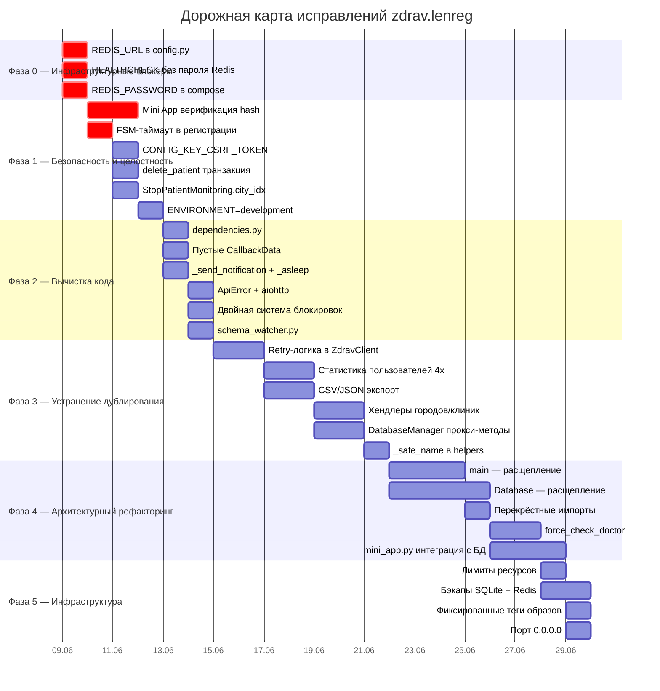
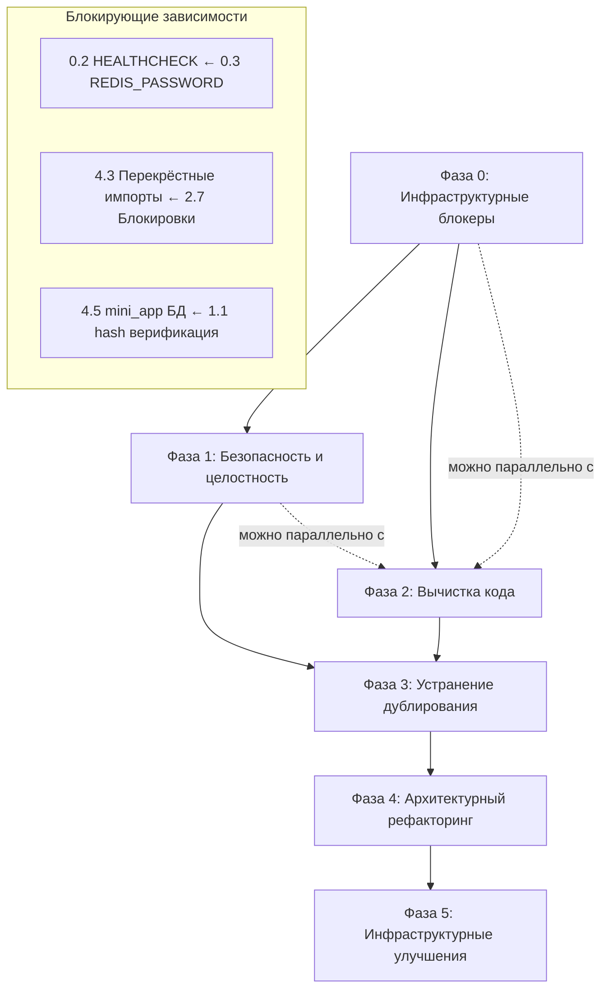

# ROADMAP.md — Дорожная карта исправлений по итогам Code Review

> **Основание:** [`docs/2026-06-08-ghost--zdrav-lenreg-code-review.md`](docs/2026-06-08-ghost--zdrav-lenreg-code-review.md) — аудит ~11 600 строк кода.
> **Дата создания:** 2026-06-08
> **Актуальность:** после завершения каждой фазы обновлять статус задач.

---

## Сводная таблица проблем

| #   | Категория         | Проблема                                          | Серьёзность        | Фаза   | Статус |
| --- | ----------------- | ------------------------------------------------- | ------------------ | ------ | ------ |
| 1   | 🔴 Баг            | `REDIS_URL` содержит мусор                        | Блокирует деплой   | Фаза 0 | ⬜     |
| 2   | 🔴 Баг            | Docker HEALTHCHECK без пароля Redis               | Блокирует деплой   | Фаза 0 | ⬜     |
| 3   | 🔴 Баг            | `REDIS_PASSWORD=***` в compose                    | Блокирует деплой   | Фаза 0 | ⬜     |
| 4   | 🔴 Баг            | Mini App без верификации hash                     | Безопасность       | Фаза 1 | ⬜     |
| 5   | 🔴 Баг            | FSM-регистрация без таймаута                      | Утечка памяти      | Фаза 1 | ⬜     |
| 6   | 🔴 Баг            | `CONFIG_KEY_CSRF_TOKEN` со звёздочками            | Целостность        | Фаза 1 | ⬜     |
| 7   | 🔴 Баг            | `delete_patient` без транзакции                   | Целостность данных | Фаза 1 | ⬜     |
| 8   | 🔴 Баг            | `StopPatientMonitoring.city_idx = ""`             | Логика             | Фаза 1 | ⬜     |
| 9   | 🔴 Баг            | `ENVIRONMENT=development` отключает auth          | Безопасность       | Фаза 1 | ⬜     |
| 10  | 🟠 Архитектура    | God-функция `main()` — 200+ строк                 | Поддерживаемость   | Фаза 4 | ⬜     |
| 11  | 🟠 Архитектура    | God-класс `Database` — 1050 строк                 | SRP                | Фаза 4 | ⬜     |
| 12  | 🟠 Архитектура    | Retry-логика скопирована 5 раз в `ZdravClient`    | Дублирование       | Фаза 3 | ⬜     |
| 13  | 🟠 Архитектура    | Перекрёстные импорты `_safe_set`, `_metrics_lock` | Инкапсуляция       | Фаза 4 | ⬜     |
| 14  | 🟠 Архитектура    | `dependencies.py` — мёртвый модуль                | Мёртвый код        | Фаза 2 | ⬜     |
| 15  | 🟠 Архитектура    | `mini_app.py` — заглушка без БД                   | Функц. разрыв      | Фаза 4 | ⬜     |
| 16  | 🟠 Архитектура    | `force_check_doctor` — монстр на 120 строк        | Поддерживаемость   | Фаза 4 | ⬜     |
| 17  | 🟡 Дублирование   | `_count_active_monitorings()` в api.py + pages.py | Дублирование       | Фаза 3 | ⬜     |
| 18  | 🟡 Дублирование   | Статистика пользователей — 4×                     | Дублирование       | Фаза 3 | ⬜     |
| 19  | 🟡 Дублирование   | Retry-логика в `user_api.py`                      | Дублирование       | Фаза 3 | ⬜     |
| 20  | 🟡 Дублирование   | POST-запросы к API — 5× идентичный паттерн        | Дублирование       | Фаза 3 | ⬜     |
| 21  | 🟡 Дублирование   | CSV и JSON экспорт — 80% кода идентичны           | Дублирование       | Фаза 3 | ⬜     |
| 22  | 🟡 Дублирование   | 4 почти идентичных хендлера городов/клиник        | Дублирование       | Фаза 3 | ⬜     |
| 23  | 🟡 Дублирование   | 11 прокси-методов в `DatabaseManager`             | Дублирование       | Фаза 3 | ⬜     |
| 24  | 🟡 Дублирование   | `_safe_name()` должна быть в `helpers.py`         | Дублирование       | Фаза 3 | ⬜     |
| 25  | 🟢 Избыточность   | `_send_notification` — пустая обёртка             | Избыточность       | Фаза 2 | ⬜     |
| 26  | 🟢 Избыточность   | `_asleep` в `user_api.py`                         | Избыточность       | Фаза 2 | ⬜     |
| 27  | 🟢 Избыточность   | 7 пустых классов `CallbackData`                   | Избыточность       | Фаза 2 | ⬜     |
| 28  | 🟢 Избыточность   | `ApiError` в `models.py`                          | Избыточность       | Фаза 2 | ⬜     |
| 29  | 🟢 Избыточность   | `aiohttp` в `error_notifier.py`                   | Избыточность       | Фаза 2 | ⬜     |
| 30  | 🟢 Избыточность   | Двойная система блокировок в `healthcheck.py`     | Избыточность       | Фаза 2 | ⬜     |
| 31  | 🟢 Избыточность   | `schema_watcher.py` HTTP-запрос                   | Избыточность       | Фаза 2 | ⬜     |
| 32  | ⚙️ Инфраструктура | `qdrant:latest` — floating тег                    | Надёжность         | Фаза 5 | ⬜     |
| 33  | ⚙️ Инфраструктура | Нет лимитов ресурсов в docker-compose             | Надёжность         | Фаза 5 | ⬜     |
| 34  | ⚙️ Инфраструктура | Нет бэкапов SQLite + Redis                        | Надёжность         | Фаза 5 | ⬜     |
| 35  | ⚙️ Инфраструктура | Redis `allkeys-lru` с 128MB                       | Данные             | Фаза 5 | ⬜     |
| 36  | ⚙️ Инфраструктура | Порт 8080 на `0.0.0.0`                            | Безопасность       | Фаза 5 | ⬜     |

---

## Диаграмма фаз (Mermaid Gantt)

---

## Фаза 0: Блокирующие инфраструктурные баги

> **Цель:** восстановить возможность деплоя. Без этих исправлений контейнер бота не стартует или падает сразу после запуска.

### Задача 0.1 — `REDIS_URL` в `config.py`

| Параметр      | Значение                                                                                                                                                                                                                                                                                                          |
| ------------- | ----------------------------------------------------------------------------------------------------------------------------------------------------------------------------------------------------------------------------------------------------------------------------------------------------------------- |
| **Приоритет** | P0 (блокирует деплой)                                                                                                                                                                                                                                                                                             |
| **Файл**      | [`src/config.py`](src/config.py:65)                                                                                                                                                                                                                                                                               |
| **Проблема**  | В строке 65 значение по умолчанию `REDIS_URL: str = "redis://localhost:6379/0"` выглядит корректно, но отчёт аудита утверждает, что в реальном `.env` или в коде присутствует «мусор вместо `redis://...`». Требуется верификация: проверить фактическое значение `REDIS_URL` в `.env` на VPS и в `.env.example`. |
| **Решение**   | 1. Проверить `.env` на VPS. 2. Убедиться, что `REDIS_URL` содержит корректный URL (на VPS: `redis://redis:6379/0`). 3. Исправить `model_post_init` (строки 183-194) — он встраивает пароль в URL, но может сломаться при нестандартном формате.                                                                   |
| **DoD**       | Бот стартует, Redis-клиент успешно подключается, нет ошибок `ValueError` при разборе URL.                                                                                                                                                                                                                         |
| **Риски**     | Если `REDIS_PASSWORD` пуст, а `REDIS_URL` корректен — бот работает, но без пароля (если Redis без `requirepass`).                                                                                                                                                                                                 |

### Задача 0.2 — Docker HEALTHCHECK бота без пароля Redis

| Параметр      | Значение                                                                                                                                                                                                       |
| ------------- | -------------------------------------------------------------------------------------------------------------------------------------------------------------------------------------------------------------- | --- | -------------------------------------------------------------------------- |
| **Приоритет** | P0 (блокирует деплой)                                                                                                                                                                                          |
| **Файл**      | [`docker-compose.yml`](docker-compose.yml:59)                                                                                                                                                                  |
| **Проблема**  | Строка 59: `redis-cli -h redis ping` — нет флага `-a` с паролем. Redis требует `requirepass`, поэтому `ping` вернёт `NOAUTH`. Healthcheck будет падать, Docker будет перезапускать контейнер каждые 30 секунд. |
| **Решение**   | Изменить healthcheck на: `test: ["CMD-SHELL", "pgrep -f 'python -m src.main' > /dev/null 2>&1 && redis-cli -h redis -a $${REDIS_PASSWORD} ping > /dev/null 2>&1                                                |     | exit 1"]`. Экранирование `$$` необходимо для docker-compose interpolation. |
| **DoD**       | `docker compose ps` показывает `healthy` для контейнера `zdrav_bot`, нет циклических перезапусков.                                                                                                             |

### Задача 0.3 — `REDIS_PASSWORD` в docker-compose.yml

| Параметр      | Значение                                                                                                                                                                                                                                                                                                                                                           |
| ------------- | ------------------------------------------------------------------------------------------------------------------------------------------------------------------------------------------------------------------------------------------------------------------------------------------------------------------------------------------------------------------ |
| **Приоритет** | P0 (блокирует деплой)                                                                                                                                                                                                                                                                                                                                              |
| **Файл**      | [`docker-compose.yml`](docker-compose.yml:9-10)                                                                                                                                                                                                                                                                                                                    |
| **Проблема**  | Строки 9-10: `REDIS_PASSWORD=${REDIS_PASSWORD}` и `--requirepass ${REDIS_PASSWORD}`. Если `.env` не содержит `REDIS_PASSWORD`, docker-compose подставляет пустую строку. При этом `requirepass` с пустым паролем может вести себя неопределённо. Кроме того, в отчёте указано `REDIS_PASSWORD=***` — возможно, в каком-то окружении стоит звёздочка вместо пароля. |
| **Решение**   | 1. Проверить, что в `.env` на VPS задан реальный пароль. 2. Добавить в `.env.example` плейсхолдер `REDIS_PASSWORD=your_redis_password_here`. 3. Добавить валидацию в `config.py` на пустой пароль (WARNING при старте).                                                                                                                                            |
| **DoD**       | Redis принимает подключения с паролем, healthcheck проходит.                                                                                                                                                                                                                                                                                                       |

---

## Фаза 1: Критические баги безопасности и целостности

> **Цель:** закрыть дыры безопасности, устранить баги целостности данных, предотвратить утечки памяти.

### Задача 1.1 — Mini App без верификации hash

| Параметр      | Значение                                                                                                                                                                                                                                                                                                                     |
| ------------- | ---------------------------------------------------------------------------------------------------------------------------------------------------------------------------------------------------------------------------------------------------------------------------------------------------------------------------- |
| **Приоритет** | P0 (безопасность)                                                                                                                                                                                                                                                                                                            |
| **Файлы**     | [`src/handlers/mini_app.py`](src/handlers/mini_app.py:14-56), [`src/web/auth_initdata.py`](src/web/auth_initdata.py)                                                                                                                                                                                                         |
| **Проблема**  | Хендлер `handle_web_app_data` (строка 14) принимает `web_app_data` от Telegram Mini App, но **не проверяет подпись** (HMAC-SHA256). Данные могут быть подделаны. При этом middleware [`auth_initdata.py`](src/web/auth_initdata.py) реализует корректную HMAC-верификацию для REST API, но хендлер бота этой проверки лишён. |
| **Решение**   | 1. Добавить вызов верификации `initData` в хендлере `handle_web_app_data` **до** обработки данных. 2. Использовать общую функцию верификации из `auth_initdata.py` (избегая дублирования). 3. В случае несовпадения подписи — логировать `WARNING` и игнорировать данные.                                                    |
| **DoD**       | Подделанные `web_app_data` (без корректной подписи Telegram) отвергаются; валидные данные обрабатываются.                                                                                                                                                                                                                    |

### Задача 1.2 — FSM-регистрация без таймаута

| Параметр      | Значение                                                                                                                                                                                                                                       |
| ------------- | ---------------------------------------------------------------------------------------------------------------------------------------------------------------------------------------------------------------------------------------------- |
| **Приоритет** | P0 (утечка памяти)                                                                                                                                                                                                                             |
| **Файл**      | [`src/handlers/registration.py`](src/handlers/registration.py)                                                                                                                                                                                 |
| **Проблема**  | Если пользователь бросает регистрацию на середине (начал, но не завершил), состояние FSM висит в Redis (или памяти — MemoryStorage) **навсегда**. Это утечка памяти/ключей Redis.                                                              |
| **Решение**   | 1. Настроить `state_ttl` в `RedisStorage` (например, 30 минут). 2. Для MemoryStorage реализовать TTL-очистку через фоновую задачу. 3. Добавить обработчик `StateFilter("*")` с таймаутом в 5 минут неактивности, который сбрасывает состояние. |
| **DoD**       | Состояние FSM автоматически удаляется через N минут неактивности; старые ключи не накапливаются в Redis.                                                                                                                                       |

### Задача 1.3 — `CONFIG_KEY_CSRF_TOKEN`

| Параметр      | Значение                                                                                                                                                                                                                                                                                                                                            |
| ------------- | --------------------------------------------------------------------------------------------------------------------------------------------------------------------------------------------------------------------------------------------------------------------------------------------------------------------------------------------------- |
| **Приоритет** | P1 (целостность)                                                                                                                                                                                                                                                                                                                                    |
| **Файл**      | [`src/config.py`](src/config.py:25)                                                                                                                                                                                                                                                                                                                 |
| **Проблема**  | В коде (строка 25) значение `CONFIG_KEY_CSRF_TOKEN = "csrf_token"` выглядит корректно. Однако отчёт аудита утверждает, что где-то используется `"***"` вместо правильного ключа. Требуется аудит всех использований `CONFIG_KEY_CSRF_TOKEN` и поиск места, где хранится/читается некорректное значение. Возможно, проблема в таблице `config` в БД. |
| **Решение**   | 1. Выполнить поиск `***` по всему проекту. 2. Проверить значение в БД: `SELECT value FROM config WHERE key = 'csrf_token'`. 3. Исправить дефолтное значение в `load_config_from_db()` (строка 242) — добавить валидацию на `***`.                                                                                                                   |
| **DoD**       | CSRF-токен корректно передаётся в заголовках API-запросов; нет `***` в значении.                                                                                                                                                                                                                                                                    |

### Задача 1.4 — `delete_patient` без транзакции

| Параметр      | Значение                                                                                                                                                                              |
| ------------- | ------------------------------------------------------------------------------------------------------------------------------------------------------------------------------------- |
| **Приоритет** | P1 (целостность данных)                                                                                                                                                               |
| **Файл**      | [`src/database/database.py`](src/database/database.py) — метод `delete_patient`                                                                                                       |
| **Проблема**  | Удаление пациента выполняет три отдельных `DELETE` без `BEGIN`/`COMMIT`. При сбое между DELETE могут остаться сиротские записи в связанных таблицах (`monitoring`, `monitoring_log`). |
| **Решение**   | Обернуть все три DELETE в транзакцию: `await db.execute("BEGIN")` → три DELETE → `await db.execute("COMMIT")`, с `try/except` и `ROLLBACK`.                                           |
| **DoD**       | Удаление пациента атомарно: либо все связанные записи удалены, либо ни одной.                                                                                                         |

### Задача 1.5 — `StopPatientMonitoring.city_idx = ""`

| Параметр      | Значение                                                                                                                                                                                                                 |
| ------------- | ------------------------------------------------------------------------------------------------------------------------------------------------------------------------------------------------------------------------ |
| **Приоритет** | P1 (логика)                                                                                                                                                                                                              |
| **Файл**      | [`src/services/monitor.py`](src/services/monitor.py) — класс/функция `StopPatientMonitoring`                                                                                                                             |
| **Проблема**  | Дефолтное значение `city_idx = ""`, но везде по коду используется `"all"` как значение «все города». Несовпадение дефолта и реального использования приводит к багу в логике остановки мониторинга.                      |
| **Решение**   | 1. Найти определение `StopPatientMonitoring` (возможно, TypedDict или dataclass). 2. Изменить дефолт `city_idx` на `"all"`. 3. Проверить все места, где создаётся экземпляр — убедиться, что `city_idx` явно передаётся. |
| **DoD**       | Остановка мониторинга корректно работает для всех городов (значение `"all"`).                                                                                                                                            |

### Задача 1.6 — `ENVIRONMENT=development` отключает аутентификацию

| Параметр      | Значение                                                                                                                                                                                                                                                                                                                       |
| ------------- | ------------------------------------------------------------------------------------------------------------------------------------------------------------------------------------------------------------------------------------------------------------------------------------------------------------------------------ |
| **Приоритет** | P1 (безопасность)                                                                                                                                                                                                                                                                                                              |
| **Файлы**     | [`src/config.py`](src/config.py:146), [`src/web/auth.py`](src/web/auth.py), [`src/web/auth_initdata.py`](src/web/auth_initdata.py)                                                                                                                                                                                             |
| **Проблема**  | В production-окружении может случайно оказаться `ENVIRONMENT=development` (из `.env` или БД). Это отключает проверку аутентификации для Mini App API, делая все эндпоинты открытыми.                                                                                                                                           |
| **Решение**   | 1. Добавить в `config.py` валидатор: если `ENVIRONMENT=development` и отсутствует флаг `--dev` в аргументах командной строки — форсировать `production`. 2. Либо разделить настройки: аутентификация управляется отдельным флагом, не привязанным к `ENVIRONMENT`. 3. Добавить WARNING в логи при старте в development-режиме. |
| **DoD**       | В production-окружении аутентификация всегда включена, независимо от значения `ENVIRONMENT`.                                                                                                                                                                                                                                   |

---

## Фаза 2: Вычистка мёртвого и избыточного кода

> **Цель:** удалить неиспользуемый код, пустые обёртки, дублирующиеся механизмы. Снизить когнитивную нагрузку и размер кодовой базы.

### Задача 2.1 — `dependencies.py` — мёртвый модуль

| Параметр      | Значение                                                                                                                                                                     |
| ------------- | ---------------------------------------------------------------------------------------------------------------------------------------------------------------------------- |
| **Приоритет** | P2                                                                                                                                                                           |
| **Файл**      | [`src/web/dependencies.py`](src/web/dependencies.py:1-29)                                                                                                                    |
| **Проблема**  | 3 функции (`get_db`, `get_health_metrics`, `get_prometheus_metrics`), которые никто не использует. Все роутеры обращаются к `request.app.state.db` напрямую.                 |
| **Решение**   | 1. Проверить через `grep`/`codebase_search`, что функции действительно не используются. 2. Удалить файл. 3. Удалить импорт в [`src/web/app.py`](src/web/app.py) (если есть). |
| **DoD**       | Файл удалён, все тесты проходят, линтер не сообщает об ошибках импорта.                                                                                                      |

### Задача 2.2 — 7 пустых классов `CallbackData`

| Параметр      | Значение                                                                                                                                                                          |
| ------------- | --------------------------------------------------------------------------------------------------------------------------------------------------------------------------------- |
| **Приоритет** | P2                                                                                                                                                                                |
| **Файл**      | [`src/handlers/callback_parser.py`](src/handlers/callback_parser.py), [`src/keyboards/inline.py`](src/keyboards/inline.py)                                                        |
| **Проблема**  | 7 классов `CallbackData` имеют только префикс, без полей. Они не несут полезной нагрузки и могут быть заменены на строковые константы.                                            |
| **Решение**   | 1. Найти все пустые `CallbackData` (только `prefix`, нет полей данных). 2. Заменить на строки в коде клавиатур. 3. Обновить парсер callback'ов для поддержки строковых префиксов. |
| **DoD**       | Пустые `CallbackData` удалены; callback-навигация работает без изменений.                                                                                                         |

### Задача 2.3 — `_send_notification` — пустая обёртка

| Параметр      | Значение                                                                                                                                                              |
| ------------- | --------------------------------------------------------------------------------------------------------------------------------------------------------------------- |
| **Приоритет** | P2                                                                                                                                                                    |
| **Файл**      | [`src/services/monitor.py`](src/services/monitor.py:26-52)                                                                                                            |
| **Проблема**  | Функция `_send_notification` только логирует ошибку и делегирует в `_send_or_update_message`. Это пустая обёртка — можно вызывать `_send_or_update_message` напрямую. |
| **Решение**   | Заменить все вызовы `_send_notification` на прямой вызов `_send_or_update_message`, удалить функцию.                                                                  |
| **DoD**       | Функция удалена, логика отправки уведомлений не изменилась.                                                                                                           |

### Задача 2.4 — `_asleep` в `user_api.py`

| Параметр      | Значение                                                                                                   |
| ------------- | ---------------------------------------------------------------------------------------------------------- |
| **Приоритет** | P2                                                                                                         |
| **Файл**      | [`src/web/routers/user_api.py`](src/web/routers/user_api.py)                                               |
| **Проблема**  | Функция `_asleep` содержит `import asyncio` внутри и `await asyncio.sleep(...)` без дополнительной логики. |
| **Решение**   | Найти и удалить функцию `_asleep`; если нужна задержка — использовать `asyncio.sleep` напрямую.            |
| **DoD**       | Функция удалена, код чище.                                                                                 |

### Задача 2.5 — `ApiError` в `models.py`

| Параметр      | Значение                                                                                                                                                                                                                 |
| ------------- | ------------------------------------------------------------------------------------------------------------------------------------------------------------------------------------------------------------------------ |
| **Приоритет** | P2                                                                                                                                                                                                                       |
| **Файл**      | [`src/api/models.py`](src/api/models.py)                                                                                                                                                                                 |
| **Проблема**  | Pydantic-модель `ApiError` определена, но нигде не используется для валидации. Мёртвый код.                                                                                                                              |
| **Решение**   | 1. Проверить использование `ApiError` через `grep`. 2. Если не используется — удалить модель и соответствующую JSON-схему в [`docs/schemas/ApiError.json`](docs/schemas/ApiError.json). 3. Обновить `docs/openapi.yaml`. |
| **DoD**       | `ApiError` либо используется для валидации ошибок API, либо удалён.                                                                                                                                                      |

### Задача 2.6 — `aiohttp` в `error_notifier.py`

| Параметр      | Значение                                                                                                                                   |
| ------------- | ------------------------------------------------------------------------------------------------------------------------------------------ |
| **Приоритет** | P2                                                                                                                                         |
| **Файл**      | [`src/services/error_notifier.py`](src/services/error_notifier.py)                                                                         |
| **Проблема**  | Весь проект использует `httpx`, но `error_notifier.py` тянет `aiohttp` только ради `ClientError`. Лишняя зависимость.                      |
| **Решение**   | Переписать на `httpx` + `httpx.HTTPError`; удалить импорт `aiohttp` и зависимость из `pyproject.toml` (если больше нигде не используется). |
| **DoD**       | `aiohttp` не используется в проекте; все HTTP-вызовы через `httpx`.                                                                        |

### Задача 2.7 — Двойная система блокировок в `healthcheck.py`

| Параметр      | Значение                                                                                                                                                                                                                                                                                                                                                  |
| ------------- | --------------------------------------------------------------------------------------------------------------------------------------------------------------------------------------------------------------------------------------------------------------------------------------------------------------------------------------------------------- |
| **Приоритет** | P2                                                                                                                                                                                                                                                                                                                                                        |
| **Файл**      | [`src/services/healthcheck.py`](src/services/healthcheck.py:96-121)                                                                                                                                                                                                                                                                                       |
| **Проблема**  | Для `HealthMetrics` (dataclass с int-полями) реализована двойная система блокировок: `_metrics_lock` для групповых операций и `_metrics_locks` (per-attribute) для одиночных. Для int-полей в asyncio это избыточно — `asyncio.Lock` для атомарных операций над int не нужен, т.к. `setattr`/`getattr` в asyncio и так атомарны (нет `await` между ними). |
| **Решение**   | 1. Заменить per-attribute locks на один `_metrics_lock`. 2. Упростить `_safe_increment` и `_safe_set` до использования единственного лока. 3. Экспортировать только публичные функции вместо приватных `_safe_set`, `_safe_increment`.                                                                                                                    |
| **DoD**       | Одна система блокировок; импорты приватных `_safe_set` из других модулей устранены.                                                                                                                                                                                                                                                                       |

### Задача 2.8 — `schema_watcher.py` HTTP-запрос

| Параметр      | Значение                                                                                                                                                                                         |
| ------------- | ------------------------------------------------------------------------------------------------------------------------------------------------------------------------------------------------ |
| **Приоритет** | P2                                                                                                                                                                                               |
| **Файл**      | [`src/services/schema_watcher.py`](src/services/schema_watcher.py)                                                                                                                               |
| **Проблема**  | Сервис выполняет HTTP-запросы для сравнения схем API, но результат не используется (только статические схемы).                                                                                   |
| **Решение**   | 1. Проверить, используется ли `schema_watcher` в `main.py`. 2. Если результат сравнения не нужен — удалить фоновую задачу, оставив только статическую валидацию через `generate_api_schemas.py`. |
| **DoD**       | Schema watcher либо оповещает о дрифте схем (и результат используется), либо удалён.                                                                                                             |

---

## Фаза 3: Устранение дублирования

> **Цель:** вынести повторяющийся код в общие функции/миксины, сократить размер кодовой базы, упростить поддержку.

### Задача 3.1 — Retry-логика в `ZdravClient` (5× дублирование)

| Параметр      | Значение                                                                                                                                                                                                        |
| ------------- | --------------------------------------------------------------------------------------------------------------------------------------------------------------------------------------------------------------- |
| **Приоритет** | P2                                                                                                                                                                                                              |
| **Файл**      | [`src/api/zdrav_client.py`](src/api/zdrav_client.py:1-732)                                                                                                                                                      |
| **Проблема**  | ~250 строк дублирующегося кода: retry-логика (3 попытки с задержкой) скопирована в 5 методах API-клиента.                                                                                                       |
| **Решение**   | Создать общий метод `_request_with_retry(method, url, data, model_class)` с: rate limiting, retry (3×), проверкой статуса, логгированием, валидацией через Pydantic. Переписать 5 методов на его использование. |
| **DoD**       | Retry-логика находится ровно в одном месте; все 5 методов API-клиента используют `_request_with_retry`.                                                                                                         |

### Задача 3.2 — Статистика пользователей (4× дублирование)

| Параметр      | Значение                                                                                                                                                                                                                                       |
| ------------- | ---------------------------------------------------------------------------------------------------------------------------------------------------------------------------------------------------------------------------------------------- |
| **Приоритет** | P2                                                                                                                                                                                                                                             |
| **Файлы**     | [`src/services/healthcheck.py`](src/services/healthcheck.py:172-185), [`src/services/metrics.py`](src/services/metrics.py:168-182), [`src/web/routers/api.py`](src/web/routers/api.py), [`src/web/routers/pages.py`](src/web/routers/pages.py) |
| **Проблема**  | Одинаковый код подсчёта пользователей (`total_users`, `total_patients`, `total_monitored_doctors`, `active_monitorings`) дублируется в 4 модулях.                                                                                              |
| **Решение**   | 1. Добавить метод `get_user_statistics()` в `DatabaseManager` или `Database`. 2. Заменить все 4 копипасты на вызов этого метода.                                                                                                               |
| **DoD**       | Статистика пользователей считается в одном месте; все потребители получают данные через единый метод.                                                                                                                                          |

### Задача 3.3 — CSV и JSON экспорт (80% дублирования)

| Параметр      | Значение                                                                                                                                                                                                   |
| ------------- | ---------------------------------------------------------------------------------------------------------------------------------------------------------------------------------------------------------- |
| **Приоритет** | P2                                                                                                                                                                                                         |
| **Файл**      | [`src/services/export.py`](src/services/export.py:1-272)                                                                                                                                                   |
| **Проблема**  | Функции `export_monitoring_csv` и `export_monitoring_json` на 80% идентичны: сбор данных, получение логов, форматирование. Различается только сериализация.                                                |
| **Решение**   | Вынести общую часть (сбор данных, получение логов) в `_collect_export_data()`. Оставить две лёгкие функции: `export_csv` и `export_json`, вызывающие общий сборщик и выполняющие специфичную сериализацию. |
| **DoD**       | Общая часть экспорта не дублируется; CSV и JSON экспорт работают без изменений.                                                                                                                            |

### Задача 3.4 — 4 почти идентичных хендлера городов/клиник

| Параметр      | Значение                                                                                                                           |
| ------------- | ---------------------------------------------------------------------------------------------------------------------------------- |
| **Приоритет** | P2                                                                                                                                 |
| **Файл**      | [`src/handlers/common.py`](src/handlers/common.py)                                                                                 |
| **Проблема**  | 4 хендлера для выбора городов/клиник имеют почти идентичную структуру.                                                             |
| **Решение**   | Создать параметризованную функцию-строитель хендлеров или использовать общий обработчик с параметром (город/клиника, adult/child). |
| **DoD**       | Логика выбора городов/клиник не дублируется; навигация работает без изменений.                                                     |

### Задача 3.5 — 11 прокси-методов в `DatabaseManager`

| Параметр      | Значение                                                                                                                                                                      |
| ------------- | ----------------------------------------------------------------------------------------------------------------------------------------------------------------------------- |
| **Приоритет** | P2                                                                                                                                                                            |
| **Файл**      | [`src/database/manager.py`](src/database/manager.py)                                                                                                                          |
| **Проблема**  | `DatabaseManager` содержит 11 методов, которые просто делегируют вызов в `Database` без дополнительной логики.                                                                |
| **Решение**   | 1. Пересмотреть архитектуру: вместо прокси-методов использовать прямое обращение к `Database` через `db_manager.db`. 2. Либо сгенерировать прокси-методы через `__getattr__`. |
| **DoD**       | `DatabaseManager` содержит только методы с реальной логикой (кэширование, атомарные операции); прокси-вызовы убраны.                                                          |

### Задача 3.6 — `_safe_name` в `user_api.py`

| Параметр      | Значение                                                                                                     |
| ------------- | ------------------------------------------------------------------------------------------------------------ |
| **Приоритет** | P3                                                                                                           |
| **Файлы**     | [`src/web/routers/user_api.py`](src/web/routers/user_api.py), [`src/utils/helpers.py`](src/utils/helpers.py) |
| **Проблема**  | Функция `_safe_name` определена в `user_api.py`, но должна быть в `helpers.py` для переиспользования.        |
| **Решение**   | Перенести `_safe_name` в [`src/utils/helpers.py`](src/utils/helpers.py), обновить импорт в `user_api.py`.    |
| **DoD**       | `_safe_name` доступна из `helpers.py`; `user_api.py` импортирует её оттуда.                                  |

---

## Фаза 4: Архитектурный рефакторинг

> **Цель:** улучшить структуру кода, соблюсти Single Responsibility Principle, устранить перекрёстные импорты, интегрировать Mini App с ботом.

### Задача 4.1 — Расщепление God-функции `main()`

| Параметр      | Значение                                                                                                                                                                                                                                                                     |
| ------------- | ---------------------------------------------------------------------------------------------------------------------------------------------------------------------------------------------------------------------------------------------------------------------------- |
| **Приоритет** | P3                                                                                                                                                                                                                                                                           |
| **Файл**      | [`src/main.py`](src/main.py:1-515)                                                                                                                                                                                                                                           |
| **Проблема**  | Функция `main()` содержит ~200 строк: инициализация БД, прокси, логов, кэша, веб-дашборда, middleware, роутеров, фоновых задач — всё в одной функции.                                                                                                                        |
| **Решение**   | Разбить на отдельные `bootstrap_*()` функции: `bootstrap_database()`, `bootstrap_proxy()`, `bootstrap_logging()`, `bootstrap_redis()`, `bootstrap_bot()`, `bootstrap_web()`, `bootstrap_background_tasks()`. Функция `main()` должна только вызывать их и запускать поллинг. |
| **DoD**       | Функция `main()` ≤ 50 строк; каждая `bootstrap_*` функция ≤ 50 строк и отвечает за один компонент.                                                                                                                                                                           |

### Задача 4.2 — Расщепление God-класса `Database`

| Параметр      | Значение                                                                                                                                                                                                                                                                           |
| ------------- | ---------------------------------------------------------------------------------------------------------------------------------------------------------------------------------------------------------------------------------------------------------------------------------- |
| **Приоритет** | P3                                                                                                                                                                                                                                                                                 |
| **Файл**      | [`src/database/database.py`](src/database/database.py:1-1050)                                                                                                                                                                                                                      |
| **Проблема**  | Класс `Database` (1050 строк) содержит всё: коннект, миграции, CRUD пользователей, врачей, клиник, алиасов, логов, статистики, поиск. Нарушение SRP.                                                                                                                               |
| **Решение**   | Разделить на: `DatabaseConnection` (подключение), `UserRepository`, `DoctorRepository`, `ClinicRepository`, `MonitoringRepository`, `ConfigRepository`, `LogRepository`. Каждый репозиторий получает соединение через DI. Сохранить обратную совместимость через фасад `Database`. |
| **DoD**       | Каждый класс репозитория ≤ 200 строк; `Database` — фасад, делегирующий в репозитории.                                                                                                                                                                                              |

### Задача 4.3 — Устранение перекрёстных импортов приватных символов

| Параметр      | Значение                                                                                                                                                                                                             |
| ------------- | -------------------------------------------------------------------------------------------------------------------------------------------------------------------------------------------------------------------- |
| **Приоритет** | P3                                                                                                                                                                                                                   |
| **Файлы**     | [`src/services/monitor.py`](src/services/monitor.py:16), [`src/services/metrics.py`](src/services/metrics.py:16-17), [`src/main.py`](src/main.py:31)                                                                 |
| **Проблема**  | `monitor.py` импортирует `_safe_set` и `_metrics_lock` из `healthcheck.py`; `metrics.py` импортирует `_metrics_lock`; `main.py` импортирует `_safe_set`. Приватные имена (`_`) не должны быть частью публичного API. |
| **Решение**   | 1. Сделать `_safe_set`, `_safe_increment`, `_metrics_lock` публичными методами `HealthMetrics` (переименовать без `_`). 2. Обновить все импорты.                                                                     |
| **DoD**       | Ни один модуль не импортирует `_`-префиксованные имена из другого модуля.                                                                                                                                            |

### Задача 4.4 — Рефакторинг `force_check_doctor` (120 строк)

| Параметр      | Значение                                                                                                                                                        |
| ------------- | --------------------------------------------------------------------------------------------------------------------------------------------------------------- |
| **Приоритет** | P3                                                                                                                                                              |
| **Файл**      | [`src/services/monitor.py`](src/services/monitor.py)                                                                                                            |
| **Проблема**  | Функция `force_check_doctor` (~120 строк) дублирует логику из `monitor.py` (проверка слотов, классификация, уведомление). Должна делегировать в сервисный слой. |
| **Решение**   | Выделить общую логику проверки одного врача в `_check_single_doctor()`. `force_check_doctor` и `monitor_loop` должны использовать эту общую функцию.            |
| **DoD**       | `force_check_doctor` ≤ 30 строк; логика проверки врача не дублируется.                                                                                          |

### Задача 4.5 — Интеграция `mini_app.py` с БД

| Параметр      | Значение                                                                                                                                                                                                                                                                                      |
| ------------- | --------------------------------------------------------------------------------------------------------------------------------------------------------------------------------------------------------------------------------------------------------------------------------------------- |
| **Приоритет** | P3                                                                                                                                                                                                                                                                                            |
| **Файлы**     | [`src/handlers/mini_app.py`](src/handlers/mini_app.py:1-57), [`src/web/routers/user_api.py`](src/web/routers/user_api.py)                                                                                                                                                                     |
| **Проблема**  | `mini_app.py` получает данные от Mini App (добавление/удаление врача), но **не сохраняет их в БД**. Только логирует и отправляет подтверждение пользователю. Mini App и бот живут в «разных вселенных» — REST API (`user_api.py`) работает с БД через `DatabaseManager`, а бот-хендлер — нет. |
| **Решение**   | 1. Добавить вызовы `db.add_doctor_to_monitoring()` и `db.remove_doctor_from_monitoring()` в `handle_web_app_data`. 2. Синхронизировать логику REST API и бот-хендлера. 3. Учесть, что `web_app_data` приходит после того, как REST API уже выполнил операцию — избежать двойного добавления.  |
| **DoD**       | Врач, добавленный через Mini App, появляется в мониторинге бота; удаление также синхронизировано.                                                                                                                                                                                             |

---

## Фаза 5: Инфраструктурные улучшения

> **Цель:** повысить надёжность и безопасность продакшен-окружения.

### Задача 5.1 — Лимиты ресурсов в docker-compose

| Параметр      | Значение                                                                                                                                                |
| ------------- | ------------------------------------------------------------------------------------------------------------------------------------------------------- |
| **Приоритет** | P3                                                                                                                                                      |
| **Файл**      | [`docker-compose.yml`](docker-compose.yml:1-80)                                                                                                         |
| **Проблема**  | Ни один сервис не имеет `deploy.resources.limits`. При утечке памяти бот или Redis могут занять всю память VPS.                                         |
| **Решение**   | Добавить `deploy.resources.limits` и `reservations` для каждого сервиса: bot (memory: 256MB, cpus: 0.5), redis (memory: 256MB), qdrant (memory: 512MB). |
| **DoD**       | Контейнеры не могут превысить выделенные лимиты; OOM killer не убивает случайные процессы на хосте.                                                     |

### Задача 5.2 — Бэкапы SQLite + Redis

| Параметр      | Значение                                                                                                                                                                                                                                         |
| ------------- | ------------------------------------------------------------------------------------------------------------------------------------------------------------------------------------------------------------------------------------------------ |
| **Приоритет** | P3                                                                                                                                                                                                                                               |
| **Файлы**     | [`docker-compose.yml`](docker-compose.yml), новый `scripts/backup.sh`                                                                                                                                                                            |
| **Проблема**  | Нет механизма резервного копирования. Потеря `data/bot.db` или Redis — потеря всех данных пользователей.                                                                                                                                         |
| **Решение**   | 1. Добавить cron-задачу на хосте: `sqlite3 /root/zdrav.lenreg/data/bot.db ".backup /root/backups/bot_$(date +%Y%m%d).db"`. 2. Настроить Redis `save` (уже есть `save 60 1`) + копирование `dump.rdb`. 3. Хранить последние 7 ежедневных бэкапов. |
| **DoD**       | Ежедневные бэкапы SQLite и Redis создаются автоматически; есть инструкция по восстановлению.                                                                                                                                                     |

### Задача 5.3 — Фиксированные теги образов

| Параметр      | Значение                                                                                                                                                   |
| ------------- | ---------------------------------------------------------------------------------------------------------------------------------------------------------- |
| **Приоритет** | P3                                                                                                                                                         |
| **Файл**      | [`docker-compose.yml`](docker-compose.yml:29)                                                                                                              |
| **Проблема**  | `qdrant/qdrant:latest` — floating тег. Обновление образа может сломать совместимость без предупреждения.                                                   |
| **Решение**   | Заменить `latest` на конкретную версию (например, `qdrant/qdrant:v1.9.0`). Аналогично для `redis:7-alpine` — указать минорную версию (`redis:7.2-alpine`). |
| **DoD**       | Все образы зафиксированы на конкретных версиях; обновление контролируется через Dependabot или ручное ревью.                                               |

### Задача 5.4 — Порт 8080 на `0.0.0.0` и reverse-proxy

| Параметр      | Значение                                                                                                                                                                                 |
| ------------- | ---------------------------------------------------------------------------------------------------------------------------------------------------------------------------------------- |
| **Приоритет** | P3                                                                                                                                                                                       |
| **Файл**      | [`docker-compose.yml`](docker-compose.yml:67)                                                                                                                                            |
| **Проблема**  | Строка 67: `0.0.0.0:8080:8080` — веб-дашборд слушает на всех интерфейсах, включая внешний. В комбинации с `ENVIRONMENT=development` — прямой доступ без аутентификации.                  |
| **Решение**   | 1. Изменить на `127.0.0.1:8080:8080`. 2. Настроить reverse-proxy (Caddy/Nginx) с HTTPS и basic auth для проксирования на `127.0.0.1:8080`. 3. Удалить прямую привязку порта 8080 наружу. |
| **DoD**       | Веб-дашборд доступен только через reverse-proxy с HTTPS; прямое подключение на порт 8080 извне невозможно.                                                                               |

### Задача 5.5 — Redis `maxmemory-policy`

| Параметр      | Значение                                                                                                                                                                                           |
| ------------- | -------------------------------------------------------------------------------------------------------------------------------------------------------------------------------------------------- |
| **Приоритет** | P3                                                                                                                                                                                                 |
| **Файл**      | [`docker-compose.yml`](docker-compose.yml:10)                                                                                                                                                      |
| **Проблема**  | `--maxmemory-policy allkeys-lru` с `--maxmemory 128mb` означает, что Redis будет удалять любые ключи при нехватке памяти. Это может привести к потере FSM-состояний и данных мониторинга.          |
| **Решение**   | 1. Оценить реальный объём данных Redis (FSM + кэш + rate limit). 2. Если 128MB достаточно — сменить на `volatile-lru` (удалять только ключи с TTL). 3. Если данных больше — увеличить `maxmemory`. |
| **DoD**       | Redis не удаляет критичные данные (FSM-состояния, кэш мониторинга) при заполнении памяти.                                                                                                          |

---

## Риски и зависимости

### Ключевые зависимости

| Задача                     | Блокируется задачей  | Причина                                                  |
| -------------------------- | -------------------- | -------------------------------------------------------- |
| 0.2 (HEALTHCHECK)          | 0.3 (REDIS_PASSWORD) | `redis-cli -a` требует пароль                            |
| 4.3 (перекрёстные импорты) | 2.7 (блокировки)     | Нужно сначала упростить систему блокировок               |
| 4.5 (mini_app БД)          | 1.1 (hash)           | Без верификации нельзя safely писать в БД                |
| 4.4 (force_check_doctor)   | 3.1 (retry)          | Использует ZdravClient → должен использовать общий retry |

### Возможный параллелизм

- **Фаза 2 + Фаза 1** — вычистка мёртвого кода может идти параллельно с исправлением багов безопасности, т.к. затрагивает разные модули.
- **Задачи 3.1–3.6** — каждая задача по устранению дублирования независима (разные файлы).
- **Задачи 5.1–5.5** — все инфраструктурные улучшения независимы друг от друга.

---

## Критерии завершения дорожной карты

1. Все 36 задач имеют статус «✅ Выполнено».
2. `pyright` и `ruff` не выдают ошибок.
3. Все тесты (`python scripts/run_tests.py`) проходят.
4. `docker compose up -d --build` успешно стартует все сервисы; healthcheck показывает `healthy`.
5. `npx markdownlint "docs/**/*.md"` — 0 errors.
6. `docs/openapi.yaml` актуализирован с учётом всех изменений.
7. `docs/ARCHITECTURE.md` обновлён (дерево директорий, граф зависимостей).
