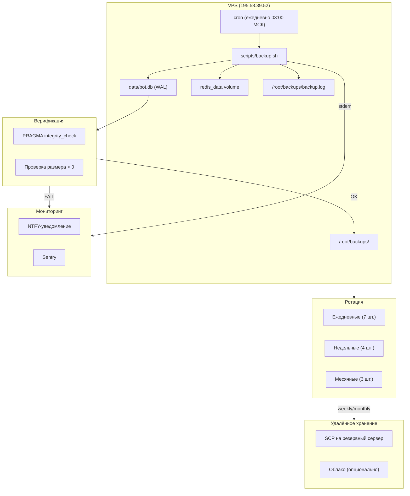
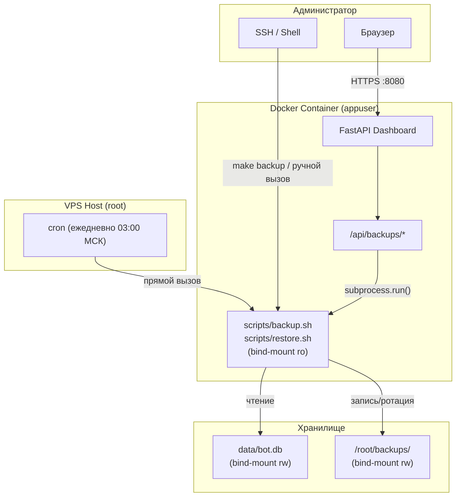
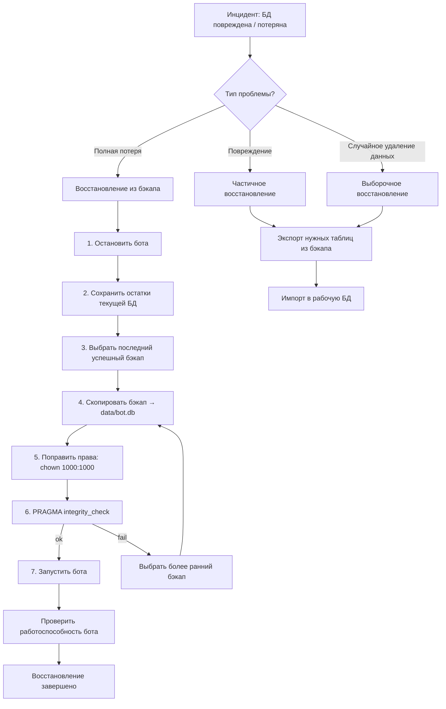

# Дизайн-документ: Механизм резервного копирования базы данных

> **Статус:** Проектирование
> **Версия:** 1.0.0
> **Дата:** 2026-06-14

---

## 1. Анализ текущего состояния

### 1.1 Существующий скрипт `scripts/backup.sh`

Проект уже содержит рабочий скрипт резервного копирования [`scripts/backup.sh`](../../scripts/backup.sh), который:

- **SQLite:** использует `sqlite3 .backup` — это **правильный** метод для WAL-режима (блокирует БД на время копирования, но гарантирует консистентность)
- **Redis:** выполняет `SAVE` и копирует `dump.rdb` из Docker-тома `zdravlenreg_redis_data`
- **Ротация:** хранит последние 7 ежедневных бэкапов в `/root/backups/`
- **Запуск:** рассчитан на cron с хоста (ежедневно в 03:00 МСК)

### 1.2 Что сделано правильно

| Аспект                   | Оценка | Комментарий                                         |
| ------------------------ | ------ | --------------------------------------------------- |
| Метод копирования SQLite | ✅     | `.backup` — единственно правильный способ для WAL   |
| Ротация                  | ✅     | 7 дней — разумный минимум                           |
| Обработка ошибок         | ✅     | `set -euo pipefail`, проверка наличия файлов        |
| Логирование              | ✅     | Вывод с метками времени, можно перенаправить в файл |

### 1.3 Что отсутствует

| Пробел                                     | Критичность | Описание                                                      |
| ------------------------------------------ | ----------- | ------------------------------------------------------------- |
| Верификация целостности бэкапа             | Высокая     | Бэкап создаётся, но не проверяется (`PRAGMA integrity_check`) |
| Удалённое хранение                         | Высокая     | Все бэкапы лежат на том же VPS; при потере VPS — потеря всего |
| Мониторинг/алерты                          | Средняя     | Нет уведомлений при сбое бэкапа                               |
| Расширенная retention-политика             | Средняя     | Только 7 дней; нет недельных/месячных бэкапов                 |
| Документированная процедура восстановления | Средняя     | Есть краткий комментарий в скрипте, нет пошаговой инструкции  |
| Интеграция с Docker-планировщиком          | Низкая      | Только cron на хосте, нет ofelia/supercronic как альтернативы |

### 1.4 Контекст развёртывания

- **VPS:** 195.58.39.52, root, проект в `/root/zdrav.lenreg`
- **Docker Compose:** bot (aiogram + aiohttp), redis (7.2-alpine), qdrant (v1.9.0)
- **БД:** SQLite WAL, путь `data/bot.db`, монтируется как bind mount `./data:/app/data`
- **Контейнер:** `python:3.11-slim`, пользователь `appuser` (UID/GID не-root)
- **sqlite3:** установлен в контейнере (строка 62 Dockerfile), доступен на хосте

---

## 2. Риски и требования

### 2.1 Матрица рисков

| Риск                                         | Вероятность | Влияние     | Сценарий                      |
| -------------------------------------------- | ----------- | ----------- | ----------------------------- |
| Отказ диска VPS                              | Низкая      | Критическое | Полная потеря БД              |
| Повреждение SQLite (corruption)              | Средняя     | Высокое     | БД не читается, нужен restore |
| Человеческая ошибка (случайный DROP/ DELETE) | Средняя     | Высокое     | Потеря данных пользователей   |
| Компрометация VPS                            | Низкая      | Критическое | Удаление/шифрование данных    |
| Сбой cron / бэкап не запустился              | Средняя     | Среднее     | Отсутствие свежего бэкапа     |
| Бэкап создан, но повреждён                   | Низкая      | Высокое     | Ложное чувство защищённости   |

### 2.2 Требования к системе бэкапа

| ID     | Требование                                                    | Приоритет |
| ------ | ------------------------------------------------------------- | --------- |
| REQ-01 | Бэкап должен быть консистентным (WAL-safe)                    | Критичный |
| REQ-02 | Каждый бэкап должен верифицироваться (`integrity_check`)      | Критичный |
| REQ-03 | Бэкапы должны храниться вне VPS (удалённое хранилище)         | Высокий   |
| REQ-04 | Retention: 7 ежедневных + 4 недельных + 3 месячных            | Высокий   |
| REQ-05 | Сбой бэкапа должен генерировать алерт (NTFY/Sentry)           | Средний   |
| REQ-06 | Процедура восстановления должна быть документирована          | Высокий   |
| REQ-07 | Бэкап не должен блокировать работу бота более чем на 5 секунд | Средний   |
| REQ-08 | Бэкап Redis — опциональный (данные FSM восстанавливаемы)      | Низкий    |

---

## 3. Архитектура резервного копирования

### 3.1 Диаграмма потоков



### 3.2 Принципиальные решения

| Решение                              | Обоснование                                                      |
| ------------------------------------ | ---------------------------------------------------------------- |
| Бэкап **с хоста**, не из контейнера  | bind mount `./data` доступен напрямую; нет нужды в `docker exec` |
| `sqlite3 .backup` (не `cp`)          | Единственный гарантированно консистентный метод для WAL          |
| `cron` на хосте, не ofelia           | Уже настроен; ofelia добавляет сложность без выигрыша            |
| SCP как первичное удалённое хранение | Минимальные зависимости; не требует облачных аккаунтов           |
| NTFY для алертов                     | Уже интегрирован в проект через `ErrorNotifier`                  |

---

## 4. Стратегия бэкапа

### 4.1 Тип бэкапа: полный (full)

Для SQLite размером до нескольких сотен мегабайт инкрементальный бэкап нецелесообразен:

- Накладные расходы на инкрементальную логику превышают выигрыш
- `.backup` всегда создаёт полную копию
- Размер `bot.db` на практике — десятки-сотни МБ, время копирования — доли секунды

### 4.2 Расписание

| Частота     | Время (МСК)      | Cron-выражение | Хранение                  |
| ----------- | ---------------- | -------------- | ------------------------- |
| Ежедневно   | 03:00            | `0 3 * * *`    | 7 дней (локально)         |
| Еженедельно | Вс 03:00         | `0 3 * * 0`    | 4 недели (локально + SCP) |
| Ежемесячно  | 1-го числа 03:00 | `0 3 1 * *`    | 3 месяца (SCP)            |

### 4.3 Retention-политика

```text
/root/backups/
├── daily/
│   ├── bot_20260614.db          # Хранить 7 дней
│   ├── bot_20260613.db
│   └── ...
├── weekly/
│   ├── bot_20260607.db          # Хранить 4 недели
│   └── ...
└── monthly/
    ├── bot_20260501.db          # Хранить 3 месяца
    └── ...
```

Логика: ежедневный бэкап всегда создаётся в `daily/`. По воскресеньям дополнительно копируется в `weekly/`. 1-го числа — в `monthly/`. Ротация удаляет файлы старше порога в каждой поддиректории независимо.

---

## 5. Безопасное копирование SQLite WAL

### 5.1 Почему `cp` опасен для WAL

При прямом копировании `bot.db` + `bot.db-wal` + `bot.db-shm` без координации:

- WAL-файл может содержать незакоммиченные транзакции
- Порядок копирования (сначала .db, потом .wal) не гарантирует консистентность
- После восстановления из таких файлов SQLite может отказаться открывать БД

### 5.2 Метод `.backup`

```bash
sqlite3 /root/zdrav.lenreg/data/bot.db ".backup '/root/backups/daily/bot_20260614.db'"
```

Что происходит:

1. `sqlite3` открывает исходную БД
2. `.backup` вызывает SQLite API `sqlite3_backup_init()` — **блокирует БД на чтение**
3. Копирует все страницы в новый файл
4. Новый файл — консистентный snapshot на момент начала `.backup`
5. Блокировка держится только на время копирования (доли секунды для типичных размеров)

### 5.3 Альтернатива: `VACUUM INTO`

SQLite 3.27.0+ (в python:3.11-slim — 3.40+) поддерживает:

```sql
VACUUM INTO '/root/backups/daily/bot_20260614.db';
```

Преимущества: не требует внешнего `sqlite3`, можно выполнить из Python. Недостатки: перестраивает БД (медленнее `.backup` для больших БД).

**Решение:** сохранить `.backup` как основной метод (уже работает, быстрее).

---

## 6. Локальное хранение и ротация

### 6.1 Структура директорий

```text
/root/backups/
├── daily/          # Ежедневные, 7 шт.
├── weekly/         # Недельные, 4 шт.
├── monthly/        # Месячные, 3 шт.
├── redis/          # Дампы Redis (опционально)
└── backup.log      # Лог выполнения
```

### 6.2 Алгоритм ротации

```bash
# Вспомогательная функция: оставить N последних файлов по маске
rotate_by_count() {
    local dir="$1"
    local pattern="$2"
    local keep="$3"
    local files
    # shellcheck disable=SC2207
    files=($(ls -1t "${dir}"/${pattern} 2>/dev/null || true))
    if [ ${#files[@]} -gt "${keep}" ]; then
        for ((i = keep; i < ${#files[@]}; i++)); do
            rm -f "${files[$i]}"
            echo "[ROTATE] Удалён: ${files[$i]}"
        done
    fi
}

# Применение
rotate_by_count "/root/backups/daily" "bot_*.db" 7
rotate_by_count "/root/backups/weekly" "bot_*.db" 4
rotate_by_count "/root/backups/monthly" "bot_*.db" 3
```

Ротация **по количеству файлов**, а не по дате в имени — это надёжнее: если бэкап пропущен, старые файлы не удалятся преждевременно.

---

## 7. Удалённое хранение

### 7.1 Варианты

| Вариант                                               | Сложность | Стоимость          | Надёжность           |
| ----------------------------------------------------- | --------- | ------------------ | -------------------- |
| SCP на другой сервер                                  | Низкая    | Цена второго VPS   | Высокая              |
| rsync на NAS / домашний сервер                        | Средняя   | Электричество      | Средняя              |
| S3-совместимое облако (AWS S3, Yandex Object Storage) | Средняя   | ~1₽/ГБ/мес         | Высокая              |
| rclone с шифрованием                                  | Средняя   | Зависит от бэкенда | Высокая              |
| Telegram-бот (отправка файла)                         | Низкая    | Бесплатно          | Низкая (лимит 50 МБ) |

### 7.2 Рекомендация: двухуровневое удалённое хранение

#### Уровень 1 (обязательный): SCP на резервный сервер

```bash
scp -i /root/.ssh/backup_key -P 22 \
  /root/backups/weekly/bot_*.db \
  user@backup-server:/backups/zdrav/
```

Подходит, если есть второй VPS или домашний сервер с SSH.

#### Уровень 2 (опциональный): rclone + S3

```bash
rclone copy /root/backups/monthly/ remote:zdrav-backups/
```

Преимущества rclone: шифрование на клиенте, поддержка 40+ бэкендов, дедупликация.

### 7.3 Что доставлять удалённо

- **Недельные** бэкапы — SCP (4 файла, ~50-200 МБ суммарно)
- **Месячные** бэкапы — S3/rclone (3 файла)
- Ежедневные — только локально (избыточно гонять каждый день)

---

## 8. Автоматизация

### 8.1 Основной вариант: cron на хосте

Текущая cron-запись (из [`backup.sh:16`](../../scripts/backup.sh:16)):

```text
0 3 * * * /root/zdrav.lenreg/scripts/backup.sh >> /root/backups/backup.log 2>&1
```

Модифицированная версия с алертами:

```text
# Ежедневный бэкап (03:00 МСК = 00:00 UTC)
0 0 * * * /root/zdrav.lenreg/scripts/backup.sh daily >> /root/backups/backup.log 2>&1

# Недельный бэкап (воскресенье)
0 0 * * 0 /root/zdrav.lenreg/scripts/backup.sh weekly >> /root/backups/backup.log 2>&1

# Месячный бэкап (1-е число)
0 0 1 * * /root/zdrav.lenreg/scripts/backup.sh monthly >> /root/backups/backup.log 2>&1
```

### 8.2 Альтернатива: ofelia (Docker-native)

Если cron на хосте недоступен (например, минимальный образ VPS), можно использовать [ofelia](https://github.com/mcuadros/ofelia) — Docker-контейнер со встроенным планировщиком:

```yaml
# docker-compose.yml (фрагмент)
ofelia:
  image: mcuadros/ofelia:latest
  container_name: zdrav_ofelia
  depends_on:
    - bot
  volumes:
    - /var/run/docker.sock:/var/run/docker.sock:ro
    - ./data:/data:ro
    - /root/backups:/backups
  command: daemon --docker
  labels:
    ofelia.job-local.backup-daily.schedule: '0 0 3 * * *'
    ofelia.job-local.backup-daily.command: '/scripts/backup.sh daily'
```

**Решение:** оставить cron как основной вариант (он уже работает). Добавить ofelia-конфигурацию как закомментированную альтернативу в `docker-compose.yml`.

---

## 9. Мониторинг бэкапов

### 9.1 Проверки после создания бэкапа

```bash
verify_backup() {
    local backup_file="$1"

    # 1. Файл существует и не пуст
    if [ ! -s "${backup_file}" ]; then
        echo "[FAIL] Бэкап ${backup_file} пуст или отсутствует"
        return 1
    fi

    # 2. PRAGMA integrity_check
    local result
    result=$(sqlite3 "${backup_file}" "PRAGMA integrity_check" 2>&1)
    if [ "${result}" != "ok" ]; then
        echo "[FAIL] integrity_check для ${backup_file}: ${result}"
        return 1
    fi

    # 3. Быстрая проверка: количество таблиц
    local table_count
    table_count=$(sqlite3 "${backup_file}" "SELECT COUNT(*) FROM sqlite_master WHERE type='table'" 2>&1)
    if [ "${table_count}" -lt 5 ]; then
        echo "[FAIL] Слишком мало таблиц в ${backup_file}: ${table_count}"
        return 1
    fi

    echo "[OK] Бэкап ${backup_file} прошёл верификацию"
    return 0
}
```

### 9.2 Алерты

Интеграция с существующей системой нотификаций проекта:

- **NTFY:** HTTP POST на `NTFY_TOPIC_URL` с сообщением о сбое
- **Sentry:** capture сообщение через `sentry_sdk` (если доступен из shell)

```bash
send_alert() {
    local message="$1"
    local ntfy_url="${NTFY_TOPIC_URL:-}"

    if [ -n "${ntfy_url}" ]; then
        curl -s -H "Title: Backup FAILED" \
             -H "Priority: high" \
             -H "Tags: warning,rotate" \
             -d "❌ ${message}" \
             "${ntfy_url}" > /dev/null 2>&1 || true
    fi
}
```

### 9.3 Периодическая проверка (weekly)

Отдельная cron-задача раз в неделю:

```bash
#!/bin/bash
# scripts/backup_healthcheck.sh
# Проверяет: есть ли свежий бэкап (не старше 25 часов)
LATEST=$(ls -1t /root/backups/daily/bot_*.db 2>/dev/null | head -1)
if [ -z "${LATEST}" ]; then
    send_alert "Нет ни одного бэкапа в /root/backups/daily/"
    exit 1
fi

AGE_HOURS=$(( ($(date +%s) - $(stat -c %Y "${LATEST}")) / 3600 ))
if [ "${AGE_HOURS}" -gt 25 ]; then
    send_alert "Последний бэкап старше 25 часов: ${LATEST} (возраст: ${AGE_HOURS}ч)"
    exit 1
fi
```

---

## 10. Процедура восстановления

### 10.1 Восстановление SQLite

```bash
# 1. Остановить бота (чтобы не писал в БД во время восстановления)
docker compose -f /root/zdrav.lenreg/docker-compose.yml stop bot

# 2. Сделать резервную копию текущей (возможно, повреждённой) БД
cp /root/zdrav.lenreg/data/bot.db /root/zdrav.lenreg/data/bot.db.broken
cp /root/zdrav.lenreg/data/bot.db-wal /root/zdrav.lenreg/data/bot.db-wal.broken 2>/dev/null || true
cp /root/zdrav.lenreg/data/bot.db-shm /root/zdrav.lenreg/data/bot.db-shm.broken 2>/dev/null || true

# 3. Удалить WAL/SHM (будут созданы заново)
rm -f /root/zdrav.lenreg/data/bot.db-wal /root/zdrav.lenreg/data/bot.db-shm

# 4. Скопировать бэкап на место
cp /root/backups/daily/bot_20260613.db /root/zdrav.lenreg/data/bot.db

# 5. Проверить целостность восстановленной БД
sqlite3 /root/zdrav.lenreg/data/bot.db "PRAGMA integrity_check"
# Должно вывести: ok

# 6. Права доступа (важно: контейнер работает под appuser)
chown -R 1000:1000 /root/zdrav.lenreg/data/

# 7. Запустить бота
docker compose -f /root/zdrav.lenreg/docker-compose.yml start bot
```

### 10.2 Восстановление Redis (опционально)

```bash
docker compose -f /root/zdrav.lenreg/docker-compose.yml stop redis
cp /root/backups/redis/dump_20260613.rdb \
   /var/lib/docker/volumes/zdravlenreg_redis_data/_data/dump.rdb
docker compose -f /root/zdrav.lenreg/docker-compose.yml start redis
```

### 10.3 Частичное восстановление (отдельные таблицы)

```bash
# Открыть бэкап и экспортировать нужную таблицу
sqlite3 /root/backups/daily/bot_20260613.db \
  ".dump user_patients" > /tmp/restore_user_patients.sql

# Применить к рабочей БД
sqlite3 /root/zdrav.lenreg/data/bot.db < /tmp/restore_user_patients.sql
```

---

## 11. Интеграция с Docker

### 11.1 Почему бэкап с хоста, а не из контейнера

| Фактор                    | Хост                | Контейнер                |
| ------------------------- | ------------------- | ------------------------ |
| Доступ к `data/bot.db`    | Прямой (bind mount) | Требуется volume mount   |
| Доступ к `/root/backups/` | Прямой              | Нужно монтировать        |
| `sqlite3`                 | Доступен            | Доступен (установлен)    |
| Права доступа             | root (полные)       | appuser (ограниченные)   |
| Cron                      | Родной              | Нужен ofelia/supercronic |
| SSH/SCP ключи             | `~/.ssh/` доступен  | Нужно монтировать        |
| Простота                  | ✅ Проще            | ❌ Сложнее               |

**Решение:** бэкап выполняется с хоста. Это даёт полный контроль над файловой системой,
SSH-ключами и cron.

### 11.2 Соображения по безопасности контейнера

- Пользователь `appuser` в контейнере имеет UID/GID, отличный от root на хосте
- При восстановлении БД необходимо скорректировать права: `chown -R 1000:1000 data/`
  (UID 1000 — стандартный для первого непривилегированного пользователя в Debian/Ubuntu)
- Текущий `docker-compose.yml` не задаёт `user:` явно — используется пользователь из Dockerfile (`appuser`)

### 11.3 Права доступа к файлу БД

Текущая ситуация (из [`connection.py:103-146`](../../src/database/connection.py:103)):

- При старте бот логирует права доступа к `data/bot.db` и директории `data/`
- При ошибке записи пишет CRITICAL в лог
- Эти диагностические сообщения полезны и при восстановлении из бэкапа

---

## 12. Гибридное управление (Shell + Веб-дашборд)

> **Статус:** Проектирование
> **Дата:** 2026-06-14

### 12.1 Архитектурный принцип

Управление резервным копированием и восстановлением реализуется через **два равноправных интерфейса**,
опирающихся на единый канонический источник логики — shell-скрипты:

| Интерфейс        | Механизм                                 | Пользователь                |
| ---------------- | ---------------------------------------- | --------------------------- |
| **Shell (хост)** | Прямой вызов `scripts/backup.sh` из cron | Администратор VPS           |
| **Веб-дашборд**  | REST API → `subprocess.run(scripts/...)` | Администратор через браузер |

**Ключевое правило:** вся логика бэкапа (копирование, верификация, ротация, алерты) живёт
**только** в скриптах. Веб-API — тонкая прослойка, которая:

1. Принимает HTTP-запрос от дашборда.
2. Валидирует параметры и проверяет права доступа.
3. Вызывает скрипт через `subprocess.run(['bash', 'scripts/backup.sh', ...])`.
4. Возвращает результат (stdout, код возврата) в JSON.

**Запрещено** дублировать логику бэкапа в Python-коде. Любое изменение алгоритма делается
только в shell-скриптах и автоматически применяется для обоих интерфейсов.

### 12.2 Среда выполнения в контейнере

Поскольку веб-дашборд работает **внутри Docker-контейнера** (пользователь `appuser`, не root),
для вызова скриптов необходимы:

| Ресурс                    | Как обеспечен                                                                                                             |
| ------------------------- | ------------------------------------------------------------------------------------------------------------------------- |
| `scripts/backup.sh`       | Bind-mount `./scripts:/app/scripts:ro`                                                                                    |
| `scripts/restore.sh`      | Bind-mount `./scripts:/app/scripts:ro`                                                                                    |
| `data/bot.db` (исходная)  | Bind-mount `./data:/app/data` (уже есть)                                                                                  |
| Директория бэкапов        | Bind-mount `/root/backups:/app/backups`                                                                                   |
| `sqlite3`                 | Уже установлен в Dockerfile (строка 62)                                                                                   |
| Права на запись в backups | `appuser` должен иметь UID, совпадающий с владельцем `/root/backups` на хосте, **или** директория должна быть `chmod 777` |

**Варианты решения проблемы прав:**

- **Вариант A (рекомендуемый):** задать `user: "1000:1000"` в `docker-compose.yml` для bot-контейнера
  и установить владельца `/root/backups` = `1000:1000` на хосте. Это уже согласуется с текущим
  использованием `appuser` (UID 1000) в [`Dockerfile`](../../Dockerfile).
- **Вариант B:** в скриптах использовать `sudo` (требует установки sudo в контейнер и настройки sudoers).
  Избыточен для данной задачи.

### 12.3 Диаграмма потоков управления



### 12.4 REST API для управления бэкапами

Новые эндпоинты в `src/web/routers/backup_api.py` (роутер монтируется с префиксом `/api/backups`).

Все эндпоинты защищены `APIKeyMiddleware` (как и остальной дашборд — см. [`src/web/auth.py`](../../src/web/auth.py)).
Публичный префикс `/api/user` на них не распространяется.

#### GET /api/backups

Список всех бэкапов с метаданными.

**Ответ 200:**

```json
{
  "backups": {
    "daily": [
      {
        "filename": "bot_20260614.db",
        "size_bytes": 5242880,
        "size_human": "5.0 MB",
        "date": "2026-06-14",
        "integrity": "ok",
        "integrity_checked_at": "2026-06-14T03:00:05"
      }
    ],
    "weekly": [...],
    "monthly": [...]
  },
  "total_count": 14,
  "total_size_human": "72.5 MB"
}
```

Источник данных: прямое чтение директорий `daily/`, `weekly/`, `monthly/` из bind-mount `/app/backups`.
Для каждого файла выполняется `stat` (размер, дата) и читается `.integrity_ok` — файл-маркер,
создаваемый скриптом после успешной верификации.

#### POST /api/backups/run

Ручной запуск бэкапа (вне расписания cron).

**Тело запроса:**

```json
{
  "type": "daily"
}
```

`type` — одно из: `daily`, `weekly`, `monthly`.

**Ответ 202 (Accepted):**

```json
{
  "status": "started",
  "type": "daily",
  "message": "Бэкап запущен. Результат будет доступен в логе.",
  "started_at": "2026-06-14T15:30:00"
}
```

**Ответ 409 (Conflict):** если бэкап уже выполняется (проверка через lock-файл `/tmp/backup.lock`).

Реализация: асинхронный `subprocess.run(['bash', 'scripts/backup.sh', type])` с таймаутом 120 секунд.
Вывод скрипта (stdout/stderr) пишется в лог-файл внутри `/app/backups/` и возвращается в ответе
при синхронном вызове (опциональный параметр `?wait=true`).

#### POST /api/backups/restore/{filename}

Двухфакторное восстановление из бэкапа.

**Шаг 1 — запрос подтверждения:**

```http
POST /api/backups/restore/bot_20260613.db
```

**Ответ 200:**

```json
{
  "status": "confirmation_required",
  "filename": "bot_20260613.db",
  "size_human": "5.0 MB",
  "date": "2026-06-13",
  "integrity": "ok",
  "confirmation_token": "a1b2c3d4-e5f6-7890-abcd-ef1234567890",
  "expires_at": "2026-06-14T15:35:00",
  "message": "Внимание: будет заменена текущая БД. Подтвердите операцию."
}
```

Токен подтверждения — UUID4 с TTL 5 минут, хранится в памяти процесса (словарь `_restore_tokens`).
При истечении TTL токен автоматически удаляется (фоновая очистка каждые 60 секунд).

**Шаг 2 — подтверждение:**

```http
POST /api/backups/restore/bot_20260613.db/confirm
Content-Type: application/json

{
  "confirmation_token": "a1b2c3d4-e5f6-7890-abcd-ef1234567890"
}
```

**Ответ 202 (Accepted):**

```json
{
  "status": "restore_started",
  "filename": "bot_20260613.db",
  "message": "Восстановление запущено. Бот будет остановлен, БД заменена, бот перезапущен.",
  "restore_log": "См. /app/backups/restore.log"
}
```

Реализация: вызов `scripts/restore.sh <filename>` через `subprocess.run`. Скрипт отвечает за:

1. Остановку бота (`docker compose stop bot` — **требует docker.sock** или выполняется с хоста).
2. Сохранение текущей БД как `.broken`.
3. Копирование бэкапа на место.
4. Проверку целостности.
5. `chown -R 1000:1000 data/`.
6. Запуск бота.

**Важное ограничение:** поскольку контейнер не имеет доступа к Docker-сокету по умолчанию,
полноценный restore из веб-интерфейса требует одного из:

- Монтирования `docker.sock` в контейнер (несёт риски безопасности).
- Выноса команд `docker compose stop/start` в отдельный скрипт на хосте, вызываемый через SSH.
- Ограничения веб-restore **только копированием файла БД** (без перезапуска бота), с последующим
  ручным перезапуском администратором.

**Решение:** на этапе реализации предусмотреть флаг `RESTORE_IN_CONTAINER=false` по умолчанию —
веб-интерфейс копирует бэкап и выполняет `integrity_check`, но **не перезапускает бот**.
Администратор получает уведомление в дашборде: «БД восстановлена. Перезапустите бота вручную:
`docker compose restart bot`».

#### GET /api/backups/status

Сводный статус системы бэкапов.

**Ответ 200:**

```json
{
  "last_backup": {
    "filename": "bot_20260614.db",
    "date": "2026-06-14T03:00:03",
    "type": "daily",
    "size_human": "5.0 MB",
    "integrity": "ok"
  },
  "last_integrity_check": "2026-06-14T03:00:05",
  "healthcheck": {
    "is_fresh": true,
    "age_hours": 3.5,
    "threshold_hours": 25
  },
  "disk_free": {
    "path": "/app/backups",
    "free_human": "15.2 GB",
    "free_pct": 68.5,
    "warning_threshold_pct": 10
  },
  "retention": {
    "daily_count": 7,
    "weekly_count": 4,
    "monthly_count": 3
  }
}
```

Источник данных: `stat` последнего файла в `daily/`, проверка `.integrity_ok` маркера,
`shutil.disk_usage()` для свободного места, подсчёт файлов в поддиректориях.

### 12.5 Меры безопасности

#### 12.5.1 Двухфакторное подтверждение восстановления

Восстановление из бэкапа — деструктивная операция (замена текущей БД). Механизм подтверждения:

1. **POST** `/api/backups/restore/{filename}` — возвращает одноразовый `confirmation_token` (UUID4, TTL 5 минут).
2. **POST** `/api/backups/restore/{filename}/confirm` с токеном в теле — исполняет восстановление.

Токен валидируется:

- По совпадению с выданным.
- По TTL (не просрочен).
- По совпадению `filename` (токен привязан к конкретному файлу).

После использования токен немедленно удаляется. При неверном токене — 403 Forbidden.
При трёх неверных попытках подряд — 5-минутная блокировка restore для данного IP.

#### 12.5.2 Логирование

Все операции через веб-API логируются:

| Событие                      | Уровень  | Куда пишется               |
| ---------------------------- | -------- | -------------------------- |
| Запуск бэкапа                | INFO     | `backup.log` + лог FastAPI |
| Ошибка бэкапа                | ERROR    | `backup.log` + NTFY-алерт  |
| Запрос подтверждения restore | WARNING  | Лог FastAPI                |
| Успешный restore             | CRITICAL | `restore.log` + NTFY-алерт |
| Ошибка restore               | CRITICAL | `restore.log` + NTFY-алерт |
| Просмотр списка бэкапов      | DEBUG    | Лог FastAPI (опционально)  |

#### 12.5.3 Контроль доступа

- Все эндпоинты `/api/backups/*` находятся **вне** публичного пути `/api/user/` —
  следовательно, проверяются `APIKeyMiddleware` (требуется заголовок `X-API-Key`).
- Если `WEB_DASHBOARD_API_KEY` не задан в `.env` — аутентификация отключена (только для разработки).
- На уровне веб-интерфейса: вкладка «Резервное копирование» скрывается, если у пользователя
  нет прав администратора (проверка через Telegram `initData` для Mini App не применима —
  дашборд использует отдельную аутентификацию по API-ключу).

### 12.6 UI-компоненты (описание)

> **Статус:** только описание. Реализация — в рамках отдельной задачи по расширению дашборда.

#### 12.6.1 Страница «Резервное копирование»

Новая вкладка в навигации дашборда (рядом с «Пользователи», «Логи», «Клиники»):

- **URL:** `/backups` (HTML-страница, рендерится Jinja2).
- **Доступ:** только с валидным `X-API-Key`.

#### 12.6.2 Таблица истории бэкапов

| Колонка  | Описание                                  |
| -------- | ----------------------------------------- |
| Дата     | `2026-06-14 03:00`                        |
| Тип      | daily / weekly / monthly (цветной бейдж)  |
| Размер   | `5.0 MB`                                  |
| Статус   | ✅ ok / ❌ fail / ⏳ in progress          |
| Действия | Кнопка «Восстановить» (с модальным окном) |

Цветовые индикаторы:

- 🟢 Зелёный — `integrity_check` пройден.
- 🔴 Красный — `integrity_check` не пройден или бэкап отсутствует.
- 🟡 Жёлтый — проверка ещё не выполнялась (для бэкапов, созданных до внедрения верификации).

Фильтры: по типу бэкапа (daily/weekly/monthly), поиск по дате.

#### 12.6.3 Кнопка «Создать бэкап сейчас»

- Находится над таблицей.
- Выпадающий список: «Ежедневный», «Недельный», «Месячный».
- После нажатия — `POST /api/backups/run`, кнопка блокируется на время выполнения (до 120 сек).
- По завершении — toast-уведомление: «Бэкап создан успешно» или «Ошибка бэкапа».

#### 12.6.4 Модальное окно «Восстановить»

Вызывается по кнопке «Восстановить» в строке таблицы.

**Шаг 1 — предупреждение:**

```text
┌─────────────────────────────────────────────────┐
│  ⚠️ Восстановление из бэкапа                    │
│                                                 │
│  Вы собираетесь заменить текущую базу данных    │
│  бэкапом от 13.06.2026 (5.0 MB).               │
│                                                 │
│  Текущие данные будут сохранены как .broken.    │
│  Бот будет остановлен на время восстановления.  │
│                                                 │
│  [Отмена]            [Подтвердить восстановление]│
└─────────────────────────────────────────────────┘
```

**Шаг 2 — код подтверждения:**

После нажатия «Подтвердить» — в модальном окне появляется поле ввода.
Пользователь должен ввести имя файла бэкапа (например, `bot_20260613.db`)
для дополнительного подтверждения осознанности действия.

**Шаг 3 — выполнение:**

Модальное окно показывает прогресс: «Останавливаю бота...», «Копирую бэкап...»,
«Проверяю целостность...», «Запускаю бота...».

**Шаг 4 — результат:**

- Успех: зелёный toast «База данных восстановлена».
- Ошибка: красный toast с описанием ошибки.

#### 12.6.5 Панель статуса

Над таблицей — информационная панель:

```text
┌──────────────────────────────────────────────────────────────┐
│  Последний бэкап: 14.06.2026 03:00  ✅   Свободно: 15.2 GB  │
│  Всего бэкапов: 14 (72.5 MB)                                 │
└──────────────────────────────────────────────────────────────┘
```

Данные получаются через `GET /api/backups/status`.

### 12.7 Технические детали реализации веб-части

#### 12.7.1 Структура модулей

```text
src/web/
├── routers/
│   └── backup_api.py          # Новый роутер /api/backups/*
├── templates/
│   └── backups.html            # Новый шаблон страницы
└── static/
    └── app/
        └── js/
            └── views/
                └── backups.js  # Логика фронтенда (fetch-запросы, таблица, модалки)
```

#### 12.7.2 Адаптация скриптов для вызова из контейнера

Скрипты должны поддерживать параметризацию путей через переменные окружения,
чтобы работать как на хосте, так и в контейнере:

| Переменная       | Хост (cron)                | Контейнер (веб)           |
| ---------------- | -------------------------- | ------------------------- |
| `PROJECT_DIR`    | `/root/zdrav.lenreg`       | `/app`                    |
| `BACKUP_DIR`     | `/root/backups`            | `/app/backups`            |
| `DATA_DIR`       | `/root/zdrav.lenreg/data`  | `/app/data`               |
| `DOCKER_COMPOSE` | `docker compose`           | `echo` (no-op)            |
| `LOG_FILE`       | `/root/backups/backup.log` | `/app/backups/backup.log` |

Скрипт читает эти переменные с дефолтными значениями (хостовые пути), веб-API
устанавливает контейнерные пути перед вызовом `subprocess.run(..., env={...})`.

#### 12.7.3 Регистрация роутера в `app.py`

В [`src/web/app.py`](../../src/web/app.py), после регистрации существующих роутеров:

```python
from src.web.routers import backup_api

app.include_router(backup_api.router)
```

---

## 13. План реализации

### 13.1 Shell-часть (хост)

| Файл                                             | Действие       | Описание                                                                                                          |
| ------------------------------------------------ | -------------- | ----------------------------------------------------------------------------------------------------------------- |
| [`scripts/backup.sh`](../../scripts/backup.sh)   | Модифицировать | Добавить: аргумент `daily`/`weekly`/`monthly`, верификацию `integrity_check`, алерты, SCP, многоуровневую ротацию |
| `scripts/backup_healthcheck.sh`                  | Создать        | Скрипт проверки «жив ли бэкап» (возраст последнего файла)                                                         |
| `scripts/restore.sh`                             | Создать        | Скрипт восстановления: остановка бота, замена БД, проверка, перезапуск                                            |
| [`docker-compose.yml`](../../docker-compose.yml) | Модифицировать | Добавить закомментированный блок ofelia как альтернативу cron                                                     |
| [`Makefile`](../../Makefile)                     | Модифицировать | Добавить цели: `backup`, `backup-restore`, `backup-list`, `backup-healthcheck`                                    |
| `docs/design/database_backup_design.md`          | Модифицировать | Этот документ                                                                                                     |

### 13.2 Веб-часть (контейнер)

| Файл                                             | Действие       | Описание                                                                         |
| ------------------------------------------------ | -------------- | -------------------------------------------------------------------------------- |
| `src/web/routers/backup_api.py`                  | Создать        | REST API: список, запуск, restore (двухфакторный), статус                        |
| [`src/web/app.py`](../../src/web/app.py)         | Модифицировать | Зарегистрировать `backup_api.router`                                             |
| `src/web/templates/backups.html`                 | Создать        | Jinja2-шаблон страницы «Резервное копирование»                                   |
| `src/web/static/app/js/views/backups.js`         | Создать        | JS-логика: fetch-запросы к API, отрисовка таблицы, модалки подтверждения         |
| [`docker-compose.yml`](../../docker-compose.yml) | Модифицировать | Добавить bind-mount `./scripts:/app/scripts:ro` и `/root/backups:/app/backups`   |
| `scripts/backup.sh`                              | Модифицировать | Параметризовать пути через переменные окружения (работа на хосте и в контейнере) |
| `.env.example`                                   | Модифицировать | Добавить `RESTORE_IN_CONTAINER` и `BACKUP_DIR`                                   |

### 13.3 Неизменяемые файлы

| Файл                                                             | Причина                                                |
| ---------------------------------------------------------------- | ------------------------------------------------------ |
| [`src/config.py`](../../src/config.py)                           | Настройки бэкапа — вне зоны ответственности приложения |
| [`src/database/connection.py`](../../src/database/connection.py) | WAL-режим и миграции не требуют изменений              |
| [`src/database/database.py`](../../src/database/database.py)     | API БД не меняется                                     |
| [`Dockerfile`](../../Dockerfile)                                 | `sqlite3` уже установлен, менять нечего                |

### 13.4 Makefile-цели (предложение)

```makefile
.PHONY: backup backup-list backup-restore backup-healthcheck

backup:
    bash scripts/backup.sh daily

backup-list:
    ls -lh /root/backups/daily/ 2>/dev/null || echo "Нет ежедневных бэкапов"
    ls -lh /root/backups/weekly/ 2>/dev/null || echo "Нет недельных бэкапов"
    ls -lh /root/backups/monthly/ 2>/dev/null || echo "Нет месячных бэкапов"

backup-restore:
    bash scripts/restore.sh

backup-healthcheck:
    bash scripts/backup_healthcheck.sh
```

---

## 14. Оценка рисков и edge cases

### 14.1 Edge cases

| Ситуация                               | Решение                                                                       |
| -------------------------------------- | ----------------------------------------------------------------------------- |
| БД заблокирована долгой транзакцией    | `.backup` ждёт 5 сек (busy_timeout); при таймауте — алерт, бэкап пропускается |
| Нет места на диске для бэкапа          | Проверка `df -h` перед созданием бэкапа; алерт при < 10% свободного места     |
| Бэкап повреждён (integrity_check fail) | Алерт, файл удаляется (не храним битые бэкапы), повтор через час              |
| SCP-сервер недоступен                  | Алерт, бэкап остаётся локально; при следующем успешном SCP отправится         |
| Одновременный запуск двух бэкапов      | `flock` на lock-файл `/tmp/backup.lock`                                       |
| Cron не запущен / demoted              | Healthcheck-скрипт обнаружит отсутствие свежих бэкапов                        |
| Бот пишет в БД во время восстановления | Остановка бота перед restore (п. 10.1)                                        |
| Несовпадение UID после restore         | `chown -R 1000:1000 data/` в процедуре восстановления                         |
| Запуск restore из веб-интерфейса       | Флаг `RESTORE_IN_CONTAINER=false` — копирование БД без перезапуска бота       |

### 14.2 Что НЕ покрывает эта система

- **Point-in-time recovery (PITR):** SQLite не имеет WAL-архивирования как PostgreSQL. Восстановление возможно только на момент последнего бэкапа.
- **Непрерывное резервирование (continuous backup):** для этого нужна репликация (например, Litestream), что выходит за рамки данной задачи.
- **Резервное копирование Qdrant:** векторная БД используется только для Codebase Indexing (инструмент Roo Code), не содержит бизнес-данных.

### 14.3 Litestream как альтернатива (на будущее)

[Litestream](https://litestream.io/) — инструмент непрерывной репликации SQLite WAL в S3:

- Потоковая репликация каждого изменения (RPO ~ секунды)
- Автоматическое восстановление при старте
- Минимальная нагрузка на основную БД

Может быть рассмотрен в будущем как замена/дополнение к текущему подходу, но требует:

- S3-совместимого хранилища
- Отдельного процесса в контейнере или на хосте
- Тестирования совместимости с WAL-режимом и aiosqlite

---

## 15. Диаграмма восстановления



---

## Приложение A: Сопоставление требований и решений

| ID     | Требование                       | Как реализовано                                                |
| ------ | -------------------------------- | -------------------------------------------------------------- |
| REQ-01 | WAL-safe бэкап                   | `sqlite3 .backup` (п. 5.2)                                     |
| REQ-02 | Верификация                      | `PRAGMA integrity_check` + проверка количества таблиц (п. 9.1) |
| REQ-03 | Удалённое хранение               | SCP + опционально rclone/S3 (п. 7)                             |
| REQ-04 | Retention 7+4+3                  | Трёхуровневая ротация daily/weekly/monthly (п. 6.2)            |
| REQ-05 | Алерты при сбое                  | NTFY-уведомления + Sentry (п. 9.2)                             |
| REQ-06 | Документированное восстановление | Пошаговая процедура (п. 10)                                    |
| REQ-07 | Минимальная блокировка           | `.backup` блокирует на доли секунды (п. 5.2)                   |
| REQ-08 | Опциональный бэкап Redis         | Отдельная секция в скрипте, можно отключить (п. 10.2)          |
