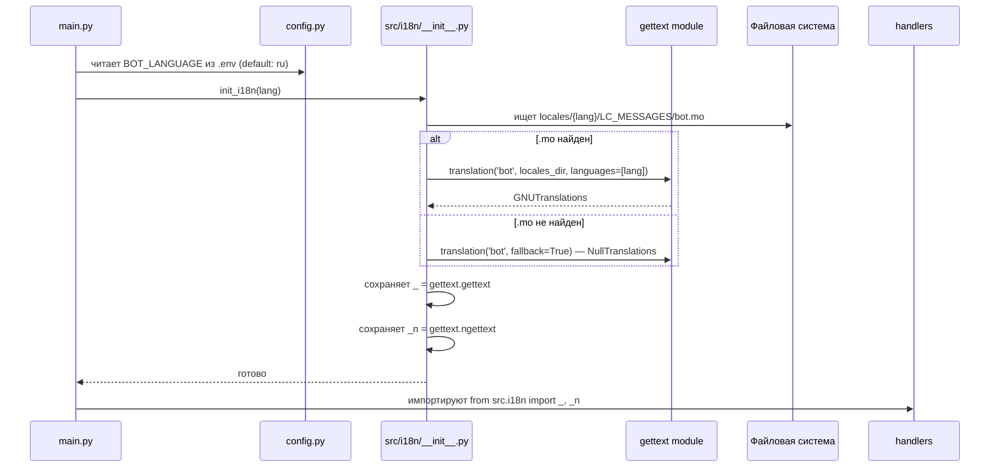
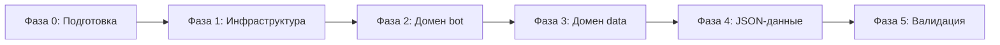

# Дизайн интернационализации (i18n) для zdrav.lenreg

> **Задача:** F4 — Интернационализация
> **Статус:** Проектирование
> **Дата:** 2026-05-19

## 1. Цели и ограничения

### Цели

- Вынести все пользовательские строки (~140 уникальных) из `.py`-файлов в файлы локализации.
- Обеспечить возможность добавления новых языков без изменения кода.
- Сохранить обратную совместимость: русский язык остаётся основным (fallback).
- Не сломать существующую функциональность в процессе миграции.

### Что НЕ подлежит интернационализации

- **Логи**: все сообщения `logger.info/warning/error` остаются на русском (внутренние, для администратора).
- **Ключи конфигурации**: `CONFIG_KEY_*` — технические идентификаторы.
- **Callback data**: `sel_p_`, `tgl_`, `back_to_main` и т.п. — это машинные токены, не видны пользователю.
- **Имена файлов и путей**: всегда на английском.
- **API-ключи и токены**: `.env` значения.

### Языки

| Язык       | Код  | Статус                                    |
| ---------- | ---- | ----------------------------------------- |
| Русский    | `ru` | Основной (fallback), реализован полностью |
| Английский | `en` | Целевой для первого расширения            |

---

## 2. Выбор технологии: gettext + Babel

### Сравнение альтернатив

| Критерий            | gettext (`.po`/`.mo`)                | Fluent (Project Fluent)                        |
| ------------------- | ------------------------------------ | ---------------------------------------------- |
| Интеграция с Python | Встроенный модуль `gettext`          | Сторонняя библиотека `fluent.runtime`          |
| Поддержка aiogram   | Стандартный подход                   | Нет прямой интеграции                          |
| Плюрализация        | `ngettext()` (ограничена)            | Полноценная (CLDR)                             |
| Инструментарий      | Babel, Poedit, msgmerge              | Fluent синтаксис, менее зрелый                 |
| Сложность миграции  | Низкая                               | Средняя                                        |
| Зависимости         | `babel` (только для компиляции, dev) | `fluent.runtime` + `fluent.compiler` (runtime) |

**Решение:** `gettext` + `babel`.

**Обоснование:**

1. Python имеет встроенную поддержку gettext — не нужна runtime-зависимость.
2. aiogram не накладывает ограничений на i18n-механизм, но большинство aiogram-проектов используют gettext.
3. Babel нужен только на этапе сборки (компиляция `.po` → `.mo`), может быть dev-зависимостью.
4. Плюрализация через `ngettext()` покрывает 100% наших сценариев (русский: 3 формы, английский: 2 формы).
5. Зрелая экосистема: Poedit для переводчиков, `msgmerge` для обновления, `msgfmt` для компиляции.

---

## 3. Архитектурная схема

```mermaid
graph TD
    subgraph "Код приложения"
        CFG[src/config.py]
        I18N[src/i18n/__init__.py]
        HANDLERS[src/handlers/]
        KB[src/keyboards/]
        MW[src/middleware/]
        API[src/api/zdrav_client.py]
        SVC[src/services/]
        UTIL[src/utils/helpers.py]
    end

    subgraph "Файлы локализации"
        LOCALES[locales/]
        RU_BOT[locales/ru/LC_MESSAGES/bot.po]
        RU_DATA[locales/ru/LC_MESSAGES/data.po]
        EN_BOT[locales/en/LC_MESSAGES/bot.po]
        EN_DATA[locales/en/LC_MESSAGES/data.po]
    end

    subgraph "JSON-данные (справочники)"
        RU_SPEC[locales/ru/data/specialty_aliases.json]
        RU_SETTLE[locales/ru/data/settlements.json]
        EN_SPEC[locales/en/data/specialty_aliases.json]
        EN_SETTLE[locales/en/data/settlements.json]
    end

    CFG -->|BOT_LANGUAGE| I18N
    I18N -->|_ gettext| HANDLERS
    I18N -->|_ gettext| KB
    I18N -->|_ gettext| MW
    I18N -->|_ gettext| API
    I18N -->|_ gettext| SVC
    I18N -->|load_json_data| UTIL

    LOCALES --> I18N
    RU_BOT --> LOCALES
    RU_DATA --> LOCALES
    EN_BOT --> LOCALES
    EN_DATA --> LOCALES

    RU_SPEC -.->|importlib.resources| I18N
    RU_SETTLE -.->|importlib.resources| I18N
```



### Поток инициализации



---

## 4. Структура файлов

```text
locales/
├── ru/
│   ├── LC_MESSAGES/
│   │   ├── bot.po              # Сообщения пользователю (~80 строк)
│   │   └── data.po             # Форматные строки, дни недели (~10 строк)
│   └── data/
│       ├── specialty_aliases.json   # 55+ псевдонимов специальностей
│       └── settlements.json         # 40+ населённых пунктов
├── en/
│   ├── LC_MESSAGES/
│   │   ├── bot.po
│   │   └── data.po
│   └── data/
│       ├── specialty_aliases.json
│       └── settlements.json
└── messages.pot                # Шаблон (генерируется pybabel extract)
```

**Примечания:**

- Файлы `.mo` (скомпилированные) **игнорируются в `.gitignore`** — они генерируются при сборке/деплое.
- `.pot` (Portable Object Template) — генерируется автоматически через `pybabel extract`, служит основой для переводчиков.
- JSON-файлы данных вынесены отдельно, потому что это **словари (ключ→значение)**, а не строки сообщений.

---

## 5. Модуль `src/i18n/__init__.py`

### API модуля

```python
# src/i18n/__init__.py

from gettext import GNUTranslations, NullTranslations

# Публичный API
_: GNUTranslations | NullTranslations  # gettext shortcut
_n: ...                                 # ngettext shortcut
_p: ...                                 # pgettext shortcut (контекстный)

async def init_i18n(lang: str = "ru") -> None:
    """Инициализирует gettext для заданного языка."""

def load_json_data(domain: str) -> dict[str, str]:
    """Загружает JSON-файл данных для текущего языка."""
```

### Логика инициализации

1. **Определение языка**: `settings.BOT_LANGUAGE` из `.env` (по умолчанию `ru`).
2. **Поиск `.mo` файлов** в `locales/{lang}/LC_MESSAGES/`.
3. **Установка `_` и `_n`** через `gettext.translation()` с fallback на `NullTranslations` (если язык не найден — возвращает msgid как есть).
4. **Загрузка JSON-данных** для `specialty_aliases` и `settlements` из `locales/{lang}/data/`.

### Ключевые решения

- **msgid — английские идентификаторы в kebab-case** (например, `"enter-full-name"`). Это стандартная практика gettext, когда исходный язык не английский. Позволяет переводчикам легко понимать контекст.
- **fallback — русский язык**. Если перевод не найден, `NullTranslations.gettext()` возвращает msgid как есть. Поскольку msgid — английские идентификаторы, а не русские строки, fallback должен быть настроен через `add_fallback()`:

  ```python
  ru_trans = gettext.translation("bot", "locales", languages=["ru"], fallback=True)
  target_trans = gettext.translation("bot", "locales", languages=[lang], fallback=True)
  target_trans.add_fallback(ru_trans)
  ```

- **Глобальные переменные** `_`, `_n`, `_p` — модульного уровня. Это допустимо, т.к. язык не меняется в рантайме (определяется при старте).

---

## 6. Конфигурация

### Новый параметр в `src/config.py`

```python
# В классе Settings:
BOT_LANGUAGE: str = "ru"  # Язык бота (ru, en)
```

### `.env.example`

```bash
# Язык интерфейса бота (ru, en)
BOT_LANGUAGE=ru
```

### Инициализация в `main.py`

```python
from src.i18n import init_i18n

async def main():
    ...
    init_i18n(settings.BOT_LANGUAGE)
    ...
```

---

## 7. Каталог строк: домен `bot`

### 7.1 `src/handlers/common.py`

| #   | msgid                       | ru (msgstr)                                                                                                                    | Исходная строка                                       | Строка    |
| --- | --------------------------- | ------------------------------------------------------------------------------------------------------------------------------ | ----------------------------------------------------- | --------- |
| 1   | `all-clinics`               | Все клиники                                                                                                                    | `"Все клиники"`                                       | 59        |
| 2   | `clinic-prefix`             | 🏥 {city}                                                                                                                      | `f"🏥 {selected_city}"`                               | 59        |
| 3   | `monitoring-summary-header` | 📊 **Активный мониторинг:**                                                                                                    | `"\n📊 **Активный мониторинг:**"`                     | 363       |
| 4   | `patient-fallback-name`     | Пациент                                                                                                                        | `"Пациент"`                                           | 367       |
| 5   | `no-patients-welcome`       | 👋 Привет! Я помогу тебе мониторить наличие талонов к врачам.\n\nУ тебя пока нет добавленных пациентов. Давай добавим первого! | Полная строка                                         | 422-424   |
| 6   | `patient-list-header`       | 📋 **Ваши пациенты:**\n---\nВыберите пациента для настройки мониторинга                                                        | Полная строка                                         | 431-433   |
| 7   | `select-city-prompt`        | 📍 Сначала выберите город/район:                                                                                               | `"📍 Сначала выберите город/район:"`                  | 517, 584  |
| 8   | `select-doctors-prompt`     | ⚙️ Выберите врачей для мониторинга:                                                                                            | `f"⚙️ Выберите врачей для мониторинга:{clinic_line}"` | 683       |
| 9   | `loading-doctors`           | ⏳ Загружаю список врачей...                                                                                                   | `"⏳ Загружаю список врачей..."`                      | 669       |
| 10  | `monitoring-disabled-for`   | ⚙️ Мониторинг для {name} отключен.                                                                                             | `f"⚙️ Мониторинг для {d_name_display} отключен."`     | 750       |
| 11  | `monitoring-enabled-for`    | ⚙️ Мониторинг для {name} включен.                                                                                              | `f"⚙️ Мониторинг для {d_name_display} включен."`      | 836       |
| 12  | `checking-slots`            | ⏳ Проверяю наличие номерков...                                                                                                | `"⏳ Проверяю наличие номерков..."`                   | 770       |
| 13  | `slots-available-status`    | ✅ есть номерки!                                                                                                               | `"✅ есть номерки!"`                                  | 785       |
| 14  | `slots-empty-status`        | Пока номерков нет 🤷‍♂️                                                                                                           | `"Пока номерков нет 🤷‍♂️"`                              | 785       |
| 15  | `slots-will-notify`         | Как только появятся, я сразу дам знать!                                                                                        | `"Как только появятся, я сразу дам знать!"`           | 795       |
| 16  | `signup-link-text`          | 🔗 [Записаться]({url})                                                                                                         | `f"\n\n🔗 [Записаться]({settings.SIGNUP_URL})"`       | 797       |
| 17  | `done-toast`                | Готово!                                                                                                                        | `"Готово!"`                                           | 848       |
| 18  | `monitoring-reset-patient`  | ✅ Мониторинг для пациента сброшен.                                                                                            | `"✅ Мониторинг для пациента сброшен."`               | 901, 921  |
| 19  | `monitoring-reset-clinic`   | ✅ Мониторинг для клиники сброшен.                                                                                             | `"✅ Мониторинг для клиники сброшен."`                | 984       |
| 20  | `monitoring-stopped-all`    | ✅ Весь мониторинг остановлен.                                                                                                 | `"✅ Весь мониторинг остановлен."`                    | 1021      |
| 21  | `confirm-delete-patient`    | Вы уверены, что хотите удалить этого пациента?                                                                                 | `"Вы уверены, что хотите удалить этого пациента?"`    | 1043      |
| 22  | `patient-list-after-delete` | 📋 **Список пациентов:**\n---\nВыберите пациента\nдля настройки мониторинга                                                    | Полная строка                                         | 1065-1068 |
| 23  | `export-no-data`            | 📭 Нет данных для экспорта.\n\nДобавьте пациентов и настройте мониторинг, чтобы появилась информация для выгрузки.             | Полная строка                                         | 1106-1109 |
| 24  | `export-format-prompt`      | 📊 **Выберите формат экспорта:**\n\nБудут выгружены данные по всем пациентам и истории мониторинга.                            | Полная строка                                         | 1119-1121 |
| 25  | `export-generating`         | ⏳ Генерирую файл...                                                                                                           | `"⏳ Генерирую файл..."`                              | 1143      |
| 26  | `export-csv-caption`        | 📄 **Экспорт данных мониторинга (CSV)**                                                                                        | Строка                                                | 1149      |
| 27  | `export-json-caption`       | 📋 **Экспорт данных мониторинга (JSON)**                                                                                       | Строка                                                | 1152      |
| 28  | `export-error`              | ❌ Произошла ошибка при генерации файла.                                                                                       | Строка                                                | 1168      |
| 29  | `admin-only-export`         | Эта команда доступна только администраторам.                                                                                   | Строка                                                | 1135      |

### 7.2 `src/handlers/registration.py`

| #   | msgid                      | ru (msgstr)                                                                                                                                                                                                                           | Исходная строка                                                    | Строка           |
| --- | -------------------------- | ------------------------------------------------------------------------------------------------------------------------------------------------------------------------------------------------------------------------------------- | ------------------------------------------------------------------ | ---------------- |
| 30  | `enter-full-name`          | Введите ФИО (Фамилия Имя Отчество):                                                                                                                                                                                                   | `"Введите ФИО (Фамилия Имя Отчество):"`                            | 28               |
| 31  | `fio-3-words-error`        | Ошибка! ФИО должно состоять строго из 3 слов (Фамилия Имя Отчество).\n\n💡 Если у вас двойная фамилия, введите её через дефис (например: _Салтыков-Щедрин Михаил Евграфович_).\nЕсли у вас двойное имя — введите все слова полностью. | Полная строка                                                      | 41-45            |
| 32  | `enter-birthday`           | Введите дату рождения (дд.мм.гггг):                                                                                                                                                                                                   | `"Введите дату рождения (дд.мм.гггг):"`                            | 53               |
| 33  | `invalid-date`             | Неверная дата. Введите корректную дату в формате дд.мм.гггг (с 01.01.1900 по сегодня).                                                                                                                                                | Полная строка                                                      | 68-71            |
| 34  | `patient-found-in-db`      | ✅ Нашли в базе! Введите псевдоним (например, 'Мама', до 25 симв.) или пропустите:                                                                                                                                                    | Полная строка                                                      | 116-118          |
| 35  | `patient-added-success`    | ✅ Пациент успешно добавлен!\n\n📋 **Список пациентов:**\n---\nВыберите пациента\nдля настройки мониторинга                                                                                                                           | Полная строка                                                      | 150-152, 185-187 |
| 36  | `alias-too-long`           | Ошибка! Псевдоним не должен превышать 25 символов.                                                                                                                                                                                    | `"Ошибка! Псевдоним не должен превышать 25 символов."`             | 132              |
| 37  | `patient-save-error`       | ⚠️ Произошла ошибка при сохранении пациента. Попробуйте снова.                                                                                                                                                                        | `"⚠️ Произошла ошибка при сохранении пациента. Попробуйте снова."` | 162              |
| 38  | `patient-save-error-short` | ⚠️ Произошла ошибка при сохранении. Попробуйте снова.                                                                                                                                                                                 | `"⚠️ Произошла ошибка при сохранении. Попробуйте снова."`          | 198              |
| 39  | `your-patients-header`     | 📋 **Ваши пациенты:**\n---\nВыберите пациента для настройки мониторинга                                                                                                                                                               | Полная строка                                                      | 212              |

### 7.3 `src/keyboards/inline.py`

| #   | msgid                          | ru (msgstr)                           | Исходная строка                         | Строка           |
| --- | ------------------------------ | ------------------------------------- | --------------------------------------- | ---------------- |
| 40  | `btn-add-patient`              | ➕ Добавить пациента                  | `"➕ Добавить пациента"`                | 26               |
| 41  | `btn-reset-all-monitoring`     | 🛑 Сбросить весь мониторинг           | `"🛑 Сбросить весь мониторинг"`         | 32               |
| 42  | `btn-back-to-clinics`          | ⬅️ К выбору клиники                   | `"⬅️ К выбору клиники"`                 | 113              |
| 43  | `btn-back-to-list`             | ⬅️ Назад к списку                     | `"⬅️ Назад к списку"`                   | 116, 206, 279    |
| 44  | `btn-reset-clinic-monitoring`  | 🛑 Сбросить мониторинг этой клиники   | `"🛑 Сбросить мониторинг этой клиники"` | 126              |
| 45  | `btn-yes-delete`               | ✅ Да, удалить                        | `"✅ Да, удалить"`                      | 136              |
| 46  | `btn-no`                       | ❌ Нет                                | `"❌ Нет"`                              | 137              |
| 47  | `btn-all-clinics`              | 🏥 Все клиники                        | `"🏥 Все клиники"`                      | 193              |
| 48  | `btn-all-cities`               | 🏥 Все                                | `"🏥 Все"`                              | 203              |
| 49  | `btn-all-cities-with-count`    | 🏥 Все ({count})                      | `f"🏥 Все ({total})"`                   | 203              |
| 50  | `btn-city-with-count`          | 📍 {city} ({count})                   | `f"📍 {city} ({cnt})"`                  | 198              |
| 51  | `btn-city`                     | 📍 {city}                             | `f"📍 {city}"`                          | 198              |
| 52  | `btn-reset-patient-monitoring` | 🛑 Сбросить мониторинг этого пациента | Строка                                  | 209-210, 285-286 |
| 53  | `btn-back-to-cities`           | ⬅️ К выбору города                    | `"⬅️ К выбору города"`                  | 276              |
| 54  | `btn-skip`                     | Пропустить                            | `"Пропустить"`                          | 296              |
| 55  | `btn-cancel-registration`      | ❌ Отмена регистрации                 | `"❌ Отмена регистрации"`               | 297              |
| 56  | `btn-csv`                      | 📄 CSV                                | `"📄 CSV"`                              | 1114             |
| 57  | `btn-json`                     | 📋 JSON                               | `"📋 JSON"`                             | 1115             |
| 58  | `doctor-fallback-name`         | Врач                                  | `"Врач"`                                | 381              |

### 7.4 `src/api/zdrav_client.py`

| #   | msgid                   | ru (msgstr)                                                                                                                                                                                                              | Исходная строка                                     | Строка   |
| --- | ----------------------- | ------------------------------------------------------------------------------------------------------------------------------------------------------------------------------------------------------------------------ | --------------------------------------------------- | -------- |
| 59  | `api-fio-3-words-error` | Пожалуйста, введите ФИО (3 слова) полностью через пробел.\n\n💡 Если у вас двойная фамилия, введите её через дефис (например: Салтыков-Щедрин Михаил Евграфович).\nЕсли у вас двойное имя — введите все слова полностью. | Полная строка                                       | 137-141  |
| 60  | `api-patient-not-found` | Пациент не найден в базе поликлиники. Проверьте правильность введенных данных.                                                                                                                                           | Строка                                              | 175-177  |
| 61  | `api-blocked`           | Портал временно недоступен (защита от ботов). Попробуйте позже.                                                                                                                                                          | Строка                                              | 181-183  |
| 62  | `api-temp-unavailable`  | Портал временно недоступен ({status})                                                                                                                                                                                    | `f"Портал временно недоступен ({res.status_code})"` | 184      |
| 63  | `api-timeout`           | Сервер zdrav.lenreg.ru не отвечает (Таймаут)                                                                                                                                                                             | Строка                                              | 187, 197 |
| 64  | `api-network-error`     | Сервер zdrav.lenreg.ru не отвечает (Сетевая ошибка)                                                                                                                                                                      | Строка                                              | 190      |
| 65  | `api-parse-error`       | Сервер zdrav.lenreg.ru не отвечает (Ошибка парсинга)                                                                                                                                                                     | Строка                                              | 193      |

### 7.5 `src/middleware/ratelimit.py`

| #   | msgid              | ru (msgstr)                             | Исходная строка                             | Строка |
| --- | ------------------ | --------------------------------------- | ------------------------------------------- | ------ |
| 66  | `rate-limit-toast` | ⏳ Слишком много запросов, подождите... | `"⏳ Слишком много запросов, подождите..."` | 104    |

### 7.6 `src/services/monitor.py`

| #   | msgid                      | ru (msgstr)                                                  | Исходная строка                                                               | Строка  |
| --- | -------------------------- | ------------------------------------------------------------ | ----------------------------------------------------------------------------- | ------- |
| 67  | `slots-disappeared-header` | **Номерков в данный момент нет** 🤷‍♂️                          | Строка                                                                        | 69      |
| 68  | `slots-appeared-header`    | 🎉 **Появились свободные номерки!**                          | Строка                                                                        | 74      |
| 69  | `slots-new-header`         | 🎉 **Появились НОВЫЕ номерки!**                              | Строка                                                                        | 87      |
| 70  | `slots-decreased-header`   | ⚠️ **Количество номерков уменьшилось до {new} (было {old})** | `f"⚠️ **Количество номерков уменьшилось до {new_count} (было {old_count})**"` | 104-106 |
| 71  | `slots-disappeared-body`   | Мы уведомим вас, когда появятся.                             | `"Мы уведомим вас, когда появятся."`                                          | 268     |

### 7.7 `src/services/healthcheck.py`

| #   | msgid                          | ru (msgstr)                       | Исходная строка                                                                                              | Строка  |
| --- | ------------------------------ | --------------------------------- | ------------------------------------------------------------------------------------------------------------ | ------- |
| 72  | `status-report-title`          | 🤖 **lenreg_ticket_bot**          | Строка                                                                                                       | 234     |
| 73  | `status-uptime`                | ⏱ **Аптайм:** {uptime}            | `f"⏱ **Аптайм:** {uptime}"`                                                                                  | 236     |
| 74  | `status-users`                 | 📊 **Пользователи:** {n}          | `f"📊 **Пользователи:** {total_users}"`                                                                      | 238     |
| 75  | `status-patients`              | ├ Пациентов: {n}                  | `f"├ Пациентов: {total_patients}"`                                                                           | 239     |
| 76  | `status-monitored`             | ├ В мониторинге: {n}              | `f"├ В мониторинге: {active_monitorings}"`                                                                   | 240     |
| 77  | `status-doctors-monitored`     | └ Врачей под мониторингом: {n}    | `f"└ Врачей под мониторингом: {total_monitored_doctors}"`                                                    | 241     |
| 78  | `status-api-header`            | 🌐 **API zdrav.lenreg.ru:**       | Строка                                                                                                       | 243     |
| 79  | `status-tasks-header`          | 🔄 **Фоновые задачи:**            | Строка                                                                                                       | 246     |
| 80  | `status-task-healthcheck`      | ├ Healthcheck: {status}           | `f"├ Healthcheck: {'✅' if healthcheck_alive else '❌'}"`                                                    | 247     |
| 81  | `status-task-monitor`          | ├ Monitor: {status}               | `f"├ Monitor: {'✅' if monitor_alive else '❌'}"`                                                            | 248     |
| 82  | `status-task-discovery`        | └ Discovery: {n} задач            | `f"└ Discovery: {discovery_tasks} задач"`                                                                    | 249     |
| 83  | `status-config-header`         | ⚙️ **Настройки:**                 | Строка                                                                                                       | 251     |
| 84  | `status-config-check-interval` | ├ Интервал проверки: {n}с         | `f"├ Интервал проверки: {settings.CHECK_INTERVAL}с"`                                                         | 252     |
| 85  | `status-config-discovery`      | ├ Discovery: {n}с                 | `f"├ Discovery: {settings.DISCOVERY_INTERVAL}с"`                                                             | 253     |
| 86  | `status-config-threshold`      | ├ Порог слотов: {abs} шт / {pct}% | `f"├ Порог слотов: {settings.SLOT_THRESHOLD_ABSOLUTE} шт / {settings.SLOT_THRESHOLD_PERCENTAGE * 100:.0f}%"` | 254-256 |
| 87  | `status-config-default-clinic` | └ Клиника по умолчанию: {id}      | `f"└ Клиника по умолчанию: {settings.DEFAULT_CLINIC_ID}"`                                                    | 258     |
| 88  | `status-last-error`            | ⚠️ **Последняя ошибка:** {err}    | `f"⚠️ **Последняя ошибка:** {last_error}"`                                                                   | 260     |

### 7.8 `src/services/export.py`

| #   | msgid                         | ru (msgstr)              | Исходная строка              | Строка   |
| --- | ----------------------------- | ------------------------ | ---------------------------- | -------- |
| 89  | `export-csv-header-patient`   | Пациент (ФИО)            | Строка                       | 63       |
| 90  | `export-csv-header-specialty` | Специальность            | Строка                       | 64       |
| 91  | `export-csv-header-doctor`    | Врач                     | Строка                       | 65       |
| 92  | `export-csv-header-clinic`    | Клиника                  | Строка                       | 66       |
| 93  | `export-csv-header-slot`      | Дата/время слота         | Строка                       | 67       |
| 94  | `export-csv-header-status`    | Статус                   | Строка                       | 68       |
| 95  | `export-csv-header-timestamp` | Временная метка          | Строка                       | 69       |
| 96  | `export-status-active`        | активен                  | `"активен"`                  | 119, 215 |
| 97  | `export-status-inactive`      | неактивен                | `"неактивен"`                | 230      |
| 98  | `export-no-data-error`        | Нет данных для экспорта. | `"Нет данных для экспорта."` | 44, 157  |

---

## 8. Каталог строк: домен `data`

### 8.1 `src/utils/helpers.py`

| #   | msgid         | ru (msgstr) | Исходная строка | Строка |
| --- | ------------- | ----------- | --------------- | ------ |
| 99  | `weekday-mon` | Пн          | `_WEEKDAYS[0]`  | 14     |
| 100 | `weekday-tue` | Вт          | `_WEEKDAYS[1]`  | 14     |
| 101 | `weekday-wed` | Ср          | `_WEEKDAYS[2]`  | 14     |
| 102 | `weekday-thu` | Чт          | `_WEEKDAYS[3]`  | 14     |
| 103 | `weekday-fri` | Пт          | `_WEEKDAYS[4]`  | 14     |
| 104 | `weekday-sat` | Сб          | `_WEEKDAYS[5]`  | 14     |
| 105 | `weekday-sun` | Вс          | `_WEEKDAYS[6]`  | 14     |

**Примечание:** дни недели (`_WEEKDAYS`) используется в `format_slots()` для отображения дат. Выносится в `data.po` как 7 отдельных msgid.

### 8.2 `src/database/database.py`

| #   | msgid                     | ru (msgstr) | Исходная строка | Строка  |
| --- | ------------------------- | ----------- | --------------- | ------- |
| 106 | `city-fallback-other`     | Прочее      | `"Прочее"`      | 43, 112 |
| 107 | `clinic-type-label-adult` | adult       | `"adult"`       |         |
| 108 | `clinic-type-label-child` | child       | `"child"`       |         |
| 109 | `clinic-type-label-all`   | all         | `"all"`         |         |

**Примечание:** `"Прочее"` используется также в `src/keyboards/inline.py:188` (как fallback city при подсчёте). Значения `adult`/`child`/`all` — это внутренние enum-значения, но они также отображаются в некоторых контекстах.

---

## 9. Каталог строк: домен `logs` (опциональный)

Этот домен — **низкоприоритетный**. Логи пишутся для администратора и в большинстве случаев не требуют перевода. Если потребуется в будущем:

| #   | Файл                          | Пример строк                                                                                            |
| --- | ----------------------------- | ------------------------------------------------------------------------------------------------------- |
| —   | `src/main.py`                 | `"Бот запущен и готов помогать!"`, `"Запущено {n} фоновых задач"`, `"Проверка связи с Telegram API..."` |
| —   | `src/services/monitor.py`     | `"Цикл мониторинга запущен"`, `"Initial sync completed"`, `"Ошибка отправки уведомления"`               |
| —   | `src/services/healthcheck.py` | `"Healthcheck-цикл запущен"`, `"Healthcheck: ошибка API"`                                               |
| —   | `src/database/database.py`    | `"Соединение с базой данных ... установлено"`, `"Применяется миграция v{version}"`                      |
| —   | `src/utils/redis.py`          | `"Redis инициализирован"`, `"Redis недоступен"`                                                         |

**Решение:** логи оставляем как есть (русский). При необходимости английской локализации для F5 (веб-дашборд) — вынесем строки логов отдельно.

---

## 10. Каталог JSON-данных: `specialty_aliases` и `settlements`

### 10.1 `locales/{lang}/data/specialty_aliases.json`

Содержит словарь полное\*название → краткое\*название. Пример:

```json
{
  "Оториноларингология": "ЛОР",
  "Офтальмология": "Окулист",
  "Акушерство и гинекология": "Гинеколог",
  "Терапия": "Терапевт"
}
```

**Всего:** 55+ записей (текущий `SPECIALTY_ALIASES` в [`helpers.py:45`](src/utils/helpers.py:45)).

### 10.2 `locales/{lang}/data/settlements.json`

Содержит словарь keyword → display_name. Пример:

```json
{
  "кудрово": "Кудрово",
  "мурино": "Мурино",
  "всеволожск": "Всеволожск",
  "сертолово": "Сертолово"
}
```

**Всего:** 40+ записей (текущий `settlements` в [`database.py:48`](src/database/database.py:48)).

### 10.3 Стратегия загрузки

```python
# src/i18n/__init__.py
import json
from importlib import resources

def load_json_data(filename: str) -> dict:
    """Загружает JSON-файл данных для текущего языка."""
    try:
        path = f"locales/{_current_lang}/data/{filename}"
        with open(path, "r", encoding="utf-8") as f:  # noqa: ASYNC240
            return json.load(f)
    except FileNotFoundError:
        # Fallback на русский
        path = f"locales/ru/data/{filename}"
        with open(path, "r", encoding="utf-8") as f:  # noqa: ASYNC240
            return json.load(f)
```

**Альтернатива:** `importlib.resources` для доступа к пакетным данным, если `locales/` станет Python-пакетом. На данном этапе — прямое файловое чтение, т.к. локаль разработки/деплоя предсказуема.

### 10.4 Интеграция в код

Данные загружаются при старте в [`main.py`](src/main.py:135):

```python
from src.i18n import load_json_data

# Замена SPECIALTY_ALIASES из helpers.py
specialty_aliases = load_json_data("specialty_aliases.json")

# Замена settlements из database.py
settlements_data = load_json_data("settlements.json")
```

Функции `shorten_specialty()` и `detect_clinic_city()` должны принимать загруженные словари как параметры (вместо доступа к модульным константам).

---

## 11. Формат `.po` файлов

### 11.1 Шаблон `.pot`

```po
# SOME DESCRIPTIVE TITLE.
# Copyright (C) YEAR THE PACKAGE'S COPYRIGHT HOLDER
# This file is distributed under the same license as the PACKAGE package.
# FIRST AUTHOR <EMAIL@ADDRESS>, YEAR.
#
#, fuzzy
msgid ""
msgstr ""
"Project-Id-Version: zdrav.lenreg 1.0.0\n"
"Report-Msgid-Bugs-To: \n"
"POT-Creation-Date: 2026-05-19 12:00+0300\n"
"PO-Revision-Date: YEAR-MO-DA HO:MI+ZONE\n"
"Last-Translator: FULL NAME <EMAIL@ADDRESS>\n"
"Language-Team: LANGUAGE <LL@li.org>\n"
"Language: \n"
"MIME-Version: 1.0\n"
"Content-Type: text/plain; charset=UTF-8\n"
"Content-Transfer-Encoding: 8bit\n"

#: src/handlers/common.py:59
msgid "all-clinics"
msgstr "Все клиники"

#: src/handlers/registration.py:28
msgid "enter-full-name"
msgstr "Введите ФИО (Фамилия Имя Отчество):"
```

### 11.2 Соглашения по msgid

| Правило                      | Пример                                                       |
| ---------------------------- | ------------------------------------------------------------ |
| kebab-case                   | `enter-full-name`, `slots-appeared-header`                   |
| Коротко и описательно        | `select-city-prompt`, а не `msg_001`                         |
| Префиксы по категориям       | `btn-*` (кнопки), `api-*` (ошибки API), `status-*` (/status) |
| Без форматных спецификаторов | `clinic-prefix` → `"🏥 {city}"` (переменные в msgstr)        |

### 11.3 Плюрализация

Для строк, где количество влияет на форму:

```po
#: src/keyboards/inline.py:193
msgid "slots-count"
msgid_plural "slots-count"
msgstr[0] "{count} талон"
msgstr[1] "{count} талона"
msgstr[2] "{count} талонов"
```

Использование в коде:

```python
from src.i18n import _n
text = _n("slots-count", "slots-count", count).format(count=count)
```

**Примечание:** на данный момент плюрализация требуется только для нескольких мест (количество талонов, врачей). Большинство строк — статические.

---

## 12. Стратегия миграции

### Фазы миграции



### Фаза 0: Подготовка (не ломает бота)

1. Создать директорию `locales/ru/LC_MESSAGES/`.
2. Создать `locales/ru/data/`.
3. Добавить `babel` в `pyproject.toml` (dev-зависимость).
4. Добавить `BOT_LANGUAGE=ru` в `src/config.py` и `.env.example`.
5. Написать `src/i18n/__init__.py` с функцией `init_i18n()`.
6. Создать `.po` файлы с русскими переводами для ВСЕХ строк.
7. Скомпилировать `.po` → `.mo` через `pybabel compile`.

### Фаза 1: Инфраструктура (не ломает бота)

1. Подключить `init_i18n(settings.BOT_LANGUAGE)` в [`main.py`](src/main.py:135).
2. Импортировать `_` из `src.i18n` во всех модулях (пока не используется).
3. Проверить, что `_("some-id")` возвращает `"some-id"` если языка нет (NullTranslations fallback).
4. Прогнать тесты — все должны проходить.

### Фаза 2: Миграция домена `bot` (по одному модулю)

**Порядок модулей** (от наименее критичных к наиболее):

1. `src/middleware/ratelimit.py` — 1 строка
2. `src/api/zdrav_client.py` — 7 строк (ошибки API)
3. `src/services/monitor.py` — 5 строк (заголовки уведомлений)
4. `src/services/healthcheck.py` — 17 строк (/status)
5. `src/services/export.py` — 10 строк (заголовки CSV)
6. `src/keyboards/inline.py` — 19 строк (кнопки)
7. `src/handlers/registration.py` — 10 строк (FSM)
8. `src/handlers/common.py` — 29 строк (основные хендлеры)

**Метод замены для каждой строки:**

```python
# Было:
await message.answer("Введите ФИО (Фамилия Имя Отчество):", ...)

# Стало:
await message.answer(_("enter-full-name"), ...)
```

После каждого модуля — запуск тестов (`pytest tests/ -x`).

### Фаза 3: Миграция домена `data`

1. Вынести `_WEEKDAYS` в `data.po` → заменить использование в `format_slots()`.
2. `"Прочее"` → `_("city-fallback-other")`.
3. Значения `adult`/`child`/`all` — остаются как есть (внутренние enum).

### Фаза 4: Миграция JSON-данных

1. Создать `locales/ru/data/specialty_aliases.json` (скопировать из `SPECIALTY_ALIASES`).
2. Создать `locales/ru/data/settlements.json` (скопировать из `settlements`).
3. Изменить `shorten_specialty()` — принимать словарь параметром.
4. Изменить `detect_clinic_city()` — принимать словарь параметром.
5. Загружать JSON в `main.py` и передавать в функции.
6. Удалить `SPECIALTY_ALIASES` и `settlements` из исходного кода.

### Фаза 5: Валидация

1. Полный прогон тестов (`pytest tests/ -v`).
2. Ручное тестирование: `/start`, регистрация, выбор клиники, toggle врача.
3. Проверка уведомлений мониторинга (заглушить API, проверить формат).
4. `ruff check src/` + `mypy -p src`.

### Обратная совместимость на каждом шаге

- **Каждая фаза НЕ ломает бота**: новый код и старые строки сосуществуют.
- **`_()` возвращает msgid если перевода нет**: `NullTranslations.gettext(x)` → `x`.
- **Тесты проходят на каждом шаге**: CI не краснеет.
- **JSON-данные имеют fallback на русский**: если файл для языка не найден.

---

## 13. План тестирования

### 13.1 Модульные тесты (`tests/test_i18n.py`)

| Тест                           | Описание                                                                 |
| ------------------------------ | ------------------------------------------------------------------------ |
| `test_init_i18n_ru`            | Инициализация русского языка — `_("enter-full-name")` возвращает перевод |
| `test_init_i18n_en`            | Инициализация английского — возвращает английский перевод                |
| `test_init_i18n_unknown`       | Неизвестный язык — fallback на русский                                   |
| `test_init_i18n_no_files`      | Нет `.mo` файлов — возвращает msgid как есть                             |
| `test_ngettext_ru`             | Плюрализация: 1 талон, 2 талона, 5 талонов                               |
| `test_ngettext_en`             | Плюрализация: 1 ticket, 2 tickets                                        |
| `test_load_json_data_ru`       | Загрузка `specialty_aliases.json` для русского                           |
| `test_load_json_data_fallback` | Неизвестный язык → fallback на `ru/data/`                                |
| `test_format_with_gettext`     | Форматные строки: `_("clinic-prefix").format(city="...")`                |

### 13.2 Интеграционные тесты

| Тест                              | Описание                                                  |
| --------------------------------- | --------------------------------------------------------- |
| `test_registration_flow_i18n`     | Проверка, что FSM-сценарий использует переведённые строки |
| `test_common_handlers_i18n`       | Проверка `/start`, выбора пациента, toggle                |
| `test_monitor_notifications_i18n` | Проверка форматирования уведомлений мониторинга           |
| `test_export_i18n`                | Проверка заголовков CSV/JSON экспорта                     |

### 13.3 Ручное тестирование

1. Переключить `BOT_LANGUAGE=en`, перезапустить бота.
2. Пройти полный сценарий: `/start` → добавить пациента → выбрать клинику → toggle врача.
3. Проверить уведомления мониторинга.
4. Проверить `/status` и `/export`.

---

## 14. Зависимости

### Новые runtime-зависимости

**Нет.** `gettext` — встроенный модуль Python.

### Новые dev-зависимости

| Пакет   | Версия        | Назначение                                                                                                                                 |
| ------- | ------------- | ------------------------------------------------------------------------------------------------------------------------------------------ |
| `babel` | `>=2.14,<3.0` | Извлечение строк из `.py` (`pybabel extract`), компиляция `.po` → `.mo` (`pybabel compile`), обновление `.po` из `.pot` (`pybabel update`) |

### Обновление `pyproject.toml`

```toml
[tool.poetry.group.dev.dependencies]
babel = ">=2.14,<3.0"
```

### Новые скрипты в `Makefile` (или `tasks.ps1`)

```makefile
# Извлечение строк из исходников → .pot
extract-strings:
    pybabel extract -F babel.cfg -o locales/messages.pot src/

# Инициализация нового .po для языка
init-lang:
    pybabel init -i locales/messages.pot -d locales -l $(LANG)

# Обновление .po из .pot
update-po:
    pybabel update -i locales/messages.pot -d locales

# Компиляция .po → .mo
compile-mo:
    pybabel compile -d locales
```

### Файл `babel.cfg`

```ini
[python: src/**.py]
encoding = utf-8
```

---

## 15. Интеграция с будущими фичами

### F5 — Веб-дашборд (FastAPI)

- `FastAPI` может использовать те же `.mo` файлы через `gettext.translation()`.
- Язык дашборда определяется через `Accept-Language` заголовок или параметр URL.
- Строки дашборда добавляются в третий домен `web.po`.
- JSON-данные (`specialty_aliases`, `settlements`) переиспользуются без изменений.

### F8 — Детектор изменений API

- Не влияет на i18n: детектор работает с JSON-схемами, а не с пользовательскими строками.

---

## 16. Сводка

| Параметр                   | Значение                                                 |
| -------------------------- | -------------------------------------------------------- |
| Технология                 | gettext + Babel                                          |
| Доменов                    | 2 (`bot`, `data`) + 1 опциональный (`logs`)              |
| Файлов `.po`               | 4 (ru/bot, ru/data, en/bot, en/data)                     |
| JSON-файлов данных         | 4 (ru/specialty_aliases, ru/settlements, en/...)         |
| Строк в `bot`              | ~88                                                      |
| Строк в `data`             | ~12                                                      |
| Записей в JSON             | ~95 (55 specialty + 40 settlements)                      |
| Новых runtime-зависимостей | 0                                                        |
| Новых dev-зависимостей     | 1 (`babel`)                                              |
| Новый модуль               | `src/i18n/__init__.py`                                   |
| Новый конфиг               | `BOT_LANGUAGE` (по умолчанию `ru`)                       |
| Фаз миграции               | 5 (подготовка → инфраструктура → bot → data → валидация) |
