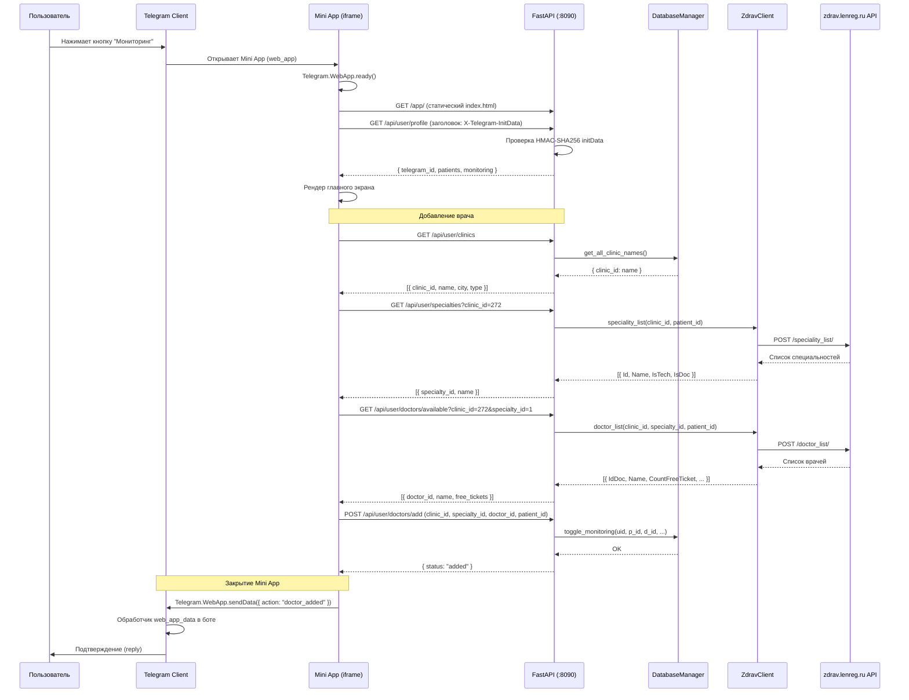
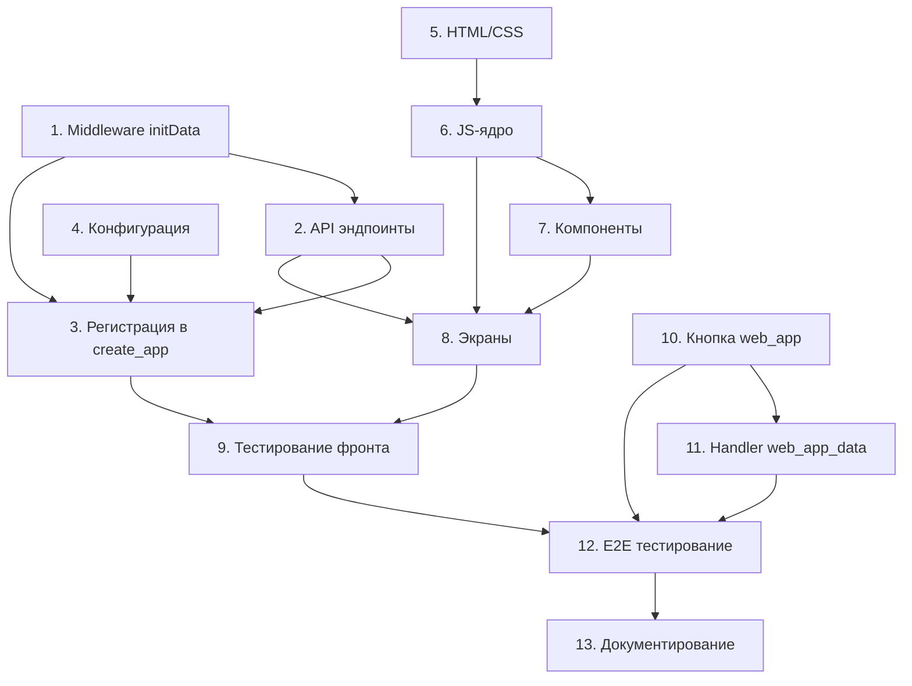

# План реализации Telegram Mini App

> **Статус:** Проект
> **Версия:** 1.0.0
> **Связанные документы:** [`ARCHITECTURE.md`](../ARCHITECTURE.md), [`openapi.yaml`](../openapi.yaml), [`web_dashboard_design.md`](web_dashboard_design.md)

## 1. Обзор архитектуры

### 1.1. Диаграмма взаимодействия



### 1.2. Описание потока

1. **Открытие.** Пользователь нажимает кнопку `web_app` в нативном Telegram-интерфейсе бота. Telegram открывает iframe с URL `https://{host}:8090/app/`.

2. **Аутентификация.** Mini App вызывает `Telegram.WebApp.initData` и отправляет его в заголовке `X-Telegram-InitData` при каждом API-запросе. Middleware [`TelegramInitDataMiddleware`](#32-middleware-аутентификации-mini-app) на стороне FastAPI проверяет HMAC-SHA256 подпись, извлекает `telegram_id` и связывает его с пользователем в БД (таблица `users`, поле `telegram_id`).

3. **Работа с данными.** Mini App — SPA (Single Page Application). Все операции выполняются через REST API `/api/user/*`. Данные поликлиник берутся из кэша `DatabaseManager`, данные специальностей и врачей — через live-запросы к `ZdravClient` (здрав API).

4. **Закрытие / отправка данных.** При завершении Mini App вызывает `Telegram.WebApp.sendData()` для уведомления бота о выполненном действии (например, `{"action": "doctor_added", "doctor_name": "..."}`). Бот получает данные через handler `web_app_data` и синхронизирует состояние.

---

## 2. Структура новых и изменяемых файлов

### 2.1. Файлы, которые нужно создать

| Путь                                          | Назначение                                                             |
| --------------------------------------------- | ---------------------------------------------------------------------- |
| `src/web/auth_initdata.py`                    | Middleware проверки `initData` из Telegram Mini App                    |
| `src/web/routers/user_api.py`                 | REST API эндпоинты `/api/user/*` для Mini App                          |
| `src/web/static/app/index.html`               | Точка входа Mini App (HTML)                                            |
| `src/web/static/app/css/style.css`            | Стили Mini App (Telegram-совместимая цветовая схема)                   |
| `src/web/static/app/js/app.js`                | Инициализация Telegram.WebApp, SPA-роутинг                             |
| `src/web/static/app/js/api.js`                | Обёртка над `fetch()` для API-запросов с `initData`                    |
| `src/web/static/app/js/auth.js`               | Получение `initData` и внедрение в заголовки                           |
| `src/web/static/app/js/views/doctors.js`      | Экран списка отслеживаемых врачей + статус слотов                      |
| `src/web/static/app/js/views/add.js`          | Экран добавления врача (пошаговый stepper)                             |
| `src/web/static/app/js/views/slots.js`        | Экран просмотра свободных слотов                                       |
| `src/web/static/app/js/components/header.js`  | Компонент шапки (имя пользователя, кнопки)                             |
| `src/web/static/app/js/components/card.js`    | Компонент карточки врача / слота                                       |
| `src/web/static/app/js/components/stepper.js` | Компонент пошагового выбора (клиника → специальность → врач → пациент) |
| `src/handlers/mini_app.py`                    | Handler `web_app_data` для aiogram-бота                                |

### 2.2. Файлы, которые нужно изменить

| Путь                                                    | Изменения                                                                                                                     |
| ------------------------------------------------------- | ----------------------------------------------------------------------------------------------------------------------------- |
| [`src/web/app.py`](src/web/app.py:28)                   | Добавить mount `/app/` для статики Mini App; подключить `TelegramInitDataMiddleware`; зарегистрировать роутер `user_api.py`   |
| [`src/main.py`](src/main.py:267)                        | Передавать `health_metrics` в `create_app()` (уже передаётся); передача `bot` для инициализации middleware (если потребуется) |
| [`src/config.py`](src/config.py:44)                     | Добавить настройку `MINI_APP_ENABLED: bool = True`                                                                            |
| [`src/keyboards/inline.py`](src/keyboards/inline.py:32) | Добавить `KeyboardButton.web_app` в клавиатуру главного меню                                                                  |
| [`src/handlers/common.py`](src/handlers/common.py:57)   | Обновить главное меню — добавить кнопку Mini App                                                                              |
| [`src/handlers/__init__.py`](src/handlers/__init__.py)  | Экспорт роутера `mini_app.py` (если требуется централизованная регистрация)                                                   |

---

## 3. Бэкенд (FastAPI)

### 3.1. Архитектура безопасности

Mini App использует двухуровневую защиту:

1. **Транспортный уровень:** Telegram открывает Mini App в iframe внутри своего клиента. `initData` подписывается `BOT_TOKEN` и не может быть подделан вне Telegram.
2. **Middleware-уровень:** [`TelegramInitDataMiddleware`](#32-middleware-аутентификации-mini-app) проверяет подпись HMAC-SHA256 на каждом запросе.

Существующий [`APIKeyMiddleware`](src/web/auth.py:15) для админского дашборда остаётся без изменений. Новый middleware применяется только к путям `/api/user/*` и `/app/*`.

### 3.2. Middleware аутентификации Mini App

**Файл:** `src/web/auth_initdata.py`

**Класс:** `TelegramInitDataMiddleware(BaseHTTPMiddleware)`

**Алгоритм верификации `initData`:**

1. Извлечь заголовок `X-Telegram-InitData` из запроса.
2. Распарсить строку `initData` как `application/x-www-form-urlencoded` в словарь.
3. Извлечь поле `hash` (контрольная сумма).
4. Отсортировать все поля, кроме `hash`, по алфавиту.
5. Сформировать строку `data_check_string`: `key1=value1\nkey2=value2\n...`.
6. Вычислить `secret_key = HMAC-SHA256("WebAppData", BOT_TOKEN)`.
7. Вычислить `computed_hash = HMAC-SHA256(data_check_string, secret_key)`.
8. Сравнить `computed_hash` (hex) с `hash` из полей. Если не совпадают → 403 Forbidden.
9. Проверить `auth_date` (опционально: не старше 24 часов).
10. Извлечь `user.id` → `telegram_id`.
11. Сохранить `telegram_id` в `request.state.telegram_id` для использования в эндпоинтах.

> **Важно:** Middleware НЕ обращается к БД — только проверяет подпись. Связывание `telegram_id` с пользователем БД происходит в эндпоинтах через `DatabaseManager.get_user_data(str(telegram_id))`.

**Интеграция с существующей моделью пользователя:**

- В текущей архитектуре `UserData` в `DatabaseManager` индексируется по `uid`, где `uid = str(telegram_id)`.
- `request.state.telegram_id` → `str(telegram_id)` → `db.get_user_data(uid)`.
- Пользователь автоматически создаётся в кэше при первом обращении (см. [`DatabaseManager._get_user_data_nolock()`](src/database/manager.py:49)).

**Пути, защищаемые middleware:**

- `/api/user/*` — все пользовательские эндпоинты Mini App
- `/app/*` — статика Mini App (опционально: отдавать без проверки, т.к. API всё равно требует `initData`)

### 3.3. Новые API-эндпоинты (`/api/user/*`)

**Файл:** `src/web/routers/user_api.py`
**Роутер:** `APIRouter(prefix="/api/user", tags=["Mini App"])`

Все эндпоинты получают `telegram_id` из `request.state.telegram_id` (установлен middleware).
Все ответы возвращаются в формате JSON.

#### 3.3.1. `GET /api/user/profile`

**Назначение:** Получить профиль пользователя (ФИО, список пациентов, статистику мониторинга).

**Ответ (200):**

```json
{
  "telegram_id": "123456789",
  "patients": [
    {
      "patient_id": "2343192",
      "fio": "Иванов Иван Иванович",
      "bday": "1990-01-01",
      "alias": "Ваня",
      "confirmed_clinics": [272, 15]
    }
  ],
  "monitoring_count": 3,
  "stats": {
    "total_patients": 2,
    "total_monitored_doctors": 5
  }
}
```

**Используемые методы:**

- [`DatabaseManager.get_user_data(telegram_id)`](src/database/manager.py:44) — получает `UserData`

**Ошибки:**

- `403` — невалидный `initData`
- `500` — ошибка БД

#### 3.3.2. `GET /api/user/doctors`

**Назначение:** Список отслеживаемых врачей со статусом слотов.

**Query-параметры:**

- `patient_id` (опционально) — фильтр по пациенту

**Ответ (200):**

```json
{
  "doctors": [
    {
      "monitoring_id": "2343192_12345",
      "patient_id": "2343192",
      "patient_name": "Иванов Иван",
      "doctor_id": "12345",
      "doctor_name": "Петрова А.С.",
      "specialty": "Терапевт",
      "clinic_id": "272",
      "clinic_name": "ГБУЗ ЛО 'Токсовская МБ' — поликлиника",
      "status": "slots_available",
      "free_tickets": 3,
      "last_check": "2026-05-22T10:30:00+03:00"
    }
  ]
}
```

**Используемые методы:**

- [`DatabaseManager.get_user_data(telegram_id)`](src/database/manager.py:44) — получает `monitoring`
- [`DatabaseManager.get_clinic_name(clinic_id)`](src/database/manager.py:264) — название клиники
- [`ZdravClient`](src/api/zdrav_client.py) — живой запрос свободных слотов (опционально, кэшируется)

**Статусы:**

- `slots_available` — есть свободные слоты
- `no_slots` — слотов нет
- `checking` — идёт проверка (неизвестно)

#### 3.3.3. `POST /api/user/doctors/add`

**Назначение:** Добавить врача в мониторинг.

**Тело запроса:**

```json
{
  "clinic_id": "272",
  "specialty_id": "1",
  "doctor_id": "12345",
  "patient_id": "2343192"
}
```

**Ответ (200):**

```json
{
  "status": "added",
  "doctor_name": "Петрова А.С.",
  "specialty": "Терапевт",
  "clinic_name": "ГБУЗ ЛО 'Токсовская МБ'"
}
```

**Используемые методы:**

- [`DatabaseManager.toggle_monitoring()`](src/database/manager.py:205) — атомарное добавление/удаление
- [`DatabaseManager.get_clinic_name()`](src/database/manager.py:264) — для ответа
- [`ZdravClient`](src/api/zdrav_client.py) — предварительная проверка существования врача (опционально)

**Примечание:** `toggle_monitoring` переключает состояние. Для явного добавления нужно сначала проверить, что врач не отслеживается, иначе он будет удалён. В Mini App API используется семантика «добавить» (вызывается только если врач не отслеживается).

**Альтернативный подход:** Вызывать `toggle_monitoring` с гарантией, что врач ещё не отслеживается (проверка на клиенте).

#### 3.3.4. `DELETE /api/user/doctors/{monitoring_id}`

**Назначение:** Удалить врача из мониторинга.

**Параметры пути:**

- `monitoring_id` — строка формата `{patient_id}_{doctor_id}`

**Ответ (200):**

```json
{
  "status": "removed",
  "doctor_name": "Петрова А.С."
}
```

**Используемые методы:**

- [`DatabaseManager.toggle_monitoring()`](src/database/manager.py:205)

**Ошибки:**

- `404` — врач не найден в мониторинге

#### 3.3.5. `GET /api/user/clinics`

**Назначение:** Список поликлиник (из кэша БД).

**Ответ (200):**

```json
{
  "clinics": [
    {
      "clinic_id": "272",
      "name": "ГБУЗ ЛО 'Токсовская МБ' — поликлиника",
      "short_name": "поликлиника",
      "type": "all",
      "city": "Токсово",
      "is_active": true
    }
  ]
}
```

**Используемые методы:**

- [`DatabaseManager.get_all_clinic_names()`](src/database/manager.py:267)
- [`DatabaseManager._db.get_active_clinics()`](src/database/database.py) — для `type`, `city`, `is_active`

#### 3.3.6. `GET /api/user/specialties`

**Назначение:** Список специальностей в выбранной поликлинике (живой запрос к API zdrav.lenreg.ru).

**Query-параметры:**

- `clinic_id` (обязательный) — ID поликлиники
- `patient_id` (опциональный) — ID пациента (для получения релевантных специальностей)

**Ответ (200):**

```json
{
  "clinic_id": "272",
  "specialties": [
    {
      "specialty_id": "1",
      "name": "Терапевт",
      "is_tech": false,
      "is_doc": true
    }
  ]
}
```

**Используемые методы:**

- [`ZdravClient.fetch_specialties(clinic_id, patient_id)`](src/api/zdrav_client.py) — живой запрос
- Или [`fetch_specialties()`](src/services/doctor_discovery.py:46) из `doctor_discovery.py`

**Ошибки:**

- `502` — API zdrav.lenreg.ru недоступно
- `504` — таймаут запроса

#### 3.3.7. `GET /api/user/doctors/available`

**Назначение:** Список врачей по специальности в поликлинике (живой запрос к API).

**Query-параметры:**

- `clinic_id` (обязательный)
- `specialty_id` (обязательный)
- `patient_id` (обязательный)

**Ответ (200):**

```json
{
  "clinic_id": "272",
  "specialty_id": "1",
  "doctors": [
    {
      "doctor_id": "12345",
      "name": "Петрова Анна Сергеевна",
      "free_tickets": 3,
      "nearest_date": "2026-06-01"
    }
  ]
}
```

**Используемые методы:**

- [`ZdravClient`](src/api/zdrav_client.py) — запрос `doctor_list`

#### 3.3.8. `GET /api/user/patients`

**Назначение:** Список пациентов пользователя.

**Ответ (200):**

```json
{
  "patients": [
    {
      "patient_id": "2343192",
      "fio": "Иванов Иван Иванович",
      "bday": "1990-01-01",
      "alias": "Ваня",
      "confirmed_clinics": [272]
    }
  ]
}
```

**Используемые методы:**

- [`DatabaseManager.get_user_data(telegram_id)`](src/database/manager.py:44)

#### 3.3.9. `POST /api/user/patients/add`

**Назначение:** Добавить нового пациента (аналог FSM-регистрации через Mini App).

**Тело запроса:**

```json
{
  "full_name": "Иванов Иван Иванович",
  "birth_date": "1990-01-01",
  "policy": "1234567890123456"
}
```

**Ответ (200):**

```json
{
  "status": "added",
  "patient_id": "2343192",
  "fio": "Иванов Иван Иванович"
}
```

**Используемые методы:**

- [`ZdravClient.fetch_patient_id(fio, date, clinic_id)`](src/api/zdrav_client.py)
- [`DatabaseManager.add_patient(uid, p_id, p_info)`](src/database/manager.py:169)

**Логика:**

1. Вызвать `fetch_patient_id()` с перебором clinic_id (как в [`process_bday()`](src/handlers/registration.py:63)).
2. При успехе — сохранить через `add_patient()`.
3. При неудаче — вернуть ошибку с сообщением.

**Ошибки:**

- `400` — некорректный формат ФИО/даты
- `404` — пациент не найден в системе zdrav.lenreg.ru
- `409` — пациент уже добавлен

#### 3.3.10. `GET /api/user/slots`

**Назначение:** Свободные слоты для отслеживаемого врача.

**Query-параметры:**

- `monitoring_id` (обязательный) — строка `{patient_id}_{doctor_id}`

**Ответ (200):**

```json
{
  "monitoring_id": "2343192_12345",
  "doctor_name": "Петрова А.С.",
  "specialty": "Терапевт",
  "clinic_name": "ГБУЗ ЛО 'Токсовская МБ'",
  "slots": [
    {
      "date": "2026-06-01",
      "time": "09:00",
      "clinic_id": "272"
    },
    {
      "date": "2026-06-02",
      "time": "11:30",
      "clinic_id": "272"
    }
  ],
  "total": 2
}
```

**Используемые методы:**

- [`ZdravClient.get_appointment_list(clinic_id, doctor_id, patient_id)`](src/api/zdrav_client.py) — живой запрос
- [`DatabaseManager.get_clinic_name()`](src/database/manager.py:264)

### 3.4. Раздача статики Mini App

**Изменения в** [`create_app()`](src/web/app.py:28):

1. Новый mount для Mini App:

```python
# Существующий mount дашборда
app.mount("/static", StaticFiles(directory=_static_dir), name="static")

# Новый mount для Mini App
_app_static_dir = os.path.join(_static_dir, "app")
if os.path.isdir(_app_static_dir):
    app.mount("/app", StaticFiles(directory=_app_static_dir, html=True), name="mini_app")
```

1. Параметр `html=True` позволяет отдавать `index.html` при запросе `/app/`.

2. CORS не требуется: Mini App работает в iframe внутри Telegram, запросы идут на тот же origin.

3. Подключение нового middleware и роутера:

```python
# Middleware аутентификации Mini App (применяется к /api/user/)
from src.web.auth_initdata import TelegramInitDataMiddleware
app.add_middleware(TelegramInitDataMiddleware, bot_token=config.BOT_TOKEN)

# Роутер Mini App API
from src.web.routers import user_api
app.include_router(user_api.router, prefix="/api/user")
```

---

## 4. Фронтенд (Mini App)

### 4.1. Технологический стек

**Рекомендация для MVP: Vanilla JavaScript (ES6+).**

| Критерий                      | Vanilla JS             | Svelte              | React               |
| ----------------------------- | ---------------------- | ------------------- | ------------------- |
| Билд-степ                     | Нет                    | Да (Vite/SvelteKit) | Да (Vite/CRA)       |
| Размер бандла                 | ~5-10 KB               | ~15-20 KB           | ~40+ KB             |
| Зависимости                   | 0                      | ~10 npm-пакетов     | ~50+ npm-пакетов    |
| Отладка                       | F12 в Telegram Desktop | Source maps         | Source maps         |
| Совместимость с `StaticFiles` | Идеально               | Нужен `dist/` mount | Нужен `dist/` mount |

**Выбор: Vanilla JS.** Минимум зависимостей, отсутствие билд-степа, прямая раздача через `StaticFiles`. Фронтенд Mini App небольшой (3 экрана), сложность низкая. Если в будущем потребуется Svelte/React — миграция будет простой (замена JS-файлов).

### 4.2. Структура файлов

```text
src/web/static/app/
├── index.html              # Точка входа, мета-теги, подключение скриптов
├── css/
│   └── style.css           # Стили с CSS-переменными Telegram
├── js/
│   ├── app.js              # Инициализация, SPA-роутер, главный цикл
│   ├── api.js              # Обёртка fetch() с X-Telegram-InitData
│   ├── auth.js             # Получение initData из Telegram.WebApp
│   ├── views/
│   │   ├── doctors.js      # Экран списка врачей + статус
│   │   ├── add.js          # Экран добавления врача (stepper)
│   │   └── slots.js        # Экран просмотра слотов
│   └── components/
│       ├── header.js       # Шапка с именем, кнопки «Назад», «Закрыть»
│       ├── card.js         # Карточка врача / слота
│       └── stepper.js      # Универсальный компонент пошагового выбора
```

### 4.3. Экраны (Views)

#### 4.3.1. Главный экран (`doctors.js`)

**Состояния:**

| Состояние     | Отображение                                                                       |
| ------------- | --------------------------------------------------------------------------------- |
| Загрузка      | Скелетон (3 мигающих плейсхолдера)                                                |
| Пустой список | Иллюстрация + текст «Вы пока не отслеживаете ни одного врача» + кнопка «Добавить» |
| Есть врачи    | Список карточек с цветовой индикацией                                             |
| Ошибка        | Текст ошибки + кнопка «Повторить»                                                 |

**Карточка врача:**

- Имя врача (сокращённое ФИО)
- Специальность
- Клиника
- Статус: 🟢 «Есть слоты (3)», 🔴 «Нет слотов», 🟡 «Проверка...»
- Кнопки: «Слоты» (→ экран слотов), «Удалить» (→ подтверждение)

**Цветовая схема (Telegram-совместимая):**

- Использовать CSS-переменные из `Telegram.WebApp.themeParams`:
  - `--tg-bg-color` → `bg_color`
  - `--tg-text-color` → `text_color`
  - `--tg-hint-color` → `hint_color`
  - `--tg-button-color` → `button_color`
  - `--tg-button-text-color` → `button_text_color`
  - `--tg-secondary-bg-color` → `secondary_bg_color`

#### 4.3.2. Добавление врача (`add.js`)

**Пошаговый stepper:**

```text
Шаг 1: Выбор пациента (если больше одного)
  ↓
Шаг 2: Выбор поликлиники (из кэша БД)
  ↓
Шаг 3: Выбор специальности (живой запрос к API)
  ↓
Шаг 4: Выбор врача (живой запрос к API)
  ↓
Шаг 5: Подтверждение (карточка с информацией)
  ↓
Готово → POST /api/user/doctors/add → Главный экран
```

**Stepper-компонент** (`stepper.js`):

- Отображает текущий шаг и прогресс-бар
- Кнопки «Назад» и «Далее»
- Поддержка асинхронной загрузки данных между шагами
- Обработка ошибок на каждом шаге (retry, пропустить)

**Кэширование:** Список поликлиник кэшируется в `localStorage` (TTL 1 час). Специальности и врачи — всегда live (меняются часто).

#### 4.3.3. Слоты (`slots.js`)

**Отображение:**

- Заголовок: имя врача, специальность, клиника
- Список слотов, сгруппированных по датам
- Для каждой даты: список времени
- Кнопка «Записаться» — deeplink на сайт zdrav.lenreg.ru (открывается в системном браузере)

**Состояния:**

- Загрузка (спиннер)
- Есть слоты (список)
- Нет слотов (сообщение)
- Ошибка API (сообщение + retry)

### 4.4. Telegram.WebApp API

Используемые методы (см. [Telegram Web Apps SDK](https://core.telegram.org/bots/webapps)):

| Метод / Свойство                 | Назначение                                     | Где используется                        |
| -------------------------------- | ---------------------------------------------- | --------------------------------------- |
| `Telegram.WebApp.ready()`        | Сигнал готовности (скрыть плейсхолдер)         | [`app.js`](#appjs-инициализация)        |
| `Telegram.WebApp.initData`       | Строка с данными для аутентификации            | [`auth.js`](#authjs-получение-initdata) |
| `Telegram.WebApp.initDataUnsafe` | Распарсенные данные (для отладки, не для auth) | [`auth.js`](#authjs-получение-initdata) |
| `Telegram.WebApp.MainButton`     | Главная кнопка внизу экрана                    | [`app.js`](#appjs-инициализация)        |
| `Telegram.WebApp.BackButton`     | Кнопка «Назад» в шапке                         | [`app.js`](#appjs-инициализация)        |
| `Telegram.WebApp.HapticFeedback` | Тактильный отклик (вибрация)                   | Карточки, кнопки                        |
| `Telegram.WebApp.sendData()`     | Отправить данные боту при закрытии             | [`app.js`](#appjs-инициализация)        |
| `Telegram.WebApp.close()`        | Закрыть Mini App                               | Кнопка «Закрыть»                        |
| `Telegram.WebApp.themeParams`    | Цветовая схема Telegram                        | [`style.css`](#css-переменные)          |
| `Telegram.WebApp.colorScheme`    | `light` / `dark`                               | [`style.css`](#css-переменные)          |

#### app.js инициализация

```javascript
// Псевдокод инициализации
Telegram.WebApp.ready();
Telegram.WebApp.MainButton.setText('Закрыть')
  .show()
  .onClick(() => {
    Telegram.WebApp.sendData(JSON.stringify({ action: 'closed' }));
    Telegram.WebApp.close();
  });
Telegram.WebApp.BackButton.onClick(() => router.back());
applyTheme(Telegram.WebApp.themeParams);
```

#### auth.js получение initData

```javascript
// initData — строка вида: query_id=...&user=...&auth_date=...&hash=...
const initData = Telegram.WebApp.initData;
// Отправляется в заголовке X-Telegram-InitData при каждом fetch
```

#### CSS-переменные

```css
:root {
  --tg-bg-color: #ffffff;
  --tg-text-color: #000000;
  --tg-hint-color: #999999;
  --tg-button-color: #3390ec;
  --tg-button-text-color: #ffffff;
  --tg-secondary-bg-color: #f4f4f5;
}
```

---

## 5. Интеграция с aiogram-ботом

### 5.1. Кнопка Mini App

**Где добавить:** Клавиатура главного меню — [`get_patient_selection()`](src/keyboards/inline.py:32).

**Тип кнопки:** `KeyboardButton.web_app` (reply-клавиатура, не inline).

**Изменения в** [`src/keyboards/inline.py`](src/keyboards/inline.py:32):

```python
from aiogram.types import KeyboardButton, WebAppInfo

# В get_patient_selection() добавить после списка пациентов:
web_app_button = KeyboardButton(
    text="🌐 Веб-интерфейс",
    web_app=WebAppInfo(url=f"https://{host}:{port}/app/")
)
```

**Альтернативный подход:** Отдельная reply-клавиатура с кнопкой `web_app` + кнопка «Меню» (возврат к inline-клавиатуре).

**URL:** Формируется из `settings.WEB_DASHBOARD_PORT` или отдельной настройки `MINI_APP_URL`.

> **Важно:** Для production URL должен быть HTTPS. В dev-окружении — ngrok/localtunnel или self-signed сертификат. Telegram Web Apps требуют HTTPS для открытия iframe (исключение: `localhost`). Порт 8090 должен быть доступен извне (или через reverse proxy).

**Изменения в** [`src/handlers/common.py`](src/handlers/common.py:57):

- Обновить `/start` или главное меню для показа reply-клавиатуры с кнопкой `web_app` (наряду с существующей inline-клавиатурой выбора пациентов).

### 5.2. Обработчик `web_app_data`

**Файл:** `src/handlers/mini_app.py`
**Роутер:** `Router()`

**Handler:**

```python
from aiogram import Router, F
from aiogram.types import Message

router = Router()

@router.message(F.web_app_data)
async def handle_web_app_data(message: Message, db: DatabaseManager) -> None:
    """Обрабатывает данные, отправленные из Mini App через sendData()."""
    if not message.web_app_data:
        return

    try:
        import json
        data = json.loads(message.web_app_data.data)
    except (json.JSONDecodeError, TypeError):
        await message.answer("⚠️ Некорректные данные от Mini App.")
        return

    action = data.get("action", "")
    uid = str(message.from_user.id) if message.from_user else "unknown"

    if action == "doctor_added":
        doctor_name = data.get("doctor_name", "неизвестный врач")
        specialty = data.get("specialty", "")
        clinic = data.get("clinic_name", "")
        await message.answer(
            f"✅ Врач добавлен в мониторинг:\n"
            f"👨‍⚕️ {doctor_name}\n"
            f"📋 {specialty}\n"
            f"🏥 {clinic}"
        )
        # Обновить кэш (синхронизация)
        await db.refresh_cache()

    elif action == "doctor_removed":
        doctor_name = data.get("doctor_name", "неизвестный врач")
        await message.answer(f"🗑 Врач удалён из мониторинга: {doctor_name}")
        await db.refresh_cache()

    elif action == "slots_viewed":
        # Только логирование (опционально)
        pass

    elif action == "closed":
        # Mini App закрыт без действий
        pass

    else:
        await message.answer(f"⚠️ Неизвестное действие: {action}")
```

**Регистрация роутера** в [`main.py`](src/main.py:412):

```python
from src.handlers import mini_app
dp.include_router(mini_app.router)
```

---

## 6. Порядок реализации

| #   | Шаг                                | Описание                                                                                                                                                     | Зависит от  | Выполняет |
| --- | ---------------------------------- | ------------------------------------------------------------------------------------------------------------------------------------------------------------ | ----------- | --------- |
| 1   | Middleware аутентификации          | Создать [`src/web/auth_initdata.py`](#32-middleware-аутентификации-mini-app) с `TelegramInitDataMiddleware` (проверка HMAC-SHA256, извлечение `telegram_id`) | —           | code      |
| 2   | API-эндпоинты                      | Создать [`src/web/routers/user_api.py`](#33-новые-api-эндпоинты-apiuser) со всеми эндпоинтами `/api/user/*`                                                  | Шаг 1       | code      |
| 3   | Регистрация в `create_app()`       | Изменить [`src/web/app.py`](src/web/app.py:28): mount `/app/`, подключить middleware и роутер                                                                | Шаг 1, 2    | code      |
| 4   | Конфигурация                       | Добавить `MINI_APP_ENABLED` и `MINI_APP_URL` в [`src/config.py`](src/config.py:44)                                                                           | —           | code      |
| 5   | Статика Mini App: HTML/CSS         | Создать [`index.html`](#43-экраны-views) и [`style.css`](#css-переменные)                                                                                    | —           | code      |
| 6   | Статика Mini App: JS-ядро          | Создать [`app.js`](#appjs-инициализация), [`api.js`](#44-telegramwebapp-api), [`auth.js`](#authjs-получение-initdata)                                        | —           | code      |
| 7   | Статика Mini App: компоненты       | Создать [`header.js`](#42-структура-файлов), [`card.js`](#42-структура-файлов), [`stepper.js`](#42-структура-файлов)                                         | Шаг 6       | code      |
| 8   | Статика Mini App: экраны           | Создать [`doctors.js`](#431-главный-экран-doctorsjs), [`add.js`](#432-добавление-врача-addjs), [`slots.js`](#433-слоты-slotsjs)                              | Шаг 2, 6, 7 | code      |
| 9   | Интеграционное тестирование фронта | Проверить все экраны в Telegram Desktop (F12) с реальным `initData`                                                                                          | Шаг 3, 8    | code      |
| 10  | Кнопка web_app в боте              | Изменить [`src/keyboards/inline.py`](src/keyboards/inline.py:32) и [`src/handlers/common.py`](src/handlers/common.py:57)                                     | —           | code      |
| 11  | Handler `web_app_data`             | Создать [`src/handlers/mini_app.py`](#52-обработчик-web_app_data), зарегистрировать в [`main.py`](src/main.py:412)                                           | Шаг 10      | code      |
| 12  | End-to-end тестирование            | Проверить полный flow: кнопка → Mini App → добавление врача → sendData → бот                                                                                 | Все шаги    | code      |
| 13  | Документирование                   | Обновить [`ARCHITECTURE.md`](../ARCHITECTURE.md) (дерево, зоны ответственности, граф)                                                                        | Все шаги    | code      |

### 6.1. Зависимости между шагами



---

## 7. Ограничения и риски

### 7.1. Технические ограничения

| Ограничение                                    | Влияние                                                            | Mitigation                                                                                                                                 |
| ---------------------------------------------- | ------------------------------------------------------------------ | ------------------------------------------------------------------------------------------------------------------------------------------ |
| Mini App требует HTTPS                         | В dev-окружении нужен ngrok/localtunnel или self-signed сертификат | Использовать `ngrok http 8090` для разработки; в production — reverse proxy (nginx) с Let's Encrypt                                        |
| `initData` валиден только внутри Telegram      | Нельзя отладить API в браузере без Telegram                        | Mock-заголовок `X-Telegram-InitData` с тестовым `hash` для dev-окружения (отключаемая проверка в middleware при `ENVIRONMENT=development`) |
| `sendData()` лимит 4096 байт                   | Нельзя передать большой объём данных обратно в бота                | Отправлять только тип действия и идентификаторы; детали получать через API                                                                 |
| Размер окна не контролируется                  | Верстка должна быть адаптивной                                     | Использовать `viewport` мета-тег, flexbox, относительные единицы                                                                           |
| `Telegram.WebApp` API доступен только в iframe | Нет доступа к API вне Telegram                                     | Проверять `window.Telegram.WebApp` и показывать ошибку, если недоступен                                                                    |
| Живые запросы к zdrav API из Mini App          | Rate limiting, медленные ответы                                    | Кэшировать специальности (TTL 5 мин); показывать индикаторы загрузки                                                                       |

### 7.2. Безопасность

| Риск                             | Уровень     | Mitigation                                                              |
| -------------------------------- | ----------- | ----------------------------------------------------------------------- |
| Подделка `initData`              | Высокий     | HMAC-SHA256 верификация на каждом запросе (ключ: `BOT_TOKEN`)           |
| Replay-атака (повтор `initData`) | Средний     | Проверка `auth_date` (не старше 24 часов; настраиваемо)                 |
| Утечка `BOT_TOKEN` через клиент  | Критический | `BOT_TOKEN` используется только на сервере; в JS-код не попадает        |
| CSRF (из другого Mini App)       | Низкий      | `initData` привязан к конкретному боту (user + bot_id в данных)         |
| Инъекция через `sendData()`      | Низкий      | Всегда парсить через `json.loads()`, валидировать `action` по whitelist |

### 7.3. Производительность

| Проблема                                      | Влияние                                         | Mitigation                                                                           |
| --------------------------------------------- | ----------------------------------------------- | ------------------------------------------------------------------------------------ |
| Много запросов в stepper (4 шага = 4 запроса) | Задержка при добавлении врача                   | Объединить специальности + врачи в один batch-эндпоинт (опционально, в v2)           |
| Живой запрос слотов для всех врачей           | N+1 запросов на главном экране                  | Отдельный эндпоинт `POST /api/user/doctors/slots/batch` для массовой проверки (в v2) |
| In-memory кэш DatabaseManager                 | Всегда актуален, но блокирует на `asyncio.Lock` | `get_user_data()` — O(1); блокировка кратковременна                                  |

### 7.4. Совместимость

| Окружение                              | Статус            | Примечание                                                     |
| -------------------------------------- | ----------------- | -------------------------------------------------------------- |
| Telegram Desktop (Windows/macOS/Linux) | ✅ Поддерживается | F12 для отладки                                                |
| Telegram iOS                           | ✅ Поддерживается | Ограниченная отладка (нет DevTools)                            |
| Telegram Android                       | ✅ Поддерживается | Ограниченная отладка                                           |
| Telegram Web (web.telegram.org)        | ⚠️ Частично       | Mini App может не работать в Web-версии (ограничение Telegram) |

### 7.5. Эксплуатационные риски

| Риск                                        | Вероятность | Влияние                                                    | Mitigation                                                                                |
| ------------------------------------------- | ----------- | ---------------------------------------------------------- | ----------------------------------------------------------------------------------------- |
| API zdrav.lenreg.ru изменяет формат ответа  | Средняя     | Mini App не может загрузить специальности/врачей           | Schema watcher уже отслеживает изменения; fallback — показать ошибку и кнопку «повторить» |
| Redis недоступен                            | Низкая      | Mini App работает (Redis не используется для Mini App API) | —                                                                                         |
| SQLite блокировка при одновременных записях | Низкая      | Кратковременная задержка                                   | WAL-режим уже включён; `asyncio.Lock` в `DatabaseManager`                                 |
| Порт 8090 занят                             | Низкая      | Mini App недоступен                                        | Fallback-порты (8091, 8092, 8093) уже реализованы в `_run_dashboard_safe()`               |
| Утечка `BOT_TOKEN` через логи               | Низкая      | Компрометация бота                                         | `BOT_TOKEN` не логируется; middleware не пишет `initData` в логи                          |

---

## Приложение A: Модели данных (JSON-схемы)

### A.1. Ответ `GET /api/user/profile`

```json
{
  "$schema": "https://json-schema.org/draft/2020-12/schema",
  "title": "UserProfileResponse",
  "type": "object",
  "properties": {
    "telegram_id": { "type": "string" },
    "patients": {
      "type": "array",
      "items": {
        "type": "object",
        "properties": {
          "patient_id": { "type": "string" },
          "fio": { "type": "string" },
          "bday": { "type": "string" },
          "alias": { "type": "string" },
          "confirmed_clinics": {
            "type": "array",
            "items": { "type": "integer" }
          }
        }
      }
    },
    "monitoring_count": { "type": "integer" },
    "stats": {
      "type": "object",
      "properties": {
        "total_patients": { "type": "integer" },
        "total_monitored_doctors": { "type": "integer" }
      }
    }
  }
}
```

### A.2. Ответ `GET /api/user/doctors`

```json
{
  "$schema": "https://json-schema.org/draft/2020-12/schema",
  "title": "DoctorsListResponse",
  "type": "object",
  "properties": {
    "doctors": {
      "type": "array",
      "items": {
        "type": "object",
        "properties": {
          "monitoring_id": { "type": "string" },
          "patient_id": { "type": "string" },
          "patient_name": { "type": "string" },
          "doctor_id": { "type": "string" },
          "doctor_name": { "type": "string" },
          "specialty": { "type": "string" },
          "clinic_id": { "type": "string" },
          "clinic_name": { "type": "string" },
          "status": {
            "type": "string",
            "enum": ["slots_available", "no_slots", "checking"]
          },
          "free_tickets": { "type": "integer" },
          "last_check": { "type": "string", "format": "date-time" }
        }
      }
    }
  }
}
```

---

## Приложение Б: Конфигурация (новые ключи)

Добавить в [`src/config.py`](src/config.py:44) (класс `Settings`):

```python
# === Mini App (F10) ===
MINI_APP_ENABLED: bool = True
MINI_APP_INITDATA_MAX_AGE: int = 86400  # 24 часа
```

Добавить в [`load_config_from_db()`](src/config.py:187) соответствующий mapping (опционально, для переопределения из БД).

---

## Приложение В: Пример `docker-compose.yml` (обновление)

При использовании Docker добавить проброс порта для Mini App:

```yaml
services:
  bot:
    ports:
      - '8090:8090' # Веб-дашборд + Mini App
      - '9090:9090' # Prometheus метрики (уже есть)
```

Или, для production, использовать nginx reverse proxy:

```nginx
server {
    listen 443 ssl;
    server_name bot.example.com;

    ssl_certificate /etc/letsencrypt/live/bot.example.com/fullchain.pem;
    ssl_certificate_key /etc/letsencrypt/live/bot.example.com/privkey.pem;

    location /app/ {
        proxy_pass http://127.0.0.1:8090;
        proxy_set_header Host $host;
        proxy_set_header X-Forwarded-For $proxy_add_x_forwarded_for;
    }

    location /api/user/ {
        proxy_pass http://127.0.0.1:8090;
        proxy_set_header Host $host;
        proxy_set_header X-Forwarded-For $proxy_add_x_forwarded_for;
    }

    location / {
        proxy_pass http://127.0.0.1:8090;
        proxy_set_header Host $host;
        proxy_set_header X-Forwarded-For $proxy_add_x_forwarded_for;
    }
}
```
