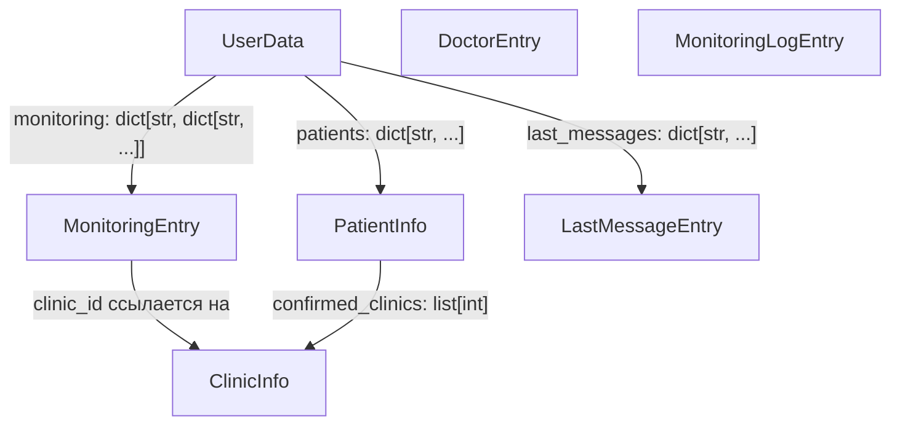

# TD-UTL-004: Проектирование TypedDict вместо строковых литералов

## 1. Анализ текущего состояния

### 1.1. Масштаб проблемы

Строковые литералы-ключи используются в **~140+ местах** по всем модулям проекта:

| Ключ                   | Кол-во использований | Затрагиваемые модули                                                                 |
| ---------------------- | -------------------- | ------------------------------------------------------------------------------------ |
| `"patients"`           | ~35                  | manager, database, monitor, common, export, healthcheck, api, pages, inline, cleanup |
| `"monitoring"`         | ~40                  | manager, database, monitor, common, export, healthcheck, api, pages, inline, cleanup |
| `"last_messages"`      | ~20                  | manager, database, common, cleanup, api, pages                                       |
| `"fio"`                | ~15                  | manager, database, registration, common, export, monitor, inline                     |
| `"bday"`               | ~12                  | manager, database, registration, common                                              |
| `"alias"`              | ~12                  | manager, database, registration, common, export, monitor, inline                     |
| `"confirmed_clinics"`  | ~8                   | manager, database, common                                                            |
| `"name"` (doctor)      | ~15                  | manager, database, monitor, common, export, inline                                   |
| `"clinic_id"` (doctor) | ~12                  | manager, database, monitor, common, export, inline                                   |
| `"specialty"`          | ~15                  | manager, database, monitor, common, export, inline                                   |
| `"msg_id"`             | ~5                   | manager, database                                                                    |
| `"ts"`                 | ~5                   | manager, database                                                                    |

### 1.2. Версия Python и доступные конструкции

- **Python**: `>=3.11` (см. [`pyproject.toml:6`](pyproject.toml:6))
- **mypy**: `>=1.10`, target `py311`
- Доступны: `TypedDict`, `NotRequired`, `Required` из стандартного `typing`
- **Не** используются `typing_extensions` (не нужны — всё есть в stdlib с 3.11)

---

## 2. Проект TypedDict

### 2.1. `PatientInfo` — информация о пациенте

```python
from typing import NotRequired, TypedDict

class PatientInfo(TypedDict):
    """Информация о пациенте (ключ в user_data['patients'])."""

    fio: str
    """ФИО пациента (например, 'Иванов Иван Иванович')."""

    bday: str
    """Дата рождения в формате 'ДД.ММ.ГГГГ'."""

    alias: NotRequired[str]
    """Псевдоним (отображаемое имя). Отсутствует в dict, если None."""

    confirmed_clinics: NotRequired[list[int]]
    """Список clinic_id подтверждённых клиник. Может отсутствовать при создании."""

    clinic_id: NotRequired[str]
    """ID клиники по умолчанию (используется как fallback в monitor.py:186)."""
```

**Обоснование полей:**

| Поле                | Обязательное? | Причина                                                                                                                                                             |
| ------------------- | :-----------: | ------------------------------------------------------------------------------------------------------------------------------------------------------------------- |
| `fio`               |      Да       | Всегда присутствует при создании ([`registration.py:160`](src/handlers/registration.py:160)) и при чтении из БД ([`database.py:307`](src/database/database.py:307)) |
| `bday`              |      Да       | Аналогично `fio`                                                                                                                                                    |
| `alias`             | `NotRequired` | Удаляется из dict когда `None` ([`database.py:312-313`](src/database/database.py:312))                                                                              |
| `confirmed_clinics` | `NotRequired` | Отсутствует при создании через registration, добавляется в [`manager.py:157`](src/database/manager.py:157)                                                          |
| `clinic_id`         | `NotRequired` | Не хранится в таблице `user_patients`; используется как fallback в [`monitor.py:186`](src/services/monitor.py:186) — вероятно, добавляется вне БД                   |

### 2.2. `MonitoringEntry` — запись мониторинга врача

```python
class MonitoringEntry(TypedDict):
    """Запись об отслеживаемом враче (ключ в user_data['monitoring'][p_id])."""

    name: str
    """ФИО врача."""

    clinic_id: str
    """ID клиники (строка, т.к. хранится как TEXT в SQLite)."""

    specialty: str
    """Специальность врача."""
```

Все три поля **обязательные** — всегда записываются вместе ([`database.py:398-401`](src/database/database.py:398), [`manager.py:201-204`](src/database/manager.py:201)).

### 2.3. `LastMessageEntry` — запись о последнем сообщении

```python
class LastMessageEntry(TypedDict):
    """Запись о последнем отправленном сообщении (ключ в user_data['last_messages'])."""

    msg_id: int
    """ID сообщения в Telegram."""

    ts: float
    """Unix-timestamp отправки."""
```

Оба поля **обязательные** — всегда записываются парой ([`manager.py:139`](src/database/manager.py:139), [`database.py:233`](src/database/database.py:233)).

### 2.4. `UserData` — агрегат данных пользователя

```python
class UserData(TypedDict):
    """Корневая структура данных пользователя в кэше и БД."""

    patients: dict[str, PatientInfo]
    """Пациенты: ключ — p_id (строка), значение — PatientInfo."""

    monitoring: dict[str, dict[str, MonitoringEntry]]
    """Мониторинг: внешний ключ — p_id, внутренний — d_id."""

    last_messages: dict[str, LastMessageEntry]
    """Последние сообщения: ключ — '{p_id}_{d_id}'."""
```

### 2.5. `DoctorEntry` — запись о враче (таблица `doctors`)

```python
class DoctorEntry(TypedDict):
    """Запись о враче из таблицы doctors (ключ — doctor_id)."""

    name: str
    """ФИО врача."""

    specialty: str
    """Специальность."""
```

Используется в [`database.py:456-458`](src/database/database.py:456) (`get_clinic_doctors`).

### 2.6. `ClinicInfo` — информация о клинике (таблица `clinics`)

```python
class ClinicInfo(TypedDict):
    """Запись о клинике из таблицы clinics."""

    clinic_id: str
    """Уникальный ID клиники."""

    name: str
    """Название клиники."""

    type: str
    """Тип: 'adult' | 'child' | 'all'."""

    is_active: int
    """Флаг активности: 0 или 1 (SQLite boolean)."""

    city: str
    """Город/район (может быть пустой строкой)."""
```

Используется в [`database.py:583-591`](src/database/database.py:583) (`get_active_clinics`).

### 2.7. `MonitoringLogEntry` — запись лога мониторинга

```python
class MonitoringLogEntry(TypedDict):
    """Запись из таблицы monitoring_log."""

    id: int
    uid: str
    p_id: str
    d_id: str
    doctor_name: str
    patient_name: str
    specialty: str
    clinic_name: str
    slot_date: str
    status: str  # 'появился' | 'исчез' | 'уменьшился'
    ts: float
```

Все поля **обязательные** — возвращаются из БД полным набором ([`database.py:797-811`](src/database/database.py:797)).

### 2.8. Сводная диаграмма связей



---

## 3. Размещение TypedDict

### Рекомендация: новый файл [`src/database/types.py`](src/database/types.py)

**Обоснование:**

1. **Принцип единственной ответственности**: текущий [`__init__.py`](src/database/__init__.py) — пустой (только комментарий `# database package`). Засорять его типами нежелательно.
2. **Независимость от рантайм-зависимостей**: [`database.py`](src/database/database.py) содержит SQLite-движок с `aiosqlite`. Типы не должны импортировать `aiosqlite`.
3. **Чистый импорт**: `from src.database.types import UserData, PatientInfo, ...` — семантически ясно.
4. **Возможность переиспользования**: типы могут импортироваться как из `src.database.*`, так и из `src.services.*`, `src.handlers.*` без циклических зависимостей.

**Альтернативы (отклонены):**

| Вариант                    | Причина отказа                                                                    |
| -------------------------- | --------------------------------------------------------------------------------- |
| `src/database/__init__.py` | Смешивает package namespace с типами; пустой `__init__.py` — устоявшаяся практика |
| `src/database/database.py` | Создаёт зависимость типов от `aiosqlite`; файл уже 917 строк                      |
| `src/models.py` (корень)   | Нет пакета `models`; размывает границы ответственности                            |

### Структура `src/database/` после изменений

```text

src/database/
├── __init__.py          # package marker (без изменений)
├── database.py          # SQLite-движок (добавит импорт типов)
├── manager.py           # DatabaseManager (добавит импорт типов)
├── migrations.py        # миграции (без изменений)
└── types.py             # NEW: все TypedDict
```

---

## 4. План миграции

### 4.1. Принцип миграции

**Важно:** TypedDict **не меняет** рантайм-ключи словарей. Ключи остаются строками `"patients"`, `"fio"` и т.д. Типизация работает на уровне **mypy**:

- Аннотации `d: UserData` вместо `d: dict[str, Any]`
- При доступе `d["patients"]` mypy знает, что это `dict[str, PatientInfo]`
- При доступе `d["patiens"]` (опечатка) mypy выдаст ошибку

Миграция **не требует** изменения строковых литералов на именованные константы или `.`-доступ.

### 4.2. Фазы миграции

#### Фаза 0: Создание `types.py` (нет зависимостей)

Создать [`src/database/types.py`](src/database/types.py) со всеми TypedDict из секции 2.

#### Фаза 1: Ядро БД (`database.py` → `manager.py`)

Изменяемые сигнатуры в [`src/database/database.py`](src/database/database.py):

| Метод                        | Было                                      | Стало                                      |
| ---------------------------- | ----------------------------------------- | ------------------------------------------ |
| `get_user()`                 | `-> dict[str, Any] \| None`               | `-> UserData \| None`                      |
| `get_user_patients()`        | `-> dict[str, dict[str, Any]]`            | `-> dict[str, PatientInfo]`                |
| `get_user_monitoring()`      | `-> dict[str, dict[str, dict[str, Any]]]` | `-> dict[str, dict[str, MonitoringEntry]]` |
| `get_last_message()`         | `-> dict[str, Any] \| None`               | `-> LastMessageEntry \| None`              |
| `get_clinic_doctors()`       | `-> dict[str, dict[str, str]]`            | `-> dict[str, DoctorEntry]`                |
| `get_active_clinics()`       | `-> list[dict]`                           | `-> list[ClinicInfo]`                      |
| `get_user_monitoring_logs()` | `-> list[dict]`                           | `-> list[MonitoringLogEntry]`              |
| `get_all_monitoring_logs()`  | `-> list[dict]`                           | `-> list[MonitoringLogEntry]`              |

Изменяемые сигнатуры в [`src/database/manager.py`](src/database/manager.py):

| Метод                      | Было                          | Стало                                                    |
| -------------------------- | ----------------------------- | -------------------------------------------------------- |
| `_data_cache`              | `dict[str, dict[str, Any]]`   | `dict[str, UserData]`                                    |
| `data` property            | `-> dict[str, Any]`           | `-> dict[str, UserData]`                                 |
| `get_user_data()`          | `-> dict[str, Any]`           | `-> UserData`                                            |
| `_get_user_data_nolock()`  | `-> dict[str, Any]`           | `-> UserData`                                            |
| `add_patient(p_info)`      | `p_info: dict[str, Any]`      | `p_info: PatientInfo`                                    |
| `update_user(update_dict)` | `update_dict: dict[str, Any]` | `update_dict: UserData` (частичный) — **см. риск 4.3.3** |

#### Фаза 2: Сервисы

Изменяемые сигнатуры в [`src/services/monitor.py`](src/services/monitor.py):

| Параметр                          | Было             | Стало                       |
| --------------------------------- | ---------------- | --------------------------- |
| `d_info` в `_check_single_doctor` | `dict \| str`    | `MonitoringEntry \| str`    |
| `p_info` в `_check_single_doctor` | `dict`           | `PatientInfo`               |
| `empty_counts`                    | `dict[str, int]` | без изменений (не UserData) |

Изменения в [`src/services/export.py`](src/services/export.py), [`src/services/healthcheck.py`](src/services/healthcheck.py), [`src/services/cleanup.py`](src/services/cleanup.py), [`src/services/metrics.py`](src/services/metrics.py) — аналогичная замена `dict[str, Any]` на `UserData`/`PatientInfo`/`MonitoringEntry` в аннотациях параметров, получаемых от `db.get_user_data()`.

#### Фаза 3: Хендлеры и веб

Изменения в [`src/handlers/common.py`](src/handlers/common.py), [`src/handlers/registration.py`](src/handlers/registration.py), [`src/keyboards/inline.py`](src/keyboards/inline.py), [`src/web/routers/api.py`](src/web/routers/api.py), [`src/web/routers/pages.py`](src/web/routers/pages.py) — замена `dict[str, Any]` на типизированные аннотации.

#### Фаза 4: Мидлвари

[`src/middleware/userdata.py`](src/middleware/userdata.py) — если использует `dict[str, Any]` для user_data.

### 4.3. Ключевая таблица замены литералов

Ниже перечислены **все** строковые литералы, подлежащие косвенной типизации (mypy будет проверять их через TypedDict):

| Литерал                  | TypedDict          | Поле                | Тип значения                            |
| ------------------------ | ------------------ | ------------------- | --------------------------------------- |
| `"patients"`             | `UserData`         | `patients`          | `dict[str, PatientInfo]`                |
| `"monitoring"`           | `UserData`         | `monitoring`        | `dict[str, dict[str, MonitoringEntry]]` |
| `"last_messages"`        | `UserData`         | `last_messages`     | `dict[str, LastMessageEntry]`           |
| `"fio"`                  | `PatientInfo`      | `fio`               | `str`                                   |
| `"bday"`                 | `PatientInfo`      | `bday`              | `str`                                   |
| `"alias"`                | `PatientInfo`      | `alias`             | `NotRequired[str]`                      |
| `"confirmed_clinics"`    | `PatientInfo`      | `confirmed_clinics` | `NotRequired[list[int]]`                |
| `"clinic_id"` (в p_info) | `PatientInfo`      | `clinic_id`         | `NotRequired[str]`                      |
| `"name"` (doctor)        | `MonitoringEntry`  | `name`              | `str`                                   |
| `"clinic_id"` (doctor)   | `MonitoringEntry`  | `clinic_id`         | `str`                                   |
| `"specialty"`            | `MonitoringEntry`  | `specialty`         | `str`                                   |
| `"msg_id"`               | `LastMessageEntry` | `msg_id`            | `int`                                   |
| `"ts"`                   | `LastMessageEntry` | `ts`                | `float`                                 |

---

## 5. Риски и ограничения

### 5.1. Ключ `alias` — удаление при `None`

**Файл:** [`src/database/database.py:312-313`](src/database/database.py:312)

```python
if p_info["alias"] is None:
    del p_info["alias"]
```

**Риск:** TypedDict с `NotRequired` допускает отсутствие ключа, но mypy может ругаться на `del p_info["alias"]` если `alias` объявлен как `NotRequired`. Статический анализ не может гарантировать, что ключ присутствует перед удалением.

**Решение:**

```python
if p_info.get("alias") is None:
    p_info.pop("alias", None)
```

Или оставить `del` с комментарием `# type: ignore[typeddict-unknown-key]` — поскольку рантайм-поведение корректно, а mypy просто не отслеживает `NotRequired`-ключи при `del`.

### 5.2. `MonitoringEntry | str` в monitor.py

**Файл:** [`src/services/monitor.py:160`](src/services/monitor.py:160)

Параметр `d_info` может быть `dict` (новый формат) или `str` (старый формат — только имя врача). Код разветвляется через `isinstance(d_info, dict)`.

**Риск:** Union-тип `MonitoringEntry | str` требует проверки `isinstance` перед доступом к полям TypedDict. Это **уже делается** в коде — проблем не будет.

### 5.3. `update_dict` в `update_user()` — частичный UserData

**Файл:** [`src/database/manager.py:86`](src/database/manager.py:86)

Метод `update_user(uid, update_dict)` принимает **частичный** словарь — например, `{"last_messages": {}}` или `{"monitoring": ..., "last_messages": ...}`. Это не полный `UserData`.

**Решение:** Использовать `TypedDict` с `total=False` для update-словаря, либо оставить `dict[str, Any]` для этого параметра с пояснительным комментарием. Альтернатива — создать отдельный `UserDataUpdate(TypedDict, total=False)` с теми же полями, но все `NotRequired`.

**Рекомендация:** Создать `UserDataUpdate(TypedDict, total=False)`:

```python
class UserDataUpdate(TypedDict, total=False):
    patients: dict[str, PatientInfo]
    monitoring: dict[str, dict[str, MonitoringEntry]]
    last_messages: dict[str, LastMessageEntry]
```

### 5.4. Совместимость с шаблонами Jinja2

**Файлы:** [`src/web/templates/*.html`](src/web/templates/)

Веб-шаблоны получают `dict` из роутеров. TypedDict прозрачен для Jinja2 — шаблоны продолжают работать через `{{ user.patients }}` без изменений.

### 5.5. Ключ `clinic_id` в `PatientInfo`

**Файл:** [`src/services/monitor.py:186`](src/services/monitor.py:186)

```python
clinic_id = d_info.get("clinic_id", p_info.get("clinic_id", settings.DEFAULT_CLINIC_ID))
```

Поле `clinic_id` **не хранится** в таблице `user_patients` (см. [`database.py:296-298`](src/database/database.py:296)). Однако используется в `monitor.py` через `.get("clinic_id", ...)`, что всегда безопасно.

**Риск:** Если `clinic_id` никогда не устанавливается в `p_info`, поле-призрак в TypedDict может вводить в заблуждение.

**Рекомендация:** Добавить `clinic_id` как `NotRequired[str]` с комментарием о legacy-статусе, либо провести аудит — действительно ли оно где-то устанавливается. Если **не устанавливается**, можно удалить и из кода, и из TypedDict (fallback всегда сработает на `DEFAULT_CLINIC_ID`).

### 5.6. Обратная совместимость с тестами

Тесты в [`tests/database/test_database_manager.py`](tests/database/test_database_manager.py) и [`tests/services/test_monitor_full.py`](tests/services/test_monitor_full.py) создают словари напрямую (например, `{"patients": {}, "monitoring": {}}`). После миграции mypy будет проверять эти словари на соответствие `UserData`. Словари, созданные в тестах с правильными ключами, **пройдут** проверку без изменений.

---

## 6. Ожидаемый эффект

| Метрика                             | До                | После                     |
| ----------------------------------- | ----------------- | ------------------------- |
| Сигнатуры с `dict[str, Any]`        | ~25 методов       | 0 (заменены на TypedDict) |
| Строковые литералы под защитой mypy | 0                 | ~140+                     |
| Риск опечатки в ключе               | Высокий (рантайм) | Нулевой (mypy)            |
| Автодополнение в IDE                | Нет               | Да (через TypedDict)      |

---

## 7. Не входит в scope TD-UTL-004

- **НЕ** менять структуру БД или миграции
- **НЕ** менять формат хранения данных (ключи остаются строками)
- **НЕ** добавлять Pydantic-модели (это отдельная задача)
- **НЕ** переписывать `.get()`-доступы на прямой доступ `[]` (это меняет поведение при отсутствии ключа)
- **НЕ** трогать `src/api/models.py` (это модели API, не БД)
