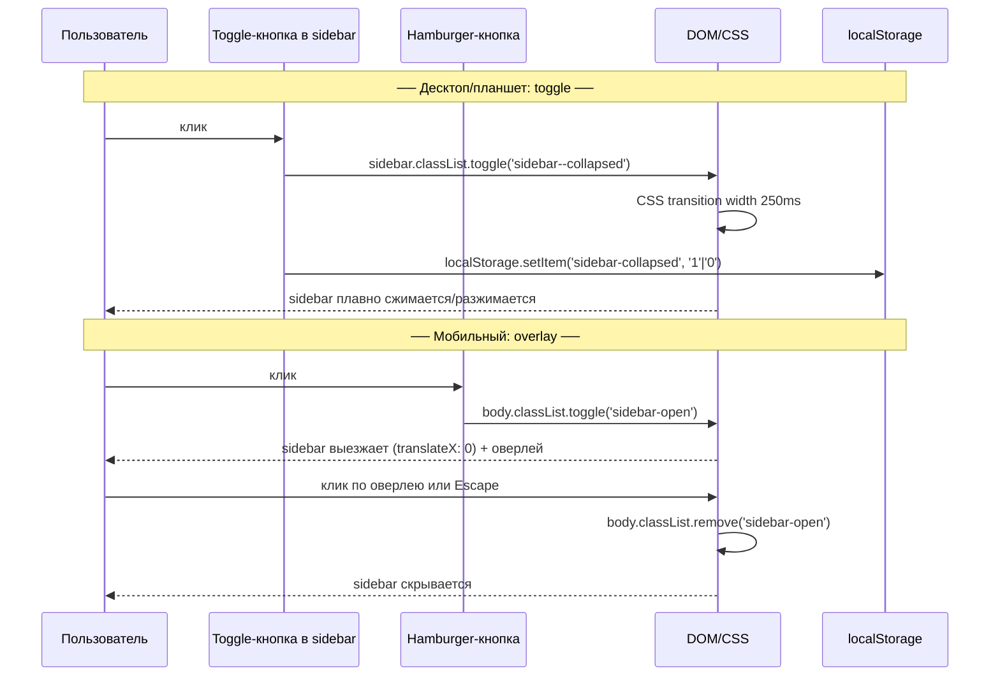

# План: Переработка адаптивной вёрстки дашборда

> **Статус:** Спроектировано, ожидает утверждения
> **Дата:** 2026-06-16
> **Связанные задачи:** F5 (веб-дашборд)

---

## 1. Инвентаризация текущих таблиц (10 экземпляров)

### `.data-table` (6 шт.)

| Шаблон                                                      | Колонок | Колонки                                                         | Примечание               |
| ----------------------------------------------------------- | ------- | --------------------------------------------------------------- | ------------------------ |
| [`summary.html`](src/web/templates/summary.html:100)        | 4       | Время, Пациент, Врач, Статус                                    | Последние 10 алертов     |
| [`clinics.html`](src/web/templates/clinics.html:9)          | 5       | ID, Название, Тип, Город, Врачей                                | Потенциально много строк |
| [`users.html`](src/web/templates/users.html:9)              | 4       | User ID, Пациентов, Мониторингов, Детали                        | Потенциально много строк |
| [`logs.html`](src/web/templates/logs.html:35)               | 8       | UID, Пациент, Врач, Специальность, Клиника, Дата, Статус, Время | Много строк + пагинация  |
| [`user_detail.html`](src/web/templates/user_detail.html:19) | 4       | p_id, ФИО, ДР, Клиники                                          | Пациенты (мало строк)    |
| [`user_detail.html`](src/web/templates/user_detail.html:47) | 4       | p_id, Врач, Специальность, Клиника                              | Врачи (мало строк)       |

### `.info-table` (4 шт.)

| Шаблон                                                                 | Строк | Данные                                                |
| ---------------------------------------------------------------------- | ----- | ----------------------------------------------------- |
| [`summary.html`](src/web/templates/summary.html:8)                     | 7     | Статус бота (Uptime, Пользователей, Пациентов...)     |
| [`summary.html`](src/web/templates/summary.html:70)                    | 4     | API zdrav.lenreg.ru                                   |
| [`_background_tasks.html`](src/web/templates/_background_tasks.html:3) | 3     | Фоновые задачи (monitor_loop, discovery, healthcheck) |
| [`api_status.html`](src/web/templates/api_status.html:8)               | 3     | Статус API (Последняя проверка, Статус, Длительность) |

> **Итого:** 10 таблиц для замены `<table>` → `<div>` + CSS Grid.

---

## 2. Layout-схема дашборда и механика sidebar

Sidebar имеет **три режима**, управляемых комбинацией breakpoint'ов и действий пользователя:

| Режим         | Ширина sidebar                     | Иконки | Текст | Toggle-кнопка | Hamburger |
| ------------- | ---------------------------------- | ------ | ----- | ------------- | --------- |
| **Expanded**  | `--sidebar-width` (240px)          | Да     | Да    | Видна         | Скрыт     |
| **Collapsed** | `--sidebar-width-collapsed` (64px) | Да     | Нет   | Видна         | Скрыт     |
| **Overlay**   | Полная (240px), поверх             | Да     | Да    | Скрыта        | Виден     |

### 2.1 Десктоп (≥1025px) — пользователь управляет

- По умолчанию sidebar в **expanded**-режиме (240px)
- В sidebar'е присутствует **toggle-кнопка** (chevron-иконка), размещённая в нижней части sidebar'а
- Пользователь кликает toggle → sidebar переходит в **collapsed** (64px, только иконки)
- Повторный клик → sidebar возвращается в **expanded**
- Состояние сохраняется в `localStorage` и восстанавливается при загрузке страницы
- Анимация: CSS transition на `width` sidebar'а и `grid-template-columns` на `body`, длительность 250ms

### 2.2 Планшет (769px — 1024px) — collapsed по умолчанию, можно развернуть

- При начальной загрузке sidebar в **collapsed**-режиме (64px), независимо от localStorage
- Toggle-кнопка доступна: пользователь может развернуть sidebar до 240px (expanded)
- Если пользователь развернул — состояние сохраняется в localStorage и действует в рамках сессии
- При переходе через breakpoint 768px вниз (на мобильный) — состояние collapsed/expanded теряет смысл (см. 2.3)
- При возврате на планшетный breakpoint — collapsed восстанавливается

### 2.3 Мобильный (≤768px) — overlay, toggle не участвует

- Sidebar скрыт полностью (`transform: translateX(-100%)`)
- В `main`-области hamburger-кнопка (`position: fixed`, левый верхний угол)
- При клике на hamburger: `body` получает класс `sidebar-open`:
  - Sidebar выезжает поверх (`transform: translateX(0); z-index: var(--z-sidebar);`)
  - Sidebar показывается всегда в **expanded**-режиме (240px, иконка + текст)
  - Оверлей (полупрозрачный backdrop) затемняет контент
- Закрытие: клик по оверлею, клавиша Escape, или клик по hamburger повторно
- Toggle-кнопка в sidebar'е скрыта на этом breakpoint'е (не имеет смысла)



### 2.4 CSS-переменные для sidebar

```css
:root {
  --sidebar-width: 240px;
  --sidebar-width-collapsed: 64px;
  --sidebar-transition: 250ms ease;
  /* ... остальные переменные */
}
```

### 2.5 CSS-классы sidebar

| Класс                     | Назначение                                                                      |
| ------------------------- | ------------------------------------------------------------------------------- |
| `.sidebar`                | Базовый aside, `width: var(--sidebar-width)`                                    |
| `.sidebar--collapsed`     | Суженное состояние: `width: var(--sidebar-width-collapsed)`, текст ссылок скрыт |
| `.sidebar-open` (на body) | Мобильный overlay: sidebar `translateX(0)`, оверлей виден                       |
| `.sidebar__toggle`        | Кнопка сворачивания/разворачивания (chevron)                                    |
| `.sidebar__toggle-icon`   | Иконка chevron внутри кнопки, поворачивается при collapse                       |
| `.sidebar-overlay`        | Полупрозрачный backdrop для мобильного overlay                                  |
| `.hamburger`              | Кнопка-гамбургер, видна только ≤768px                                           |

### 2.6 CSS transition — детали анимации

```css
/* На body: grid-template-columns реагирует на изменение --sidebar-width */
body {
  display: grid;
  grid-template-columns: var(--sidebar-width) 1fr;
  grid-template-rows: 1fr auto;
  min-height: 100vh;
  transition: grid-template-columns var(--sidebar-transition);
}

/* На sidebar: width следует за переменной */
.sidebar {
  width: var(--sidebar-width);
  transition: width var(--sidebar-transition);
  overflow-x: hidden; /* обрезаем текст при сужении */
}

/* Текст ссылок: opacity + max-width для плавного исчезновения */
.sidebar__link-text {
  opacity: 1;
  max-width: 200px;
  white-space: nowrap;
  overflow: hidden;
  transition:
    opacity var(--sidebar-transition),
    max-width var(--sidebar-transition);
}

.sidebar--collapsed .sidebar__link-text {
  opacity: 0;
  max-width: 0;
}

/* Chevron иконка поворачивается */
.sidebar__toggle-icon {
  transition: transform var(--sidebar-transition);
}

.sidebar--collapsed .sidebar__toggle-icon {
  transform: rotate(180deg);
}
```

---

## 3. Стратегия замены `<table>` → CSS Grid

### 3.1 `.info-table` → `.info-grid` (key-value, 2 колонки)

**Структура HTML (было/стало):**

```html
<!-- БЫЛО -->
<table class="info-table">
  <tr>
    <td>Uptime</td>
    <td>2д 5ч 31м</td>
  </tr>
  <tr>
    <td>Пользователей</td>
    <td>42</td>
  </tr>
</table>

<!-- СТАЛО -->
<div class="info-grid">
  <div class="info-label">Uptime</div>
  <div class="info-value">2д 5ч 31м</div>
  <div class="info-label">Пользователей</div>
  <div class="info-value">42</div>
</div>
```

**CSS:**

```css
.info-grid {
  display: grid;
  grid-template-columns: auto 1fr;
  gap: var(--space-xs) var(--space-lg);
  align-items: baseline;
}

.info-label {
  color: var(--color-text-secondary);
  font-size: 0.85rem;
}

.info-value {
  font-weight: var(--font-weight-medium);
  font-size: 0.85rem;
}

/* Мобильный: стек (label над value) */
@media (width <= 768px) {
  .info-grid {
    grid-template-columns: 1fr;
    gap: var(--space-xs);
  }
  .info-label {
    font-size: 0.75rem;
    text-transform: uppercase;
    letter-spacing: 0.05em;
  }
  /* Разделитель между парами */
  .info-label + .info-value {
    margin-bottom: var(--space-md);
  }
}
```

### 3.2 `.data-table` → `.dg-table` (многоколоночные данные)

**Структура HTML (на примере clinics, 5 колонок):**

```html
<!-- БЫЛО -->
<table class="data-table">
  <thead>
    <tr>
      <th>ID</th>
      <th>Название</th>
      ...
    </tr>
  </thead>
  <tbody>
    <tr>
      <td>272</td>
      <td>ГБУЗ...</td>
      ...
    </tr>
  </tbody>
</table>

<!-- СТАЛО -->
<div class="dg-table" role="table" aria-label="Клиники" style="--dg-cols: 5">
  <div class="dg-header" role="row">
    <div class="dg-cell" role="columnheader">ID</div>
    <div class="dg-cell" role="columnheader">Название</div>
    <div class="dg-cell" role="columnheader">Тип</div>
    <div class="dg-cell" role="columnheader">Город</div>
    <div class="dg-cell" role="columnheader">Врачей</div>
  </div>
  <div class="dg-row" role="row">
    <div class="dg-cell" role="cell" data-label="ID"><code>272</code></div>
    <div class="dg-cell" role="cell" data-label="Название">
      ГБУЗ ЛО "Всеволожская КМБ"
    </div>
    <div class="dg-cell" role="cell" data-label="Тип">
      <span class="badge badge-info">adult</span>
    </div>
    <div class="dg-cell" role="cell" data-label="Город">Всеволожск</div>
    <div class="dg-cell" role="cell" data-label="Врачей">34</div>
  </div>
</div>
```

**CSS — Десктоп:**

```css
.dg-table {
  display: grid;
  grid-template-columns: repeat(var(--dg-cols, 1), auto);
  font-size: 0.85rem;
  width: 100%;
}

.dg-header,
.dg-row {
  display: contents; /* ячейки участвуют в родительском Grid напрямую */
}

.dg-header > .dg-cell {
  background: var(--color-border);
  color: var(--color-text-secondary);
  font-weight: var(--font-weight-semibold);
  text-transform: uppercase;
  font-size: 0.75rem;
  letter-spacing: 0.05em;
  padding: 0.5rem 0.75rem;
  position: sticky;
  top: 0;
  z-index: 1;
}

.dg-row:nth-child(even) > .dg-cell {
  background: var(--color-bg-primary);
}

.dg-row:hover > .dg-cell {
  background: var(--color-border);
}

.dg-cell {
  padding: 0.5rem 0.75rem;
  border-bottom: 1px solid var(--color-border);
}

/* Разделитель между строками — бордер на первой ячейке ряда? Нет, на всех */
```

**Важно:** `display: contents` у `.dg-row` означает, что сама `.dg-row` не генерирует бокс — её дети напрямую участвуют в гриде `.dg-table`. Это даёт ровное выравнивание колонок как у таблицы.

**CSS — Мобильный (карточный layout):**

```css
@media (width <= 768px) {
  .dg-table {
    grid-template-columns: 1fr; /* один столбец */
    gap: var(--space-md);
  }

  .dg-header {
    display: none; /* заголовок скрыт */
  }

  .dg-row {
    display: grid;
    grid-template-columns: 1fr 2fr; /* label: value */
    gap: var(--space-xs) var(--space-md);
    padding: var(--space-md);
    background: var(--color-bg-secondary);
    border: 1px solid var(--color-border-strong);
    border-radius: var(--radius-md);
  }

  .dg-cell {
    padding: 0;
    border-bottom: none;
  }

  /* Псевдо-лейблы из data-label */
  .dg-cell::before {
    content: attr(data-label);
    display: block;
    color: var(--color-text-secondary);
    font-weight: var(--font-weight-semibold);
    font-size: 0.75rem;
    text-transform: uppercase;
    letter-spacing: 0.05em;
    margin-bottom: var(--space-xs);
  }
}
```

### 3.3 Специфичные колоночные раскладки

Для разных таблиц нужны разные `grid-template-columns` — не все колонки равнозначны. Предлагаю добавить модификаторы через CSS-переменные или классы:

```css
/* clinics: ID (узкая) | Название (широкая) | Тип (узкая) | Город (средняя) | Врачей (узкая) */
.dg-table--clinics {
  grid-template-columns: 60px 1fr 80px 120px 60px;
}

/* users: User ID (средняя) | Пациентов (узкая) | Мониторингов (узкая) | Детали (узкая) */
.dg-table--users {
  grid-template-columns: 120px 100px 120px 100px;
}

/* logs: 8 колонок — UID, Пациент, Врач, Специальность, Клиника, Дата, Статус, Время */
.dg-table--logs {
  grid-template-columns: 80px 1fr 1fr 120px 1fr 100px 100px 120px;
}

/* summary alerts: Время, Пациент, Врач, Статус */
.dg-table--alerts {
  grid-template-columns: 140px 1fr 1fr 100px;
}

/* user_detail patients: p_id, ФИО, ДР, Клиники */
.dg-table--patients {
  grid-template-columns: 80px 1fr 100px 1fr;
}

/* user_detail doctors: p_id, Врач, Специальность, Клиника */
.dg-table--doctors {
  grid-template-columns: 80px 1fr 120px 80px;
}

/* api_status schemas: Endpoint, Статус */
.dg-table--schemas {
  grid-template-columns: 1fr 1fr;
}
```

При мобильном разрешении все сводятся к `grid-template-columns: 1fr` (карточный режим).

---

## 4. CSS-переменные (дизайн-токены) — дополнения

Добавить в `:root` блока `dashboard.css`:

```css
:root {
  /* === Боковая панель === */
  --sidebar-width: 240px;
  --sidebar-width-collapsed: 64px;
  --sidebar-bg: var(--color-bg-secondary);
  --sidebar-border: var(--color-border-strong);
  --sidebar-transition: 0.25s ease;

  /* === Точки перелома (как переменные для документации) === */
  --bp-tablet: 1024px;
  --bp-mobile: 768px;

  /* === Оверлей === */
  --overlay-bg: rgb(0 0 0 / 50%);
  --overlay-z: 90;

  /* === Z-индексы === */
  --z-sidebar: 100;
  --z-hamburger: 110;
  --z-overlay: 90;
}
```

---

## 5. JavaScript — [`dashboard.js`](src/web/static/dashboard.js)

Файл [`dashboard.js`](src/web/static/dashboard.js) (новый) — единственный JS-файл дашборда, подключается в [`base.html`](src/web/templates/base.html) с `defer`. Отвечает за три независимые функции:

### 5.1 Инициализация (DOMContentLoaded)

1. **Читает localStorage** ключ `sidebar-collapsed`:
   - Значение `'1'` → sidebar был свёрнут при прошлом посещении
   - Значение `'0'` или отсутствие → sidebar был развёрнут
2. **Определяет текущий breakpoint** через `window.matchMedia('(width <= 768px)')`:
   - На мобильном (≤768px): игнорирует localStorage, sidebar скрыт (overlay-режим), hamburger видим, toggle скрыт
   - На планшете (769–1024px): sidebar по умолчанию collapsed (64px), даже если localStorage говорит expanded. Пользователь может развернуть через toggle
   - На десктопе (≥1025px): применяет сохранённое состояние — если `'1'`, добавляет класс `.sidebar--collapsed`
3. **Применяет класс**: `sidebar.classList.add('sidebar--collapsed')` если нужно

### 5.2 Toggle (кнопка сворачивания/разворачивания)

Элемент: `#sidebar-toggle-collapse` — кнопка с chevron-иконкой, расположена в нижней части sidebar'а.

- Переключает класс `.sidebar--collapsed` на `<aside id="sidebar">`
- Обновляет `aria-expanded` на кнопке (true = sidebar развёрнут)
- Сохраняет выбор в `localStorage` (`'1'` = collapsed, `'0'` = expanded)
- Видна только на десктопе и планшете; на мобильном (`≤768px`) скрыта

### 5.3 Mobile overlay (hamburger)

Элементы: `#sidebar-toggle-mobile` (hamburger-кнопка), `#sidebar-overlay` (backdrop).

- При клике: `body.classList.toggle('sidebar-open')`
- При открытии: фокус переводится на первый пункт меню для a11y
- Закрытие: клик по оверлею, повторный клик по hamburger, клавиша Escape
- При закрытии: фокус возвращается на hamburger

### 5.4 Resize listener

Через `window.matchMedia('(width <= 768px)')`:

| Переход                    | Действие                                                                                                                                  |
| -------------------------- | ----------------------------------------------------------------------------------------------------------------------------------------- |
| → Мобильный (≤768px)       | Убрать `.sidebar--collapsed` (overlay всегда expanded). Скрыть toggle, показать hamburger                                                 |
| → Десктоп/планшет (>768px) | Закрыть overlay если открыт. Показать toggle, скрыть hamburger. Планшет → collapsed принудительно. Десктоп → восстановить из localStorage |

### 5.5 Полный каркас dashboard.js

```javascript
// dashboard.js — sidebar: collapsible toggle + mobile overlay
document.addEventListener("DOMContentLoaded", () => {
  const sidebar = document.getElementById("sidebar");
  const toggleBtn = document.getElementById("sidebar-toggle-collapse");
  const hamburger = document.getElementById("sidebar-toggle-mobile");
  const overlay = document.getElementById("sidebar-overlay");
  const mobileQuery = window.matchMedia("(width <= 768px)");

  // ── Инициализация ──
  function init() {
    if (mobileQuery.matches) {
      // Мобильный: sidebar скрыт, hamburger видим, toggle скрыт
      sidebar.classList.remove("sidebar--collapsed");
      if (toggleBtn) toggleBtn.style.display = "none";
      if (hamburger) hamburger.style.display = "";
    } else {
      // Десктоп/планшет: hamburger скрыт, toggle видим
      if (hamburger) hamburger.style.display = "none";
      if (toggleBtn) toggleBtn.style.display = "";
      if (window.innerWidth <= 1024) {
        // Планшет: всегда collapsed при старте
        sidebar.classList.add("sidebar--collapsed");
      } else if (localStorage.getItem("sidebar-collapsed") === "1") {
        // Десктоп: восстановить состояние
        sidebar.classList.add("sidebar--collapsed");
      }
    }
    updateToggleAria();
  }

  // ── Toggle: свернуть/развернуть ──
  function updateToggleAria() {
    if (!toggleBtn) return;
    const collapsed = sidebar.classList.contains("sidebar--collapsed");
    toggleBtn.setAttribute("aria-expanded", String(!collapsed));
    toggleBtn.setAttribute(
      "aria-label",
      collapsed ? "Развернуть меню" : "Свернуть меню",
    );
  }

  toggleBtn?.addEventListener("click", () => {
    const collapsed = sidebar.classList.toggle("sidebar--collapsed");
    localStorage.setItem("sidebar-collapsed", collapsed ? "1" : "0");
    updateToggleAria();
  });

  // ── Mobile overlay ──
  function openOverlay() {
    document.body.classList.add("sidebar-open");
    hamburger?.setAttribute("aria-expanded", "true");
    sidebar.querySelector(".sidebar__link")?.focus();
  }

  function closeOverlay() {
    document.body.classList.remove("sidebar-open");
    hamburger?.setAttribute("aria-expanded", "false");
    hamburger?.focus();
  }

  hamburger?.addEventListener("click", () => {
    document.body.classList.contains("sidebar-open")
      ? closeOverlay()
      : openOverlay();
  });

  overlay?.addEventListener("click", closeOverlay);

  document.addEventListener("keydown", (e) => {
    if (
      e.key === "Escape" &&
      document.body.classList.contains("sidebar-open")
    ) {
      closeOverlay();
    }
  });

  // ── Resize: сброс при пересечении breakpoint'а ──
  mobileQuery.addEventListener("change", (e) => {
    if (e.matches) {
      // → мобильный
      sidebar.classList.remove("sidebar--collapsed");
      if (toggleBtn) toggleBtn.style.display = "none";
      if (hamburger) hamburger.style.display = "";
    } else {
      // → десктоп/планшет
      document.body.classList.remove("sidebar-open");
      if (hamburger) hamburger.style.display = "none";
      if (toggleBtn) toggleBtn.style.display = "";
      if (window.innerWidth <= 1024) {
        sidebar.classList.add("sidebar--collapsed");
      } else if (localStorage.getItem("sidebar-collapsed") === "1") {
        sidebar.classList.add("sidebar--collapsed");
      } else {
        sidebar.classList.remove("sidebar--collapsed");
      }
    }
    updateToggleAria();
  });

  init();
});
```

---

## 6. Полный список изменений по файлам

### 6.1 [`dashboard.css`](src/web/static/dashboard.css)

| #   | Изменение                                                                                              | Описание                                                                         |
| --- | ------------------------------------------------------------------------------------------------------ | -------------------------------------------------------------------------------- |
| 1   | Удалить `.navbar`, `.nav-links`, `.nav-brand`                                                          | Горизонтальная навигация заменена на sidebar                                     |
| 2   | Добавить `body` Grid-layout                                                                            | `grid-template-columns: var(--sidebar-width) 1fr; grid-template-rows: 1fr auto;` |
| 3   | Добавить `.sidebar`                                                                                    | `position: sticky; height: 100vh; overflow-y: auto;` со стилями ссылок           |
| 4   | Добавить `.sidebar__brand`, `.sidebar__nav`, `.sidebar__link`                                          | Элементы бокового меню                                                           |
| 5   | Добавить `.hamburger`                                                                                  | Кнопка-гамбургер, скрыта на десктопе, `position: fixed` на мобильных             |
| 6   | Добавить `.sidebar-overlay`                                                                            | Полупрозрачный фон, `position: fixed; z-index: var(--z-overlay)`                 |
| 7   | Заменить `.data-table` → `.dg-table`                                                                   | Grid-таблица с `display: contents` для строк                                     |
| 8   | Добавить `.dg-table--clinics`, `--users`, `--logs`, `--alerts`, `--patients`, `--doctors`, `--schemas` | Модификаторы колонок                                                             |
| 9   | Заменить `.info-table` → `.info-grid`                                                                  | Grid key-value, 2 колонки                                                        |
| 10  | Добавить медиа-запрос `≤1024px`                                                                        | Суженный sidebar (64px, иконки)                                                  |
| 11  | Расширить медиа-запрос `≤768px`                                                                        | Sidebar overlay, карточный режим таблиц, `.hamburger` видим                      |
| 12  | Удалить `td svg`, `th svg` из глобальных селекторов                                                    | Больше нет `<td>`/`<th>`                                                         |

### 6.2 [`base.html`](src/web/templates/base.html)

| #   | Изменение                                                                                                                      |
| --- | ------------------------------------------------------------------------------------------------------------------------------ |
| 1   | Заменить `<nav class="navbar">...</nav>` на `<aside class="sidebar" id="sidebar">` с вертикальным списком ссылок               |
| 2   | Обернуть `<main class="container">` в `<div class="main-area">` для правильного grid-placement                                 |
| 3   | Добавить `<button class="hamburger" id="sidebar-toggle-mobile" aria-label="Меню">` (три полоски SVG)                           |
| 4   | Добавить `<div class="sidebar-overlay" id="sidebar-overlay"></div>`                                                            |
| 5   | Добавить в **нижнюю часть sidebar'а** кнопку `<button class="sidebar__toggle" id="sidebar-toggle-collapse">` с chevron-иконкой |
| 6   | Обернуть текст каждой ссылки в `<span class="sidebar__link-text">` для opacity-анимации                                        |
| 7   | Подключить `<script defer src="/static/dashboard.js"></script>`                                                                |

**Новая структура `body`:**

```html
<body>
  <!-- Мобильный hamburger -->
  <button
    class="hamburger"
    id="sidebar-toggle-mobile"
    aria-label="Меню"
    aria-expanded="false"
  >
    <span class="hamburger__bar"></span>
    <span class="hamburger__bar"></span>
    <span class="hamburger__bar"></span>
  </button>

  <!-- Оверлей (только мобильный) -->
  <div class="sidebar-overlay" id="sidebar-overlay"></div>

  <!-- Sidebar -->
  <aside class="sidebar" id="sidebar">
    <div class="sidebar__brand">
      <!-- SVG иконка -->
      <span class="sidebar__link-text">LenReg Ticket Bot</span>
    </div>

    <nav class="sidebar__nav">
      <a href="/" class="sidebar__link ..." aria-current="page">
        <!-- SVG иконка -->
        <span class="sidebar__link-text">Сводка</span>
      </a>
      <a href="/users" class="sidebar__link ...">
        <!-- SVG иконка -->
        <span class="sidebar__link-text">Пользователи</span>
      </a>
      <!-- ... остальные пункты ... -->
    </nav>

    <!-- Toggle-кнопка (десктоп + планшет) -->
    <button
      class="sidebar__toggle"
      id="sidebar-toggle-collapse"
      aria-label="Свернуть меню"
      aria-expanded="true"
    >
      <svg
        class="sidebar__toggle-icon"
        viewBox="0 0 16 16"
        width="16"
        height="16"
      >
        <path
          d="M5 2L10 8L5 14"
          stroke="currentColor"
          stroke-width="1.5"
          fill="none"
          stroke-linecap="round"
          stroke-linejoin="round"
        />
      </svg>
    </button>
  </aside>

  <main class="container"></main>

  <footer class="footer">...</footer>
</body>
```

### 6.3 Шаблоны с таблицами (замена `<table>` → `<div>`)

| Шаблон                                                               | Что меняется                                                                                                      |
| -------------------------------------------------------------------- | ----------------------------------------------------------------------------------------------------------------- |
| [`summary.html`](src/web/templates/summary.html)                     | 3× `.info-table` → `.info-grid`; 1× `.data-table` → `.dg-table.dg-table--alerts` (4 колонки)                      |
| [`clinics.html`](src/web/templates/clinics.html)                     | 1× `.data-table` → `.dg-table.dg-table--clinics` (5 колонок)                                                      |
| [`users.html`](src/web/templates/users.html)                         | 1× `.data-table` → `.dg-table.dg-table--users` (4 колонки)                                                        |
| [`logs.html`](src/web/templates/logs.html)                           | 1× `.data-table` → `.dg-table.dg-table--logs` (8 колонок)                                                         |
| [`user_detail.html`](src/web/templates/user_detail.html)             | 2× `.data-table` → `.dg-table.dg-table--patients` + `.dg-table--doctors`                                          |
| [`api_status.html`](src/web/templates/api_status.html)               | 2× `.info-table` → `.info-grid`; 1× `.data-table` → `.dg-table.dg-table--schemas`                                 |
| [`_background_tasks.html`](src/web/templates/_background_tasks.html) | 1× `.info-table` → `.info-grid`                                                                                   |
| [`macros.html`](src/web/templates/macros.html)                       | Удалить макрос `background_task_row()` (использует `<tr>`). Заменить на макрос `background_task_item()` с `<div>` |

### 6.4 [`dashboard.js`](src/web/static/dashboard.js) — **новый файл**

Минимальный скрипт (~30 строк) для управления sidebar (см. секцию 5).

### 6.5 [`web_dashboard_design.md`](specs/design/web_dashboard_design.md)

Обновить:

- Секцию 4.1 (базовый шаблон): заменить ASCII-схему горизонтальной навигации на sidebar + main
- Секцию «CSS-подход»: описать Grid-стратегию, отказ от `<table>`, адаптивные брейкпоинты
- Дерево файлов (секция 2): добавить `dashboard.js`

---

## 7. Сводка стратегии Grid vs Flexbox

| Компонент                      | Технология                     | Причина                                                                            |
| ------------------------------ | ------------------------------ | ---------------------------------------------------------------------------------- |
| `body` layout (sidebar + main) | **CSS Grid**                   | Фиксированная боковая колонка + гибкий main — идеально для `grid-template-columns` |
| Sidebar (навигация)            | **Flexbox**                    | Вертикальный стек ссылок (`flex-direction: column`)                                |
| `.grid-2col` (сетка карточек)  | **CSS Grid** (без изменений)   | Уже Grid, остаётся Grid                                                            |
| Бывшие `.data-table`           | **CSS Grid**                   | Явные колонки, выравнивание — `display: contents` для строк                        |
| Бывшие `.info-table`           | **CSS Grid**                   | 2 колонки key-value → `grid-template-columns: auto 1fr`                            |
| `.filter-form`                 | **Flexbox** (без изменений)    | `flex-wrap: wrap` — правильно для форм                                             |
| `.pagination`                  | **Flexbox** (без изменений)    | Горизонтальная центровка                                                           |
| `.footer`                      | **Flexbox** (без изменений)    | Горизонтальный ряд элементов                                                       |
| Карточный режим на мобильных   | **Flexbox** (внутри `.dg-row`) | Или Grid `1fr 2fr` — оба варианта допустимы                                        |

---

## 8. Точки перелома (breakpoints)

| Название | Ширина       | Поведение                                                                                                                                                |
| -------- | ------------ | -------------------------------------------------------------------------------------------------------------------------------------------------------- |
| Desktop  | ≥1025px      | Sidebar: пользователь переключает expanded (240px) / collapsed (64px) через toggle. По умолчанию expanded, localStorage сохраняет выбор                  |
| Tablet   | 769px—1024px | Sidebar: по умолчанию collapsed (64px). Пользователь может развернуть через toggle до 240px. При ресайзе в мобильный — состояние сбрасывается            |
| Mobile   | ≤768px       | Sidebar: overlay-режим (hamburger). Всегда expanded при открытии (240px поверх контента). Toggle скрыт. Карточный режим таблиц, `.grid-2col` → 1 колонка |

---

## 9. Макрос `background_task_row()` — замена

Текущий макрос в [`macros.html`](src/web/templates/macros.html:371) использует `<tr>`/`<td>`:

```jinja2

<tr>
  <td>{{ name }}</td>
  <td>
     ... 
  </td>
</tr>

```

Замена:

```jinja2

<div class="info-label">{{ name }}</div>
<div class="info-value">
  
  <span class="badge badge-ok">{{ icon('check')|safe }} alive</span>
  
  <span class="badge badge-err">{{ icon('cross')|safe }} dead</span>
  
</div>

```

И в [`_background_tasks.html`](src/web/templates/_background_tasks.html) — заменить `<table class="info-table">` на `<div class="info-grid">` и использовать новый макрос.

---

## 10. Итоговая оценка

| Аспект                          | Оценка                                                                                                                                                   |
| ------------------------------- | -------------------------------------------------------------------------------------------------------------------------------------------------------- |
| **JS-зависимость**              | Минимальная (~30 строк) только для sidebar toggle. Без JS sidebar остаётся скрытым на мобильных — приемлемо, т.к. основной контент доступен на десктопе. |
| **Обратная совместимость**      | Полный breaking change для CSS-классов `.navbar`, `.data-table`, `.info-table`. Старые стили удаляются.                                                  |
| **Сложность миграции шаблонов** | Механическая замена `<table>` → `<div>` + добавление `data-label`. 10 таблиц, ~2-3 строки на ячейку.                                                     |
| **CSS-сложность**               | Умеренная. Grid-логика прямолинейна. Основная работа — медиа-запросы и колоночные модификаторы.                                                          |
| **Accessibility**               | Сохранена: `role="table"`, `role="row"`, `role="columnheader"`, `role="cell"`, `aria-label`.                                                             |
