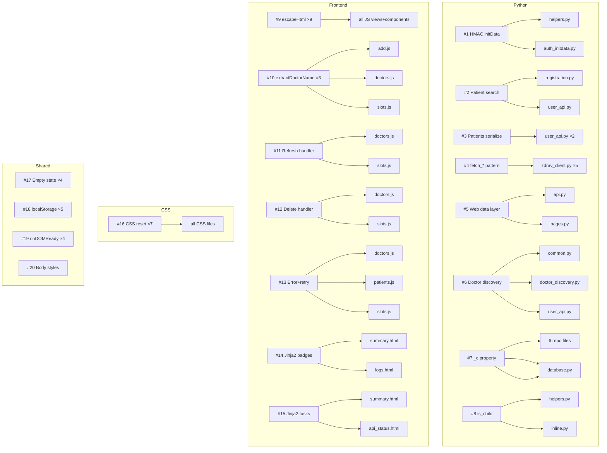

# Стратегия рефакторинга: устранение Copy-Paste дублирования

> **Статус:** Архитектурный план (не код)
> **Область:** 20 случаев дублирования (8 Python + 12 фронтенд)
> **Стек:** Python 3.12+ (aiogram, aiohttp, aiosqlite, Pydantic) + Vanilla JS SPA + Jinja2

---

## 1. Сводка: перекрёстные зависимости



### Ключевые перекрёстные влияния

| Изменение                            | Затрагивает                                                                                                         | Характер влияния                                                                                                                                                                                                                                                                                                             |
| ------------------------------------ | ------------------------------------------------------------------------------------------------------------------- | ---------------------------------------------------------------------------------------------------------------------------------------------------------------------------------------------------------------------------------------------------------------------------------------------------------------------------- |
| Вынос `_c` property в `base_repo.py` | `database.py` (фасад `__getattr__`), `manager.py` (`DatabaseManager`)                                               | Изменение цепочки наследования: все 6 репозиториев должны наследовать `BaseRepository`. Фасад `Database` и `DatabaseManager` должны быть протестированы — они используют репозитории через агрегацию, не через наследование. **Прямого влияния на `__getattr__` нет**, т.к. прокси работает на уровне методов, а не свойств. |
| Унификация HMAC initData             | `auth_initdata.py` (middleware), `helpers.py` (утилита), `mini_app.py` (обработчик `web_app_data`)                  | `auth_initdata.py` должен вызвать общую функцию из `helpers.py` вместо встроенного алгоритма. `mini_app.py` уже использует `verify_telegram_init_data()` из helpers — не требует изменений.                                                                                                                                  |
| Вынос `patient_discovery.py`         | `registration.py` (FSM), `user_api.py` (REST), БД (через `DatabaseManager`)                                         | Оба потребителя должны вызывать новую функцию. Разный формат даты (datetime vs date) требует параметризации. Разная обработка ошибок (return vs JSONResponse) требует двух обёрток или флага.                                                                                                                                |
| Унификация doctor discovery          | `common.py`, `doctor_discovery.py`, `user_api.py`, `openapi.yaml`                                                   | Если меняется формат ответа API — ломается Mini App фронтенд (слоты, врачи). **Не менять контракты** — только устранить дублирование логики.                                                                                                                                                                                 |
| Создание `utils/` в JS               | Все 7 JS-файлов (`app.js`, `add.js`, `doctors.js`, `slots.js`, `patients.js`, `card.js`, `header.js`, `stepper.js`) | Изменение импортов во всех view-файлах. Требуется обновление `index.html` — порядок загрузки скриптов.                                                                                                                                                                                                                       |
| Создание `macros.html`               | `summary.html`, `logs.html`, `api_status.html`                                                                      | Добавление `` в шаблоны. Безопасно при сохранении контракта макросов.                                                                                                                                                                                                                              |

---

## 2. Фазы рефакторинга

### Фаза 0: Подготовительная (нулевой риск)

**Цель:** Создать новые модули, не меняя поведение существующего кода.

#### 0.1. Python: `src/database/base_repo.py` (#7)

Новый файл с базовым классом `BaseRepository`, содержащим `__init__` + `_c` property + RuntimeError guard.

- **Файл:** `src/database/base_repo.py` (новый)
- **Не менять:** 6 репозиториев пока остаются как есть
- **Тест:** модульный тест `BaseRepository` на `RuntimeError` при `None`-соединении
- **Спецификация:** не затрагивает `openapi.yaml`

#### 0.2. Фронтенд: `src/web/static/app/js/utils/` (#9, #13, #17, #18, #19)

Создать структуру утилит, не меняя существующие вызовы:

```text
src/web/static/app/js/utils/
├── escape.js      # escapeHtml() — #9
├── doctor.js      # extractDoctorName() — #10
├── dom.js         # onDOMReady() — #19
├── storage.js     # safeLocalStorage — #18
└── ui.js          # renderError(), bindErrorEvents(), renderEmpty(), bindEmptyEvents() — #13, #17
```

- **Не менять:** существующие inline-функции остаются, новый код только добавляется
- **Не менять:** `index.html` — скрипты пока не подключаются

#### 0.3. Jinja2: `src/web/templates/macros.html` (#14, #15)

Создать файл с макросами Jinja2:

- `badge_status(alive, ok_text, fail_text)` — статус-бейдж
- `background_tasks_table(monitor_alive, discovery_alive, healthcheck_alive, ...)` — таблица фоновых задач

- **Не менять:** существующие шаблоны пока не импортируют макросы

---

### Фаза 1: Python — низкий риск

**Цель:** Устранить дублирование в Python без изменения внешнего поведения.

#### 1.1. `_c` property → `BaseRepository` (#7)

1. Перевести все 6 репозиториев на `class XxxRepository(BaseRepository):`
2. Удалить `__init__` и `_c` property из каждого репозитория
3. `BaseRepository.__init__` принимает `DatabaseConnection`, сохраняет в `self._db_conn`
4. Проверить: `Database` (фасад) создаёт репозитории через `XxxRepository(self._conn)` — **сигнатура не меняется**
5. Проверить: `DatabaseManager` оборачивает `Database` — не затронут

**Затрагивает:**

- [`src/database/repo_users.py:27-36`](src/database/repo_users.py:27)
- [`src/database/repo_doctors.py:20-29`](src/database/repo_doctors.py:20)
- [`src/database/repo_clinics.py:??`](src/database/repo_clinics.py:??)
- [`src/database/repo_monitoring.py`](src/database/repo_monitoring.py)
- [`src/database/repo_config.py`](src/database/repo_config.py)
- [`src/database/repo_logs.py`](src/database/repo_logs.py)
- [`src/database/database.py:49-56`](src/database/database.py:49) — проверка совместимости

**Тесты:**

- `tests/database/test_database_manager.py` — полный прогон
- Все тесты, использующие `DatabaseManager` или `Database`

#### 1.2. Унификация `is_child` (#8)

1. Привести реализацию в [`helpers.py:71`](src/utils/helpers.py:71) к алгоритму `relativedelta` (более точный)
2. Заменить inline-вычисление в [`inline.py:321`](src/keyboards/inline.py:321) на импорт `from src.utils.helpers import is_child`
3. Удалить дублирующий код из `inline.py`

**Затрагивает:**

- [`src/utils/helpers.py`](src/utils/helpers.py) — изменение алгоритма
- [`src/keyboards/inline.py`](src/keyboards/inline.py) — замена на импорт

**Тесты:**

- `tests/keyboards/test_keyboards.py`
- Ручной тест: клавиатура выбора клиники с ребёнком/взрослым

#### 1.3. Сериализация patients (#3)

1. Извлечь общую функцию `_serialize_patients(user_data)` в `user_api.py` (внутри файла)
2. Вызвать из двух мест: строка ~116 и строка ~593

**Затрагивает:** только [`src/web/routers/user_api.py`](src/web/routers/user_api.py)

**Тесты:** ручной тест Mini App — экран пациентов

#### 1.4. Слой данных веб-роутов (#5)

1. Создать `src/web/routers/_shared.py` с чистыми функциями сбора данных:
   - `get_summary_data(db) → dict`
   - `get_users_data(db) → dict`
   - `get_clinics_data(db) → dict`
2. [`api.py`](src/web/routers/api.py) вызывает их и возвращает JSON
3. [`pages.py`](src/web/routers/pages.py) вызывает их и рендерит Jinja2

**Затрагивает:**

- [`src/web/routers/api.py`](src/web/routers/api.py) — замена inline-запросов
- [`src/web/routers/pages.py`](src/web/routers/pages.py) — замена inline-запросов
- **Новый:** `src/web/routers/_shared.py`

**Тесты:** ручной тест всех страниц дашборда

---

### Фаза 2: Фронтенд — низкий риск

**Цель:** Заменить inline-функции на импорты из `utils/`.

#### 2.1. `escapeHtml()` — замена 9 копий (#9)

1. Во всех 9 файлах удалить локальное определение `function escapeHtml`
2. Добавить `import { escapeHtml } from '../utils/escape.js';`
3. В `index.html` добавить `<script type="module" src="js/utils/escape.js"></script>` (но с учётом ES modules — фактически импорты работают через цепочку)

**Затрагивает:**

- [`src/web/static/app/js/app.js`](src/web/static/app/js/app.js)
- [`src/web/static/app/js/views/add.js`](src/web/static/app/js/views/add.js)
- [`src/web/static/app/js/views/doctors.js`](src/web/static/app/js/views/doctors.js)
- [`src/web/static/app/js/views/patients.js`](src/web/static/app/js/views/patients.js)
- [`src/web/static/app/js/views/slots.js`](src/web/static/app/js/views/slots.js)
- [`src/web/static/app/js/components/card.js`](src/web/static/app/js/components/card.js)
- [`src/web/static/app/js/components/header.js`](src/web/static/app/js/components/header.js)
- [`src/web/static/app/js/components/stepper.js`](src/web/static/app/js/components/stepper.js)
- [`_design_lab/stepper/live-stepper.js`](_design_lab/stepper/live-stepper.js)

**Тесты:** ручной тест всех 4 экранов Mini App

#### 2.2. `extractDoctorName()` → `utils/doctor.js` (#10)

1. Создать унифицированную версию с параметризуемым fallback
2. Заменить в `add.js`, `doctors.js`, `slots.js`

**Затрагивает:**

- [`src/web/static/app/js/views/add.js`](src/web/static/app/js/views/add.js)
- [`src/web/static/app/js/views/doctors.js`](src/web/static/app/js/views/doctors.js)
- [`src/web/static/app/js/views/slots.js`](src/web/static/app/js/views/slots.js)
- **Новый:** `src/web/static/app/js/utils/doctor.js`

#### 2.3. Error state + Empty state → `utils/ui.js` (#13, #17)

1. Перенести `renderError()`, `bindErrorEvents()`, `renderEmpty()`, `bindEmptyEvents()` в `utils/ui.js`
2. Параметризовать тексты и иконки
3. Импортировать в `doctors.js`, `patients.js`, `slots.js`

**Затрагивает:**

- [`src/web/static/app/js/views/doctors.js`](src/web/static/app/js/views/doctors.js)
- [`src/web/static/app/js/views/patients.js`](src/web/static/app/js/views/patients.js)
- [`src/web/static/app/js/views/slots.js`](src/web/static/app/js/views/slots.js)
- **Новый:** `src/web/static/app/js/utils/ui.js`

#### 2.4. `onDOMReady()` → `utils/dom.js` (#19)

1. Перенести в `utils/dom.js`
2. Импортировать во всех 4 точках использования

**Затрагивает:** 4 JS-файла
**Новый:** `src/web/static/app/js/utils/dom.js`

---

### Фаза 3: Python — средний риск

**Цель:** Устранить структурное дублирование бизнес-логики.

#### 3.1. Patient search → `src/services/patient_discovery.py` (#2)

1. Создать общую функцию `find_patient_across_clinics(fio, date, api, db) → tuple[str|None, str|None]`
   - Принимает `date` как `datetime` (registration.py) или `date` (user_api.py) — унифицировать через `str`
   - Возвращает `(patient_id, error_message)`
2. В `registration.py` заменить inline-перебор на вызов новой функции
3. В `user_api.py` заменить inline-перебор на вызов новой функции
4. Обработка ошибок остаётся на стороне вызывающего кода (return в registration, JSONResponse в user_api)

**Затрагивает:**

- [`src/handlers/registration.py:81-112`](src/handlers/registration.py:81)
- [`src/web/routers/user_api.py:654`](src/web/routers/user_api.py:654)
- **Новый:** `src/services/patient_discovery.py`
- `specs/openapi.yaml` — добавить описание нового сервиса в секцию `Фоновые сервисы`

**Точка риска:** Разный формат даты. В `registration.py` — `datetime` объект, в `user_api.py` — `date` объект. Унифицировать через преобразование в строку ISO внутри новой функции.

**Тесты:**

- Новые модульные тесты `tests/services/test_patient_discovery.py`
- `tests/handlers/test_handlers_registration.py` — полный прогон FSM
- Ручной тест: регистрация нового пациента через бот
- Ручной тест: проверка пациента через Mini App

#### 3.2. fetch\_\* методы в ZdravClient (#4)

**Примечание:** [`ARCHITECTURE.md`](specs/ARCHITECTURE.md:232) утверждает, что уже реализован "унифицированный `_request_with_retry()` (замена 5 дублирующих методов)". **Необходимо верифицировать** — если это уже сделано, данный пункт пропускается.

Если дублирование осталось:

1. Оставить один приватный метод `_fetch_endpoint(endpoint, request_model, response_model, default_value)`
2. Все 5 публичных методов становятся однострочными вызовами `_fetch_endpoint`

**Затрагивает:** только [`src/api/zdrav_client.py`](src/api/zdrav_client.py)

**Точка риска:** Все 5 методов критичны для работы мониторинга, healthcheck и пользовательских запросов. Любая ошибка в унификации ломает весь фоновый цикл.

**Тесты:**

- `tests/api/test_zdrav_client.py` — полный прогон
- Проверка мониторинга на VPS после деплоя

#### 3.3. Doctor discovery — завершить унификацию (#6)

Анализ текущего состояния:

- [`common.py`](src/handlers/common.py) — содержит `_discover_doctors_on_demand`
- [`doctor_discovery.py`](src/services/doctor_discovery.py) — фоновый `discovery_loop`
- [`user_api.py`](src/web/routers/user_api.py) — импортирует `_discover_doctors_on_demand` из common

Действия:

1. Перенести `_discover_doctors_on_demand` из `common.py` в `doctor_discovery.py` (это сервис, не хендлер)
2. В `common.py` оставить тонкую обёртку-импорт для обратной совместимости
3. Убедиться, что `user_api.py` импортирует из `doctor_discovery.py`

**Затрагивает:**

- [`src/handlers/common.py`](src/handlers/common.py)
- [`src/services/doctor_discovery.py`](src/services/doctor_discovery.py)
- [`src/web/routers/user_api.py`](src/web/routers/user_api.py)

**Тесты:**

- `tests/services/test_doctor_discovery.py`
- `tests/handlers/test_handlers_common.py`

---

### Фаза 4: Фронтенд — средний риск

**Цель:** Устранить дублирование обработчиков событий.

#### 4.1. Refresh + Delete handlers → `utils/monitoring.js` (#11, #12)

1. Создать функции `bindRefreshHandler(container)` и `bindDeleteHandler(container)` в `utils/monitoring.js`
2. Параметризовать callback'и (например, что делать после успешного refresh/delete)
3. Заменить inline-код в `doctors.js` и `slots.js`

**Затрагивает:**

- [`src/web/static/app/js/views/doctors.js:171-217`](src/web/static/app/js/views/doctors.js:171)
- [`src/web/static/app/js/views/slots.js:198`](src/web/static/app/js/views/slots.js:198)
- **Новый:** `src/web/static/app/js/utils/monitoring.js`

**Точка риска:** Разное поведение после refresh (в `doctors.js` — toast, в `slots.js` — перерендер слотов). Требуется параметризация через callback.

#### 4.2. localStorage → `utils/storage.js` (#18)

1. Создать `safeLocalStorage` с унифицированным try/catch
2. Заменить 5 копий в `switcher.js`

**Затрагивает:**

- [`_design_lab/stepper/switcher.js`](_design_lab/stepper/switcher.js)
- **Новый:** `src/web/static/app/js/utils/storage.js`

---

### Фаза 5: Критический риск — HMAC initData (#1)

**Это самый опасный рефакторинг. Ошибка здесь ломает аутентификацию Mini App.**

#### План

1. **Не** удалять `verify_telegram_init_data()` из [`helpers.py`](src/utils/helpers.py:400) — она уже используется в [`mini_app.py`](src/handlers/mini_app.py) (обработчик `web_app_data`)
2. Извлечь **только** вычисление HMAC-подписи в отдельную внутреннюю функцию `_compute_init_data_hash(parsed_fields, bot_token) → str` в `helpers.py`
3. В [`auth_initdata.py`](src/web/auth_initdata.py) заменить шаги 2-7 (парсинг → HMAC → сравнение) на вызов `verify_telegram_init_data()` из helpers
4. Удалить дублирующую константу `_WEB_APP_DATA_KEY` из `auth_initdata.py` (оставить только в `helpers.py`)
5. Middleware остаётся ответственным за: извлечение заголовка, проверку пути, возврат 403/400 JSONResponse
6. **Проверить:** `mini_app.py` уже использует `verify_telegram_init_data()` — поведение не должно измениться

**Затрагивает:**

- [`src/utils/helpers.py`](src/utils/helpers.py) — возможно, рефакторинг внутренней структуры (не сигнатуры)
- [`src/web/auth_initdata.py`](src/web/auth_initdata.py) — замена inline HMAC на вызов helpers
- [`src/handlers/mini_app.py`](src/handlers/mini_app.py) — без изменений (уже использует helpers)

**Точка риска:** Безопасность. Если `verify_telegram_init_data()` и middleware используют разные `max_age` (86400 в helpers vs `MINI_APP_INITDATA_MAX_AGE` в middleware), это нужно явно передать параметром.

**Тесты (ОБЯЗАТЕЛЬНО):**

1. Модульный тест HMAC с эталонными векторами (известная initData + токен → известный hash)
2. Проверка, что `helpers.verify_telegram_init_data()` и middleware возвращают одинаковый результат на одинаковых входных данных
3. Ручной тест Mini App на стенде (открытие, навигация, проверка слотов)
4. Ручной тест `web_app_data` из бота (отправка данных из Mini App)

**Стратегия отката:** После изменений в `auth_initdata.py` должна пройти минимум одна итерация фонового мониторинга на VPS с наблюдением логов.

---

### Фаза 6: Jinja2 и CSS (низкий приоритет)

#### 6.1. Jinja2 macros (#14, #15)

1. Импортировать `macros.html` в `summary.html`, `logs.html`, `api_status.html`
2. Заменить inline-бейджи и таблицы на вызовы макросов

**Затрагивает:**

- [`src/web/templates/summary.html`](src/web/templates/summary.html)
- [`src/web/templates/logs.html`](src/web/templates/logs.html)
- [`src/web/templates/api_status.html`](src/web/templates/api_status.html)
- **Новый:** `src/web/templates/macros.html`

#### 6.2. CSS reset (#16)

1. Вынести общий reset в отдельный файл (импортируется через `@import` или копируется на этапе сборки)
2. **Важно:** проект не использует CSS-сборщик — Vanilla CSS. Варианты:
   - Создать `src/web/static/reset.css` и подключать в `<link>` первым в каждом HTML
   - Либо оставить как есть (низкий приоритет, не влияет на функциональность)

#### 6.3. Body styles (#20)

Самое низкоприоритетное. Разные дизайн-системы (дашборд vs Mini App) — дублирование body-стилей может быть оправдано.

**Решение:** не объединять. Оставить как есть с комментарием о причине.

---

## 3. Сводная таблица новых модулей

| Файл                                        | Назначение                                                         | Фаза |
| ------------------------------------------- | ------------------------------------------------------------------ | ---- |
| `src/database/base_repo.py`                 | Базовый класс репозитория (`__init__` + `_c` property)             | 0    |
| `src/services/patient_discovery.py`         | Унифицированный поиск пациента по clinic_id                        | 3    |
| `src/web/routers/_shared.py`                | Общие функции сбора данных для API и Pages                         | 1    |
| `src/web/templates/macros.html`             | Jinja2 макросы: бейджи статуса, таблица задач                      | 6    |
| `src/web/static/app/js/utils/escape.js`     | `escapeHtml()`                                                     | 2    |
| `src/web/static/app/js/utils/doctor.js`     | `extractDoctorName()`                                              | 2    |
| `src/web/static/app/js/utils/dom.js`        | `onDOMReady()`                                                     | 2    |
| `src/web/static/app/js/utils/storage.js`    | `safeLocalStorage`                                                 | 4    |
| `src/web/static/app/js/utils/ui.js`         | `renderError`, `bindErrorEvents`, `renderEmpty`, `bindEmptyEvents` | 2    |
| `src/web/static/app/js/utils/monitoring.js` | `bindRefreshHandler`, `bindDeleteHandler`                          | 4    |
| `src/web/static/reset.css`                  | Общий CSS reset (опционально)                                      | 6    |

---

## 4. Стратегия тестирования

### На каждом этапе

1. **Python:** `python -m ruff check src > .tmp_check_results.txt 2>&1`
2. **Python:** `python -m mypy src` (если настроено)
3. **Python:** `python -m pytest tests/ -x` (остановка на первом падении)
4. **Markdown:** `npx markdownlint "specs/**/*.md" ".roo/**/*.md" "*.md"`
5. **Markdown:** `npx prettier --write` на изменённые `.md` файлы

### Специфические проверки по фазам

| Фаза             | Критические проверки                                                                                       |
| ---------------- | ---------------------------------------------------------------------------------------------------------- |
| 0                | Только создание файлов — ничего не ломается. Прогон существующих тестов.                                   |
| 1 (Python low)   | `test_database_manager.py`, `test_keyboards.py`, ручной тест регистрации                                   |
| 2 (Frontend low) | Ручной тест всех 4 экранов Mini App в Telegram WebView                                                     |
| 3 (Python mid)   | `test_zdrav_client.py`, `test_doctor_discovery.py`, ручной тест на VPS                                     |
| 4 (Frontend mid) | Ручной тест refresh/delete на экранах doctors и slots                                                      |
| 5 (Critical)     | **Модульный тест HMAC с эталонными векторами**, ручной тест Mini App на стенде, ручной тест `web_app_data` |
| 6 (Low priority) | Визуальный осмотр дашборда и страниц                                                                       |

### Протокол деплоя на VPS (после фаз 3, 5)

```bash
ssh -i C:/Users/acidgrip/.ssh/vps_zdrav_nopass -p 2244 root@195.58.39.52
cd /srv/bots/lenreg-ticket-bot && git pull origin mini_app_beta && docker compose up -d --build bot
docker compose -f /srv/bots/lenreg-ticket-bot/docker-compose.yml logs bot --tail=50
```

---

## 5. Точки риска (детально)

| #      | Случай            | Риск                                                                       | Вероятность поломки | Стратегия митигации                                                                                                             |
| ------ | ----------------- | -------------------------------------------------------------------------- | ------------------- | ------------------------------------------------------------------------------------------------------------------------------- |
| 1      | HMAC initData     | Аутентификация Mini App сломана → все пользователи Mini App не могут войти | **Высокая**         | Эталонные векторы HMAC в тестах; ручной тест на стенде ДО деплоя; мониторинг логов после деплоя; быстрый откат через git revert |
| 2      | Patient search    | Регистрация новых пациентов сломана                                        | Средняя             | Параметризация формата даты; тест FSM сценария; проверка обоих путей (бот + Mini App)                                           |
| 4      | fetch\_\* методы  | Мониторинг слотов перестаёт работать                                       | **Высокая**         | Полный прогон `test_zdrav_client.py`; мониторинг логов на VPS 30 мин после деплоя                                               |
| 5      | Web data layer    | Дашборд показывает неверные данные                                         | Низкая              | Ручной осмотр всех страниц дашборда                                                                                             |
| 11, 12 | Refresh/Delete JS | Кнопки в Mini App перестают работать                                       | Средняя             | Ручной тест обоих экранов (doctors, slots)                                                                                      |
| 7      | \_c property      | Все операции с БД падают с RuntimeError                                    | Низкая              | Прогон всех database-тестов; проверка старта бота                                                                               |

---

## 6. Соблюдение правил проекта

### Spec-First (openapi.yaml)

- Фаза 3.1 — новый сервис `patient_discovery.py` → добавить описание в `specs/openapi.yaml` (секция `Фоновые сервисы`)
- Фаза 3.3 — перенос `_discover_doctors_on_demand` не меняет контракты API → `openapi.yaml` без изменений
- Фаза 5 — HMAC верификация: внутренняя логика, контракты API не меняются → `openapi.yaml` без изменений

### Инкремент версии openapi.yaml

При добавлении `patient_discovery` в спецификацию: `info.version: '1.0.1'` → `'1.0.2'`

### SESSION_LOG

После каждой завершённой фазы в режиме orchestrator — запись в [`.roo/sessions/SESSION_LOG.md`](.roo/sessions/SESSION_LOG.md).

### Форматирование

После каждого изменения Python-файлов:

```powershell
python -m ruff check src > .tmp_check_results.txt 2>&1
# анализ ошибок
python -m ruff format src
Remove-Item .tmp_check_results.txt
```

---

## 7. Порядок выполнения (итоговый)

```text
Фаза 0: Подготовка
  ├── 0.1: base_repo.py (новый файл)
  ├── 0.2: JS utils/ (5 новых файлов)
  └── 0.3: macros.html (новый файл)

Фаза 1: Python низкий риск
  ├── 1.1: _c property → BaseRepository (#7)
  ├── 1.2: is_child унификация (#8)
  ├── 1.3: patients сериализация (#3)
  └── 1.4: Web data layer _shared.py (#5)

Фаза 2: Frontend низкий риск
  ├── 2.1: escapeHtml → utils/escape.js (#9)
  ├── 2.2: extractDoctorName → utils/doctor.js (#10)
  ├── 2.3: Error + Empty state → utils/ui.js (#13, #17)
  └── 2.4: onDOMReady → utils/dom.js (#19)

Фаза 3: Python средний риск
  ├── 3.1: patient_discovery.py (#2)
  ├── 3.2: fetch_* → _fetch_endpoint (#4) [верифицировать]
  └── 3.3: doctor discovery унификация (#6)

Фаза 4: Frontend средний риск
  ├── 4.1: Refresh + Delete → utils/monitoring.js (#11, #12)
  └── 4.2: localStorage → utils/storage.js (#18)

⚠️ ДЕПЛОЙ НА VPS И МОНИТОРИНГ 30 МИНУТ ⚠️

Фаза 5: КРИТИЧЕСКИЙ РИСК
  └── 5.1: HMAC initData унификация (#1)

⚠️ ДЕПЛОЙ НА VPS И МОНИТОРИНГ 60 МИНУТ ⚠️

Фаза 6: Низкий приоритет
  ├── 6.1: Jinja2 macros (#14, #15)
  ├── 6.2: CSS reset (#16) — опционально
  └── 6.3: Body styles (#20) — НЕ объединять
```

---

## 8. Чек-лист приёмки для каждой фазы

- [ ] Все существующие тесты проходят (`pytest tests/ -x`)
- [ ] Ruff не показывает новых ошибок
- [ ] Markdown-файлы проходят `markdownlint`
- [ ] `ARCHITECTURE.md` обновлён (новые модули, изменения в графе зависимостей)
- [ ] `openapi.yaml` обновлён (если применимо)
- [ ] `SESSION_LOG.md` обновлён (в режиме orchestrator)
- [ ] Ручной тест критического пути (регистрация → мониторинг → уведомление)
