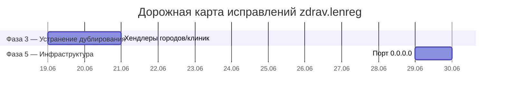

# ROADMAP.md — Дорожная карта исправлений по итогам Code Review

> **Основание:** (архивный code review, удалён) — аудит ~11 600 строк кода.
> **Дата создания:** 2026-06-08
> **Актуальность:** 2026-06-15

---

## Сводная таблица проблем

| #   | Категория         | Проблема                                   | Серьёзность  | Фаза   | Статус |
| --- | ----------------- | ------------------------------------------ | ------------ | ------ | ------ |
| 1   | 🟡 Дублирование   | 4 почти идентичных хендлера городов/клиник | Дублирование | Фаза 3 | ⚠️     |
| 2   | ⚙️ Инфраструктура | Порт 8080 на `0.0.0.0`                     | Безопасность | Фаза 5 | ⚠️     |

---

## Диаграмма фаз (Mermaid Gantt)

---

## Фаза 3: Устранение дублирования

> **Цель:** вынести повторяющийся код в общие функции/миксины, сократить размер кодовой базы, упростить поддержку.

### Задача 3.4 — 4 почти идентичных хендлера городов/клиник

| Параметр      | Значение                                                                                                                           |
| ------------- | ---------------------------------------------------------------------------------------------------------------------------------- |
| **Приоритет** | P2                                                                                                                                 |
| **Файл**      | [`src/handlers/common.py`](src/handlers/common.py)                                                                                 |
| **Проблема**  | 4 хендлера для выбора городов/клиник имеют почти идентичную структуру.                                                             |
| **Решение**   | Создать параметризованную функцию-строитель хендлеров или использовать общий обработчик с параметром (город/клиника, adult/child). |
| **DoD**       | Логика выбора городов/клиник не дублируется; навигация работает без изменений.                                                     |

---

## Фаза 5: Инфраструктурные улучшения

> **Цель:** повысить надёжность и безопасность продакшен-окружения.

### Задача 5.4 — Порт 8080 на `0.0.0.0` и reverse-proxy

| Параметр      | Значение                                                                                                                                                                                 |
| ------------- | ---------------------------------------------------------------------------------------------------------------------------------------------------------------------------------------- |
| **Приоритет** | P3                                                                                                                                                                                       |
| **Файл**      | [`docker-compose.yml`](docker-compose.yml:67)                                                                                                                                            |
| **Проблема**  | Строка 67: `0.0.0.0:8080:8080` — веб-дашборд слушает на всех интерфейсах, включая внешний. В комбинации с `ENVIRONMENT=development` — прямой доступ без аутентификации.                  |
| **Решение**   | 1. Изменить на `127.0.0.1:8080:8080`. 2. Настроить reverse-proxy (Caddy/Nginx) с HTTPS и basic auth для проксирования на `127.0.0.1:8080`. 3. Удалить прямую привязку порта 8080 наружу. |
| **DoD**       | Веб-дашборд доступен только через reverse-proxy с HTTPS; прямое подключение на порт 8080 извне невозможно.                                                                               |

---

## Риски и зависимости

Оставшиеся задачи (3.4 и 5.4) независимы друг от друга и не имеют блокирующих зависимостей.

### Возможный параллелизм

- **Задача 1 (хендлеры городов/клиник)** и **Задача 2 (порт 8080)** — независимы (разные файлы: `src/handlers/common.py` и `docker-compose.yml`).

---

## Критерии завершения дорожной карты

1. Все 36 задач имеют статус «✅ Выполнено».
2. `pyright` и `ruff` не выдают ошибок.
3. Все тесты (`python scripts/run_tests.py`) проходят.
4. `docker compose up -d --build` успешно стартует все сервисы; healthcheck показывает `healthy`.
5. `npx markdownlint "specs/**/*.md" ".roo/**/*.md" "*.md"` — 0 errors.
6. [`specs/openapi.yaml`](openapi.yaml) актуализирован с учётом всех изменений.
7. [`specs/ARCHITECTURE.md`](ARCHITECTURE.md) обновлён (дерево директорий, граф зависимостей).
