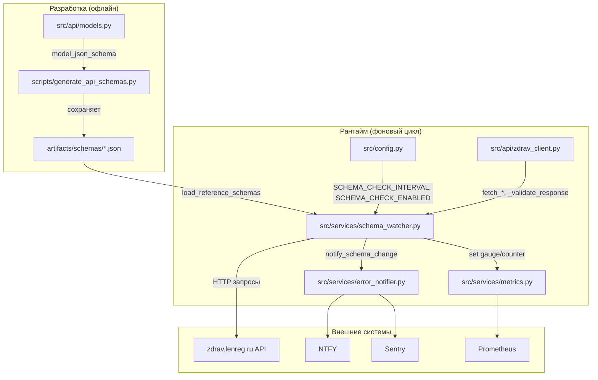
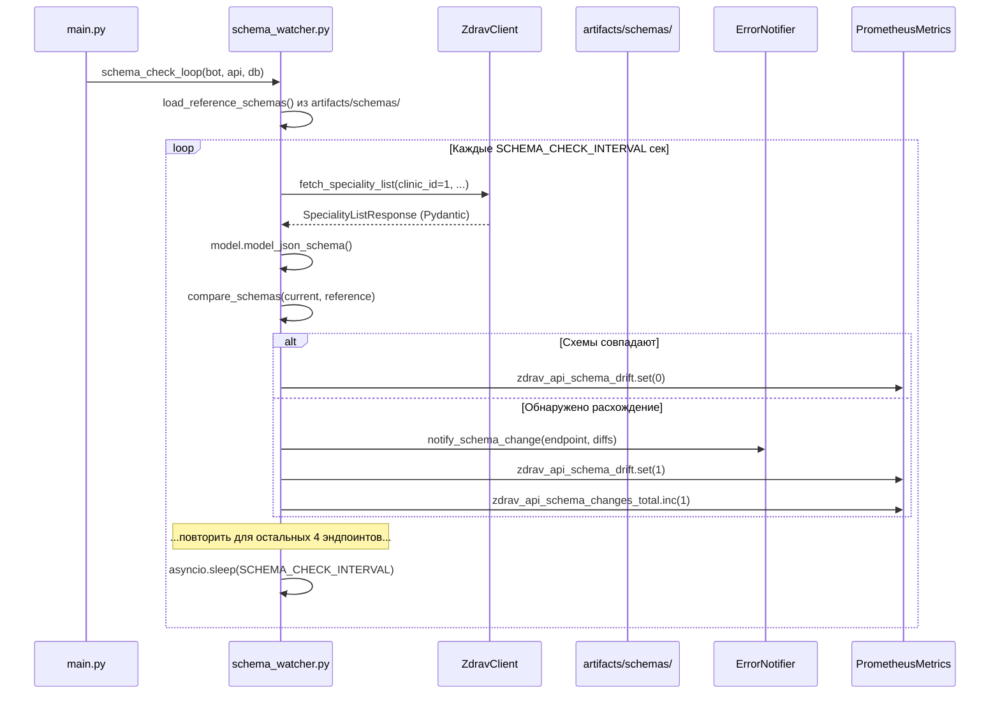
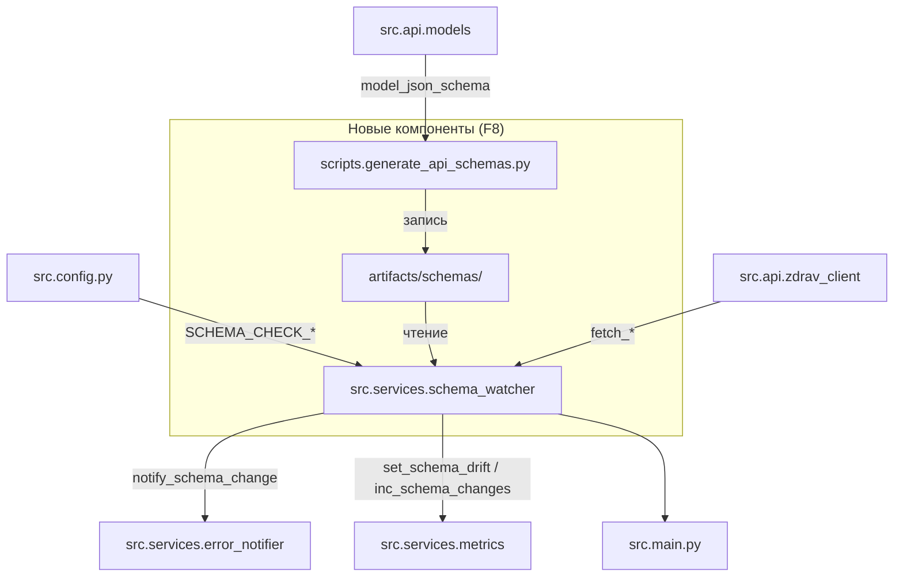

# Дизайн детектора изменений API zdrav.lenreg.ru (F8)

> **Задача:** F8 — Детектор изменений API
> **Статус:** Проектирование
> **Дата:** 2026-05-19

## 1. Цели и ограничения

### Цели

- Автоматически обнаруживать изменения в структуре ответов API zdrav.lenreg.ru (новые/удалённые поля, изменение типов, изменение обязательности полей).
- Оповещать администратора при обнаружении расхождений (NTFY + Sentry).
- Предоставлять метрики для мониторинга стабильности API (Prometheus).
- Хранить эталонные JSON Schema в Git — единый источник истины для структуры API.

### Ограничения

- **Минимум новых зависимостей.** Сравнение схем реализуется рекурсивным diff на чистом Python, без `deepdiff`.
- **Минимальная нагрузка на API.** Фоновая проверка делает ровно по одному запросу к каждому из 5 эндпоинтов раз в час (по умолчанию).
- **Не ломает существующие фоновые задачи.** Schema check — независимый asyncio-цикл, запускается параллельно с monitor, discovery, healthcheck.
- **Не дублирует логику валидации.** Использует существующий `_validate_response()` из [`ZdravClient`](src/api/zdrav_client.py:87), но расширяет его пост-проверкой схемы.

### Что детектор НЕ делает

- **Не модифицирует ответы API** — только наблюдает.
- **Не блокирует работу бота** при расхождении схем — только оповещает.
- **Не заменяет ручное обновление моделей** — разработчик сам правит Pydantic-модели и перегенерирует схемы.
- **Не проверяет бизнес-логику** (например, изменился ли смысл поля `CountFreeTicket`) — только структуру JSON.

---

## 2. Архитектурная схема

### 2.1 Компонентная диаграмма



### 2.2 Поток фоновой проверки



---

## 3. Структура файлов

### 3.1 Новые файлы

```text
artifacts/
└── schemas/                          # Эталонные JSON Schema (коммитятся в Git)
    ├── CheckPatientResponse.json
    ├── CheckPatientData.json
    ├── SpecialityListResponse.json
    ├── SpecialityItem.json
    ├── DoctorListResponse.json
    ├── DoctorItem.json
    ├── AppointmentListResponse.json
    ├── AppointmentSlot.json
    ├── ClinicListResponse.json
    ├── ClinicItem.json
    ├── DateInfo.json
    └── ApiError.json

scripts/
└── generate_api_schemas.py           # Скрипт генерации эталонных схем

src/services/
└── schema_watcher.py                 # Модуль детектора изменений
```

### 3.2 Изменяемые файлы

| Файл                                                               | Изменение                                                     |
| ------------------------------------------------------------------ | ------------------------------------------------------------- |
| [`src/config.py`](src/config.py)                                   | +2 параметра: `SCHEMA_CHECK_INTERVAL`, `SCHEMA_CHECK_ENABLED` |
| [`src/main.py`](src/main.py)                                       | +1 фоновая задача: `schema_check_loop`                        |
| [`src/services/error_notifier.py`](src/services/error_notifier.py) | +1 метод: `notify_schema_change()`                            |
| [`src/services/metrics.py`](src/services/metrics.py)               | +1 Gauge, +1 Counter                                          |
| [`pyproject.toml`](pyproject.toml)                                 | Без новых runtime-зависимостей                                |
| [`specs/openapi.yaml`](../openapi.yaml)                            | +секция для `schema_check_loop`                               |

---

## 4. Компонент 1: Генерация эталонных JSON Schema

### 4.1 Скрипт `scripts/generate_api_schemas.py`

**Назначение:** генерирует `.model_json_schema()` для каждой Pydantic-модели из [`src/api/models.py`](src/api/models.py) и сохраняет в `artifacts/schemas/`.

**Запуск:**

```powershell
python scripts/generate_api_schemas.py
```

**Логика:**

```python
# Псевдокод
from src.api.models import (
    CheckPatientResponse, CheckPatientData,
    SpecialityListResponse, SpecialityItem,
    DoctorListResponse, DoctorItem,
    AppointmentListResponse, AppointmentSlot,
    ClinicListResponse, ClinicItem,
    DateInfo, ApiError,
)

MODELS = [
    CheckPatientResponse, CheckPatientData,
    SpecialityListResponse, SpecialityItem,
    DoctorListResponse, DoctorItem,
    AppointmentListResponse, AppointmentSlot,
    ClinicListResponse, ClinicItem,
    DateInfo, ApiError,
]

for model in MODELS:
    schema = model.model_json_schema()
    path = f"artifacts/schemas/{model.__name__}.json"
    with open(path, "w", encoding="utf-8") as f:
        json.dump(schema, f, indent=2, ensure_ascii=False)
```

### 4.2 Формат эталонной схемы

Пример `artifacts/schemas/CheckPatientResponse.json`:

```json
{
  "$defs": {
    "ApiError": {
      "additionalProperties": true,
      "properties": {},
      "title": "ApiError",
      "type": "object"
    },
    "CheckPatientData": {
      "properties": {
        "history_id": {
          "anyOf": [{ "type": "string" }, { "type": "null" }],
          "default": null,
          "title": "History Id"
        },
        "patient_id": {
          "anyOf": [{ "type": "string" }, { "type": "null" }],
          "default": null,
          "title": "Patient Id"
        }
      },
      "title": "CheckPatientData",
      "type": "object"
    }
  },
  "properties": {
    "response": {
      "$ref": "#/$defs/CheckPatientData",
      "default": { "history_id": null, "patient_id": null }
    },
    "success": { "default": false, "title": "Success", "type": "boolean" },
    "error": {
      "$ref": "#/$defs/ApiError",
      "default": {}
    }
  },
  "title": "CheckPatientResponse",
  "type": "object"
}
```

### 4.3 Требования к схемам

- **Коммитятся в Git** — это эталон, с которым сравнивается рантайм.
- **Перегенерируются вручную** при изменении Pydantic-моделей.
- **Формат:** `model_json_schema()` с `indent=2`, `ensure_ascii=False` (кириллица в `title` сохраняется как UTF-8).
- **Именование:** `{ModelName}.json`, точно соответствующее имени Pydantic-класса.

---

## 5. Компонент 2: Модуль `src/services/schema_watcher.py`

### 5.1 API модуля

```python
# src/services/schema_watcher.py

from typing import Any

async def load_reference_schemas() -> dict[str, dict[str, Any]]:
    """Загружает эталонные JSON Schema из artifacts/schemas/ в словарь {ModelName: schema}.

    Returns:
        Словарь, где ключ — имя модели (напр. 'CheckPatientResponse'),
        значение — полная JSON Schema (dict).
    """

def compare_schemas(
    current: dict[str, Any],
    reference: dict[str, Any],
    path: str = "root",
) -> list[str]:
    """Рекурсивно сравнивает текущую JSON Schema с эталонной.

    Args:
        current: JSON Schema, полученная из model_json_schema() в рантайме.
        reference: Эталонная JSON Schema из artifacts/schemas/.
        path: Путь в дереве схемы для сообщений об ошибках.

    Returns:
        Список строк с описанием расхождений. Пустой список — схемы идентичны.
    """

async def schema_check_loop(
    api,            # ZdravClient
    bot,            # aiogram.Bot (для контекста, не используется напрямую)
    db,             # DatabaseManager (для получения тестовых patient_id/clinic_id)
) -> None:
    """Фоновый цикл проверки схем API.

    Каждые SCHEMA_CHECK_INTERVAL секунд:
    1. Делает тестовые запросы к 5 эндпоинтам API.
    2. Валидирует ответы через существующий _validate_response().
    3. Сравнивает model_json_schema() с эталонной схемой.
    4. При расхождении — отправляет алерт через ErrorNotifier.
    5. Обновляет Prometheus-метрики.
    """
```

### 5.2 Алгоритм сравнения схем

Функция `compare_schemas()` реализует рекурсивный diff двух JSON Schema без внешних зависимостей.

**Сравниваемые аспекты:**

| Аспект                 | Описание                                                 | Пример расхождения                              |
| ---------------------- | -------------------------------------------------------- | ----------------------------------------------- |
| `type`                 | Тип JSON Schema узла (`object`, `array`, `string`, etc.) | `"type": "string"` vs `"type": "integer"`       |
| `properties`           | Набор ключей объекта верхнего уровня                     | Добавлено поле `new_field`, удалено `old_field` |
| `required`             | Список обязательных полей                                | Поле стало обязательным: `["success"]` vs `[]`  |
| `additionalProperties` | Разрешены ли дополнительные поля                         | `true` vs `false`                               |
| `items` (для массивов) | Схема элементов массива                                  | Изменился `$ref` внутри `items`                 |
| `anyOf` / `oneOf`      | Union-типы (nullable поля)                               | `anyOf: [string, null]` → `anyOf: [string]`     |

**Что НЕ сравнивается:**

- `title` — неструктурные метаданные, могут меняться без изменения API.
- `default` — значения по умолчанию (задаются кодом, не API).
- Порядок ключей в `properties` — порядок не гарантирован API.
- `$defs` — вложенные определения (сравниваются опосредованно через `$ref`).

**Алгоритм (псевдокод):**

```python
def compare_schemas(current, reference, path="root") -> list[str]:
    diffs = []

    # 1. Сравнение type
    if current.get("type") != reference.get("type"):
        diffs.append(f"{path}: type изменился с '{reference.get('type')}' на '{current.get('type')}'")

    # 2. Сравнение additionalProperties
    if current.get("additionalProperties") != reference.get("additionalProperties"):
        diffs.append(f"{path}: additionalProperties изменился с {reference.get('additionalProperties')} на {current.get('additionalProperties')}")

    # 3. Сравнение required (только для объектов)
    if current.get("type") == "object" and reference.get("type") == "object":
        cur_req = set(current.get("required", []))
        ref_req = set(reference.get("required", []))
        added = cur_req - ref_req
        removed = ref_req - cur_req
        if added:
            diffs.append(f"{path}: поля стали обязательными: {sorted(added)}")
        if removed:
            diffs.append(f"{path}: поля перестали быть обязательными: {sorted(removed)}")

    # 4. Сравнение properties (только для объектов)
    if "properties" in current or "properties" in reference:
        cur_props = set(current.get("properties", {}).keys())
        ref_props = set(reference.get("properties", {}).keys())
        added = cur_props - ref_props
        removed = ref_props - cur_props
        for key in added:
            diffs.append(f"{path}.{key}: новое поле (тип: {_describe_type(current['properties'][key])})")
        for key in removed:
            diffs.append(f"{path}.{key}: поле удалено (был тип: {_describe_type(reference['properties'][key])})")
        # Рекурсивно сравниваем общие поля
        for key in cur_props & ref_props:
            diffs.extend(compare_schemas(
                current["properties"][key],
                reference["properties"][key],
                f"{path}.{key}",
            ))

    # 5. Сравнение items (для массивов)
    if "items" in current or "items" in reference:
        diffs.extend(compare_schemas(
            current.get("items", {}),
            reference.get("items", {}),
            f"{path}.items",
        ))

    # 6. Сравнение anyOf (nullable поля)
    cur_anyof = _normalize_anyof(current.get("anyOf", []))
    ref_anyof = _normalize_anyof(reference.get("anyOf", []))
    if cur_anyof != ref_anyof:
        diffs.append(f"{path}: anyOf изменился с {ref_anyof} на {cur_anyof}")

    return diffs
```

**Вспомогательная функция `_normalize_anyof`:**

```python
def _normalize_anyof(anyof: list[dict]) -> set[str]:
    """Извлекает множество типов из anyOf (напр. {'string', 'null'})."""
    return {item.get("type", "?") for item in anyof}
```

**Вспомогательная функция `_describe_type`:**

```python
def _describe_type(prop: dict) -> str:
    """Человекочитаемое описание типа свойства."""
    if "$ref" in prop:
        return f"$ref:{prop['$ref'].split('/')[-1]}"
    if "anyOf" in prop:
        types = [t.get("type", "?") for t in prop["anyOf"]]
        return f"anyOf[{', '.join(types)}]"
    return prop.get("type", "?")
```

### 5.3 Загрузка эталонных схем

```python
import json
import os

_SCHEMAS_DIR = "artifacts/schemas"

async def load_reference_schemas() -> dict[str, dict[str, Any]]:
    """Загружает эталонные схемы из artifacts/schemas/."""
    schemas: dict[str, dict[str, Any]] = {}
    if not os.path.isdir(_SCHEMAS_DIR):
        logger.warning(f"Директория эталонных схем не найдена: {_SCHEMAS_DIR}")
        return schemas

    for filename in os.listdir(_SCHEMAS_DIR):
        if filename.endswith(".json"):
            model_name = filename[:-5]  # убираем .json
            filepath = os.path.join(_SCHEMAS_DIR, filename)
            with open(filepath, "r", encoding="utf-8") as f:
                schemas[model_name] = json.load(f)

    logger.info(f"Загружено {len(schemas)} эталонных схем из {_SCHEMAS_DIR}")
    return schemas
```

**Примечание:** загрузка выполняется однократно при старте цикла, эталонные схемы хранятся в памяти. Если схемы не найдены — цикл стартует, но проверки не выполняются (graceful degradation).

### 5.4 Тестовые данные для запросов

Для каждого эндпоинта нужны минимальные валидные параметры. Используются данные из конфигурации и БД:

| Эндпоинт           | Метод                   | Параметры                                 | Источник данных                                                                                       |
| ------------------ | ----------------------- | ----------------------------------------- | ----------------------------------------------------------------------------------------------------- |
| `check_patient`    | `fetch_patient_id`      | `fio`, `bday`, `clinic_id`                | `DISCOVERY_PATIENT_ID_ADULT` (разбираем ФИО из БД пациентов), `DEFAULT_BIRTHDAY`, `DEFAULT_CLINIC_ID` |
| `speciality_list`  | `fetch_speciality_list` | `patient_id`, `clinic_id`                 | `DISCOVERY_PATIENT_ID_ADULT`, `DEFAULT_CLINIC_ID`                                                     |
| `doctor_list`      | `fetch_all_doctors`     | `specialty_id`, `patient_id`, `clinic_id` | Первая специальность из `speciality_list`, `DISCOVERY_PATIENT_ID_ADULT`, `DEFAULT_CLINIC_ID`          |
| `appointment_list` | `check_slots`           | `doc_id`, `patient_id`, `clinic_id`       | Первый врач из `doctor_list`, `DISCOVERY_PATIENT_ID_ADULT`, `DEFAULT_CLINIC_ID`                       |
| `clinic_list`      | `fetch_clinic_list`     | `district_id`                             | `DISTRICT_ID`                                                                                         |

**Важно:** для `doctor_list` и `appointment_list` требуется двухшаговая цепочка: сначала получить список специальностей → взять первую → получить список врачей → взять первого. Специальности и врачи НЕ кэшируются между циклами (каждый цикл — свежие данные).

### 5.5 Использование rate limiter

Фоновая проверка использует выделенный лимитер `api.limiter_healthcheck` (30 запросов/минуту), поскольку:

- Проверка выполняется редко (раз в час).
- Нагрузка минимальна: 5 эндпоинтов (+ 2 дополнительных для цепочек `doctor_list`/`appointment_list`) = до 7 запросов за цикл.
- Не конкурирует с основным мониторингом (`limiter_monitor`) и пользовательскими запросами.

---

## 6. Компонент 3: Фоновый цикл `schema_check_loop`

### 6.1 Псевдокод

```python
async def schema_check_loop(
    api: ZdravClient,
    bot: Bot,
    db: DatabaseManager,
) -> None:
    """Фоновый цикл проверки схем API."""
    if not settings.SCHEMA_CHECK_ENABLED:
        logger.info("Проверка схем API отключена (SCHEMA_CHECK_ENABLED=False)")
        return

    logger.info("Цикл проверки схем API запущен")

    # Загружаем эталонные схемы однократно
    reference_schemas = await load_reference_schemas()
    if not reference_schemas:
        logger.error("Эталонные схемы не найдены, проверка схем API остановлена")
        return

    while True:
        try:
            # Для каждого эндпоинта: запрос → валидация → сравнение схем
            for endpoint_name, fetch_fn, model_class in _ENDPOINT_CHECKS:
                try:
                    # 1. Получаем ответ API (валидированный через Pydantic)
                    result = await fetch_fn(api, db)
                    if result is None:
                        logger.warning(f"schema_check: {endpoint_name} — API вернул None")
                        continue

                    # 2. Получаем текущую JSON Schema из модели
                    current_schema = model_class.model_json_schema()

                    # 3. Сравниваем с эталоном
                    ref_schema = reference_schemas.get(model_class.__name__)
                    if ref_schema is None:
                        logger.warning(f"schema_check: нет эталонной схемы для {model_class.__name__}")
                        continue

                    diffs = compare_schemas(current_schema, ref_schema)
                    if diffs:
                        logger.error(
                            f"Обнаружено расхождение схемы API: {endpoint_name} "
                            f"({len(diffs)} расхождений)"
                        )
                        for d in diffs:
                            logger.error(f"  {d}")

                        # Алерт через ErrorNotifier
                        await error_notifier.notify_schema_change(
                            endpoint=endpoint_name,
                            model=model_class.__name__,
                            diffs=diffs,
                        )

                        # Метрики
                        _schema_drift_gauge.set(1.0)
                        _schema_changes_counter.inc(len(diffs))
                    else:
                        logger.debug(f"schema_check: {endpoint_name} — схемы совпадают")
                        _schema_drift_gauge.set(0.0)

                except Exception as e:
                    logger.error(f"schema_check: ошибка проверки {endpoint_name}: {e}")
                    # Не фатально — продолжаем со следующим эндпоинтом

            # Пауза до следующего цикла
            await asyncio.sleep(settings.SCHEMA_CHECK_INTERVAL)

        except asyncio.CancelledError:
            logger.info("Цикл проверки схем API остановлен (cancelled)")
            break
        except Exception as e:
            logger.error(f"Ошибка в цикле проверки схем: {e}", exc_info=True)
            await asyncio.sleep(60)  # пауза перед retry
```

### 6.2 Определение эндпоинтов для проверки

```python
# Кортеж: (название_эндпоинта, async_функция_запроса, Pydantic_модель)
_ENDPOINT_CHECKS: list[tuple[str, Callable, type[BaseModel]]] = [
    ("check_patient", _check_patient_schema, CheckPatientResponse),
    ("speciality_list", _check_speciality_list_schema, SpecialityListResponse),
    ("doctor_list", _check_doctor_list_schema, DoctorListResponse),
    ("appointment_list", _check_appointment_list_schema, AppointmentListResponse),
    ("clinic_list", _check_clinic_list_schema, ClinicListResponse),
]
```

### 6.3 Вспомогательные fetch-функции для тестовых запросов

Каждая функция делает минимальный запрос, достаточный для получения ответа от API:

```python
async def _check_speciality_list_schema(api: ZdravClient, db: DatabaseManager) -> Any:
    """Тестовый запрос speciality_list для проверки схемы."""
    specialties = await api.fetch_speciality_list(
        patient_id=settings.DISCOVERY_PATIENT_ID_ADULT,
        clinic_id=settings.DEFAULT_CLINIC_ID,
        limiter=api.limiter_healthcheck,
    )
    return specialties

async def _check_clinic_list_schema(api: ZdravClient, db: DatabaseManager) -> Any:
    """Тестовый запрос clinic_list для проверки схемы."""
    clinics = await api.fetch_clinic_list(
        district_id=settings.DISTRICT_ID,
        limiter=api.limiter_healthcheck,
    )
    return clinics
```

**Цепочки запросов** (для `doctor_list` и `appointment_list` нужны ID из предыдущих ответов):

```python
async def _check_doctor_list_schema(api: ZdravClient, db: DatabaseManager) -> Any:
    """Тестовый запрос doctor_list: speciality_list → первый speciality_id → doctor_list."""
    specialties = await api.fetch_speciality_list(
        patient_id=settings.DISCOVERY_PATIENT_ID_ADULT,
        clinic_id=settings.DEFAULT_CLINIC_ID,
        limiter=api.limiter_healthcheck,
    )
    if not specialties:
        return None
    first_specialty_id = specialties[0].get("FerIdSpesiality") or specialties[0].get("IdSpesiality")
    if not first_specialty_id:
        return None
    return await api.fetch_all_doctors(
        specialty_id=first_specialty_id,
        patient_id=settings.DISCOVERY_PATIENT_ID_ADULT,
        clinic_id=settings.DEFAULT_CLINIC_ID,
        limiter=api.limiter_healthcheck,
    )
```

### 6.4 Интеграция в `main.py`

Цикл `schema_check_loop` добавляется как ещё одна фоновая задача в `_start_background_tasks()`:

```python
# В _start_background_tasks(), после остальных задач:
tasks.append(asyncio.create_task(schema_check_loop(api, bot, db)))

logger.info(f"Запущено {len(tasks)} фоновых задач")
return tasks
```

---

## 7. Компонент 4: Интеграция с ErrorNotifier

### 7.1 Новый метод `notify_schema_change`

```python
# В классе ErrorNotifier (src/services/error_notifier.py)

async def notify_schema_change(
    self,
    endpoint: str,
    model: str,
    diffs: list[str],
) -> None:
    """Отправляет уведомление об изменении схемы API.

    Args:
        endpoint: Название эндпоинта (напр. 'speciality_list').
        model: Имя Pydantic-модели (напр. 'SpecialityListResponse').
        diffs: Список строк с описанием расхождений.
    """
    if not settings.ERROR_NOTIFY_ENABLED:
        return

    # NTFY
    if settings.NTFY_TOPIC_URL:
        await self._notify_schema_change_ntfy(endpoint, model, diffs)

    # Sentry
    if self._sentry_initialized and settings.SENTRY_DSN:
        self._notify_schema_change_sentry(endpoint, model, diffs)
```

### 7.2 Формат NTFY-сообщения

```python
async def _notify_schema_change_ntfy(self, endpoint, model, diffs):
    title = f"⚠️ API Schema Change: {endpoint}"
    message = f"Модель: {model}\nЭндпоинт: {endpoint}\n\nРасхождения ({len(diffs)}):\n"
    for i, diff in enumerate(diffs, 1):
        message += f"{i}. {diff}\n"

    # Truncate до 2000 символов
    if len(message) > 2000:
        message = message[:1997] + "..."

    safe_title = title.encode("ascii", errors="replace").decode("ascii")
    safe_content = message.encode("utf-8")

    async with httpx.AsyncClient(timeout=5.0, trust_env=False) as client:
        await client.post(
            settings.NTFY_TOPIC_URL,
            content=safe_content,
            headers={
                "Title": safe_title,
                "Priority": "high",
                "Tags": "warning,api_schema_change",
            },
        )
```

### 7.3 Формат Sentry-сообщения

```python
def _notify_schema_change_sentry(self, endpoint, model, diffs):
    import sentry_sdk

    with sentry_sdk.push_scope() as scope:
        scope.set_tag("alert_type", "api_schema_change")
        scope.set_tag("endpoint", endpoint)
        scope.set_tag("model", model)
        scope.set_extra("endpoint", endpoint)
        scope.set_extra("model", model)
        scope.set_extra("diffs", diffs)
        scope.set_extra("diffs_count", len(diffs))
        sentry_sdk.capture_message(
            f"API Schema Change: {endpoint} ({model}) — {len(diffs)} расхождений"
        )
```

---

## 8. Компонент 5: Prometheus-метрики

### 8.1 Новые метрики в `PrometheusMetrics`

Добавляются в [`src/services/metrics.py`](src/services/metrics.py) в метод `__init__`:

```python
# Gauge: 0 = схемы совпадают, 1 = обнаружено расхождение
self._schema_drift: Gauge = Gauge(
    "zdrav_api_schema_drift",
    "Расхождение схемы API (1 = расхождение, 0 = совпадение)",
    labelnames=["endpoint"],
)

# Counter: количество обнаруженных изменений (монотонно возрастающий)
self._schema_changes_total: Counter = Counter(
    "zdrav_api_schema_changes_total",
    "Общее количество обнаруженных изменений схемы API",
    labelnames=["endpoint"],
)
```

### 8.2 Методы установки метрик

```python
def set_schema_drift(self, endpoint: str, has_drift: bool) -> None:
    """Устанавливает Gauge расхождения схемы для эндпоинта."""
    self._schema_drift.labels(endpoint=endpoint).set(1.0 if has_drift else 0.0)

def inc_schema_changes(self, endpoint: str, count: int = 1) -> None:
    """Инкрементирует счётчик изменений схемы."""
    self._schema_changes_total.labels(endpoint=endpoint).inc(count)
```

### 8.3 Использование в `schema_watcher.py`

Метрики обновляются непосредственно из `schema_check_loop()`:

```python
from src.services.metrics import prometheus_metrics

# При расхождении:
prometheus_metrics.set_schema_drift(endpoint_name, True)
prometheus_metrics.inc_schema_changes(endpoint_name, len(diffs))

# При совпадении:
prometheus_metrics.set_schema_drift(endpoint_name, False)
```

---

## 9. Конфигурация

### 9.1 Новые параметры в `Settings`

```python
# В src/config.py, класс Settings:

# === API Schema Change Detection (F8) ===
# Интервал проверки схем API (секунды, по умолчанию 1 час)
SCHEMA_CHECK_INTERVAL: int = 3600
# Включить/выключить проверку схем API
SCHEMA_CHECK_ENABLED: bool = True
```

### 9.2 Константы для БД-переопределения

```python
# В src/config.py:
CONFIG_KEY_SCHEMA_CHECK_INTERVAL = "schema_check_interval"
CONFIG_KEY_SCHEMA_CHECK_ENABLED = "schema_check_enabled"
```

### 9.3 Регистрация в `load_config_from_db`

```python
# В mapping внутри load_config_from_db():
CONFIG_KEY_SCHEMA_CHECK_INTERVAL: ("SCHEMA_CHECK_INTERVAL", int),
CONFIG_KEY_SCHEMA_CHECK_ENABLED: (
    "SCHEMA_CHECK_ENABLED",
    lambda v: v.lower() in ("1", "true", "yes"),
),
```

### 9.4 `.env.example`

```bash
# Детектор изменений схемы API (F8)
# Интервал проверки (секунды, 3600 = 1 час)
SCHEMA_CHECK_INTERVAL=3600
# Включить проверку схем API (true/false)
SCHEMA_CHECK_ENABLED=true
```

---

## 10. Обработка ошибок и граничные случаи

### 10.1 Таблица сценариев

| Сценарий                                                                       | Поведение                                                                                                |
| ------------------------------------------------------------------------------ | -------------------------------------------------------------------------------------------------------- |
| **API недоступен** (все эндпоинты возвращают ошибки)                           | Цикл логирует warning, ждёт следующий интервал. Метрики НЕ обновляются (не false-positive drift).        |
| **API вернул пустой список** (напр., нет врачей для специальности)             | Запрос считается успешным, схема сравнивается. Пустой список валиден для Pydantic-модели.                |
| **Нет эталонных схем** (директория `artifacts/schemas/` пуста или отсутствует) | Цикл логирует ошибку однократно при старте, не запускает проверки (возвращается из `schema_check_loop`). |
| **Схема содержит новые поля**                                                  | Фиксируется как `новое поле: {path}` в diff. Алерт отправляется.                                         |
| **Схема потеряла поля**                                                        | Фиксируется как `поле удалено: {path}` в diff. Алерт отправляется.                                       |
| **Изменился тип поля**                                                         | Фиксируется как `type изменился с 'X' на 'Y'`. Алерт отправляется.                                       |
| **Изменилась обязательность поля**                                             | Фиксируется как `поля стали/перестали быть обязательными`.                                               |
| **Schema check отключён** (`SCHEMA_CHECK_ENABLED=False`)                       | Цикл логирует info и завершается без ошибок.                                                             |
| **Ошибка в самом цикле** (unexpected exception)                                | Логируется traceback, пауза 60с, цикл продолжается.                                                      |

### 10.2 Защита от ложных срабатываний

- **Проверка происходит только при успешном ответе API** (`result is not None`).
- **Ошибки сети/таймауты не интерпретируются как изменение схемы.**
- **Пустые ответы API валидируются через Pydantic** (пустой список — допустимое значение для `List[DoctorItem]`).
- **Схема генерируется из той же Pydantic-модели**, которая используется для валидации — это гарантирует консистентность сравнения.

---

## 11. План тестирования

### 11.1 Модульные тесты (`tests/test_schema_watcher.py`)

| #   | Тест                                         | Описание                                                 |
| --- | -------------------------------------------- | -------------------------------------------------------- |
| 1   | `test_compare_schemas_identical`             | Идентичные схемы → пустой список расхождений             |
| 2   | `test_compare_schemas_type_change`           | Изменение `type` с `string` на `integer` → 1 расхождение |
| 3   | `test_compare_schemas_new_field`             | Добавлено поле `new_field` → 1 расхождение               |
| 4   | `test_compare_schemas_removed_field`         | Удалено поле `old_field` → 1 расхождение                 |
| 5   | `test_compare_schemas_required_added`        | Поле стало обязательным → 1 расхождение                  |
| 6   | `test_compare_schemas_required_removed`      | Поле перестало быть обязательным → 1 расхождение         |
| 7   | `test_compare_schemas_additional_properties` | `additionalProperties: true` → `false`                   |
| 8   | `test_compare_schemas_anyof_change`          | `anyOf: [string, null]` → `anyOf: [string]`              |
| 9   | `test_compare_schemas_nested`                | Изменение вложенного свойства → путь включает родителя   |
| 10  | `test_compare_schemas_array_items`           | Изменение схемы элементов массива                        |
| 11  | `test_compare_schemas_multiple_diffs`        | Несколько расхождений в одной схеме                      |
| 12  | `test_load_reference_schemas_empty_dir`      | Пустая директория → пустой словарь                       |
| 13  | `test_load_reference_schemas_missing_dir`    | Отсутствующая директория → пустой словарь + warning      |
| 14  | `test_load_reference_schemas_valid`          | Валидная директория → корректный словарь схем            |

### 11.2 Интеграционные тесты

| #   | Тест                                  | Описание                                        |
| --- | ------------------------------------- | ----------------------------------------------- |
| 15  | `test_schema_check_loop_disabled`     | `SCHEMA_CHECK_ENABLED=False` → цикл не стартует |
| 16  | `test_schema_check_loop_no_reference` | Нет эталонных схем → цикл завершается с ошибкой |
| 17  | `test_notify_schema_change_ntfy`      | Проверка формата NTFY-сообщения (мок HTTP)      |
| 18  | `test_notify_schema_change_sentry`    | Проверка Sentry-события (мок sentry_sdk)        |
| 19  | `test_metrics_schema_drift_gauge`     | Gauge выставляется в 1 при расхождении          |
| 20  | `test_metrics_schema_changes_counter` | Counter инкрементируется при обнаружении        |

### 11.3 Ручное тестирование

1. Запустить `python scripts/generate_api_schemas.py` — проверить, что создались 12 `.json` файлов в `artifacts/schemas/`.
2. Запустить бота с `SCHEMA_CHECK_ENABLED=true`, дождаться первого цикла (или уменьшить `SCHEMA_CHECK_INTERVAL` до 60с для теста).
3. Проверить логи: `schema_check: speciality_list — схемы совпадают` для каждого эндпоинта.
4. Симулировать изменение схемы: вручную подменить одно поле в эталонной схеме — проверить, что приходит NTFY-алерт.
5. Проверить `/metrics` эндпоинт: наличие `zdrav_api_schema_drift{endpoint="speciality_list"} 0`.

---

## 12. Зависимости

### 12.1 Новые runtime-зависимости

**Нет.** Сравнение схем реализовано на чистом Python (рекурсивный diff), без `deepdiff` или других внешних библиотек.

**Обоснование отказа от `deepdiff`:**

| Критерий                      | `deepdiff`                               | Рекурсивный diff                            |
| ----------------------------- | ---------------------------------------- | ------------------------------------------- |
| Размер зависимости            | ~500 KB + зависимости                    | 0                                           |
| Сложность                     | Высокая (DeepDiff, Delta, Distance)      | ~100 строк кода                             |
| Контроль над сравнением       | Ограниченный (настройки через параметры) | Полный (сравниваем только то, что нужно)    |
| Специфичность для JSON Schema | Общий diff (лишние поля в результате)    | Заточен под структуру JSON Schema           |
| Производительность            | Оптимизирован (C-расширения)             | Достаточна (схемы < 5 KB, 5 штук раз в час) |

Для 12 Pydantic-моделей с максимальной вложенностью 2-3 уровня рекурсивный diff более чем достаточен и не требует новой зависимости.

### 12.2 Новые dev-зависимости

**Нет.**

### 12.3 Обновление `pyproject.toml`

Не требуется.

---

## 13. Интеграция с существующей архитектурой

### 13.1 Обновлённый граф зависимостей (добавляемые элементы)



### 13.2 Совместимость с другими компонентами

| Компонент           | Влияние F8                                                                                                                                 |
| ------------------- | ------------------------------------------------------------------------------------------------------------------------------------------ |
| `monitor_loop`      | Нет влияния. Schema check использует отдельный limiter (`healthcheck`) и не пересекается с мониторингом слотов.                            |
| `discovery_loop`    | Нет влияния. Schema check делает единичные запросы, а не массовый обход.                                                                   |
| `healthcheck_loop`  | Использует тот же `limiter_healthcheck` (30 req/min). При 7 запросах schema check + 1 запрос healthcheck — укладывается в лимит с запасом. |
| `ErrorNotifier`     | Добавляется новый метод `notify_schema_change()` — обратно совместимо, существующий `notify()` не меняется.                                |
| `PrometheusMetrics` | Добавляются 2 новые метрики — не затрагивают существующие.                                                                                 |
| `cleanup_loop`      | Нет влияния.                                                                                                                               |

---

## 14. Сводка

| Параметр                   | Значение                                                                                                                             |
| -------------------------- | ------------------------------------------------------------------------------------------------------------------------------------ |
| Новый модуль               | `src/services/schema_watcher.py`                                                                                                     |
| Новый скрипт               | `scripts/generate_api_schemas.py`                                                                                                    |
| Новая директория           | `artifacts/schemas/` (12 JSON-файлов)                                                                                                |
| Изменяемые файлы           | `src/config.py`, `src/main.py`, `src/services/error_notifier.py`, `src/services/metrics.py`, [`specs/openapi.yaml`](../openapi.yaml) |
| Новых runtime-зависимостей | 0                                                                                                                                    |
| Новых dev-зависимостей     | 0                                                                                                                                    |
| Алгоритм сравнения         | Рекурсивный diff (чистый Python, ~100 строк)                                                                                         |
| Метод оповещения           | NTFY (priority=high, tag=api_schema_change) + Sentry                                                                                 |
| Метрики                    | `zdrav_api_schema_drift` (Gauge), `zdrav_api_schema_changes_total` (Counter)                                                         |
| Конфигурация               | `SCHEMA_CHECK_INTERVAL` (default: 3600), `SCHEMA_CHECK_ENABLED` (default: true)                                                      |
| Rate limiter               | `limiter_healthcheck` (30 req/min)                                                                                                   |
| Тестов                     | 20 (14 модульных + 6 интеграционных)                                                                                                 |
