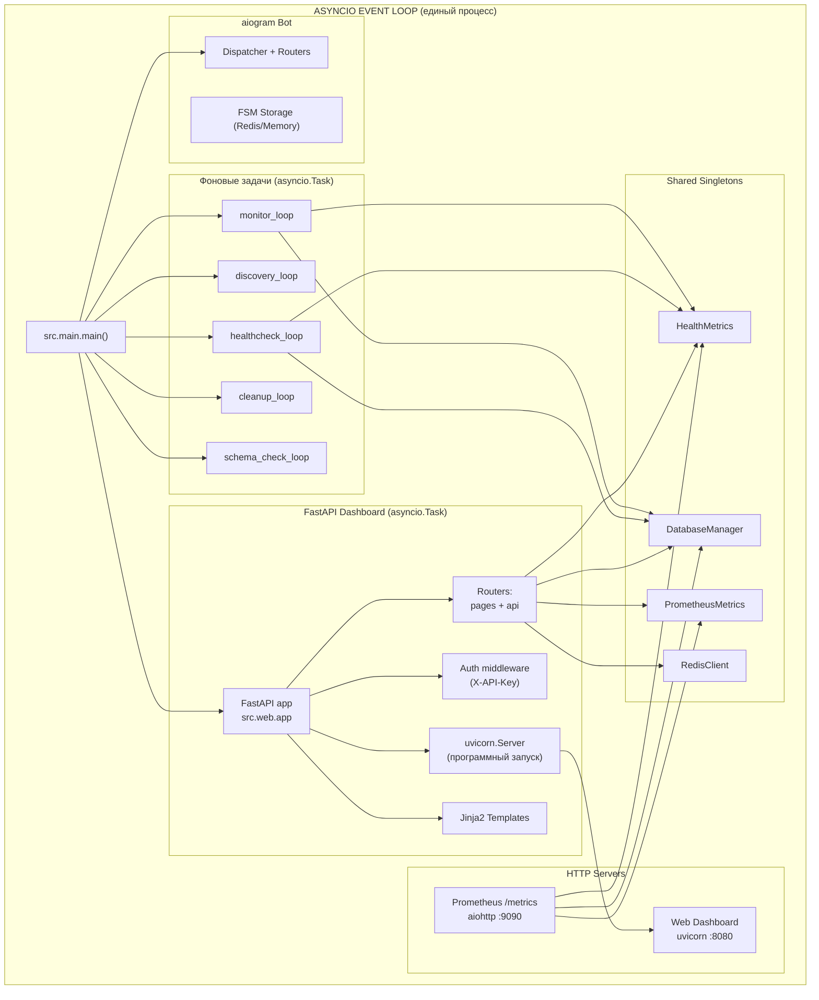
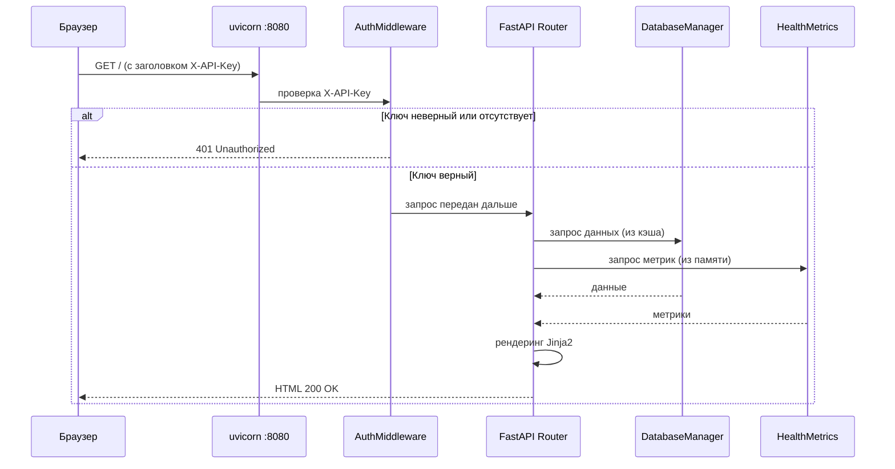

# Дизайн-документ: Веб-интерфейс мониторинга (F5)

> **Статус:** Проектирование
> **Версия:** 1.0.0
> **Дата:** 2026-05-19
> **Связанные задачи:** F5 в [`AGENT_TASKS.md`](../agents/AGENT_TASKS.md)

## 1. Архитектурная схема

### 1.1 Встраивание FastAPI в asyncio-процесс бота

FastAPI-приложение запускается как `asyncio.Task` в том же event loop, что и aiogram-бот.
Оно использует те же singleton-объекты (`DatabaseManager`, `HealthMetrics`, `PrometheusMetrics`, `RedisClient`)
без каких-либо отдельных процессов или IPC.



### 1.2 Поток запроса к дашборду



## 2. Структура пакета `src/web/`

```text
src/web/
├── __init__.py              # Пустой (пакет)
├── app.py                   # Создание FastAPI приложения, lifespan, middleware
├── auth.py                  # Проверка X-API-Key (зависимость FastAPI)
├── dependencies.py          # Общие зависимости (get_db, get_metrics, get_redis)
├── routers/
│   ├── __init__.py
│   ├── pages.py             # Роуты HTML-страниц (Jinja2)
│   └── api.py               # Роуты JSON API
├── templates/
│   ├── base.html.j2         # Базовый шаблон (шапка, меню, футер, стили)
│   ├── index.html.j2        # Главная страница — сводка
│   ├── users.html.j2        # Таблица пользователей
│   ├── user_detail.html.j2  # Детали пользователя (пациенты, врачи, статус)
│   ├── logs.html.j2         # Лог мониторинга с пагинацией
│   ├── clinics.html.j2      # Справочник клиник
│   └── api_status.html.j2   # Состояние внешнего API
└── static/
    └── dashboard.css        # Минимальные стили (серверный рендеринг, без JS-фреймворков)
```

### 2.1 Сводка зон ответственности

| Файл                                                       | Зона ответственности                                                                              |
| ---------------------------------------------------------- | ------------------------------------------------------------------------------------------------- |
| [`app.py`](#32-apppy--создание-fastapi-приложения)         | Создание `FastAPI()`, lifespan (старт/стоп uvicorn), регистрация middleware и роутеров            |
| [`auth.py`](#33-authpy--аутентификация)                    | `APIKeyHeader` + функция-зависимость `verify_api_key`                                             |
| [`dependencies.py`](#34-dependenciespy--общие-зависимости) | `get_db()`, `get_health_metrics()`, `get_prometheus_metrics()`, `get_redis()` — FastAPI `Depends` |
| [`routers/pages.py`](#35-routerspagespy--html-страницы)    | 6 HTML-эндпоинтов (`/`, `/users`, `/users/{uid}`, `/logs`, `/clinics`, `/api-status`)             |
| [`routers/api.py`](#36-routersapipy--json-api)             | 7 JSON-эндпоинтов (`/api/dashboard/*` + `/api/health`)                                            |
| [`templates/`](#4-дизайн-страниц)                          | Jinja2-шаблоны, расширяющие `base.html.j2`                                                        |
| [`static/dashboard.css`](#4-дизайн-страниц)                | Минимальный CSS: таблицы, статус-бейджи, навигация                                                |

## 3. Компоненты — детальное описание

### 3.1 Модуль `src/web/__init__.py`

Пустой файл, маркирующий пакет.

### 3.2 `app.py` — создание FastAPI приложения

**Функции:**

- `create_app()` — фабрика, создающая `FastAPI()` с:
  - `lifespan` для управления uvicorn.Server
  - Подключением статики (`StaticFiles`, `/static`)
  - Подключением `Jinja2Templates`
  - Регистрацией middleware (CORS опционально)
  - Регистрацией роутеров (`pages.router`, `api.router`)
- `run_dashboard(db, health_metrics, prometheus_metrics, redis_client)` — корутина, запускающая uvicorn.Server программно. Эта функция будет вызвана как `asyncio.Task` в [`main.py`](#71-изменения-в-mainpy).

**Ключевые аспекты:**

- `uvicorn.Server` запускается **программно**, а не через `uvicorn.run()` (несовместимо с уже запущенным event loop).
- `lifespan` обрабатывает `startup`/`shutdown` события.
- Передача singleton-объектов через `app.state`:

```python
app.state.db = db
app.state.health_metrics = health_metrics
app.state.prometheus_metrics = prometheus_metrics
app.state.redis_client = redis_client
```

### 3.3 `auth.py` — аутентификация

**Механизм:** `X-API-Key` заголовок.

```python
from fastapi import Security, HTTPException, status
from fastapi.security import APIKeyHeader

api_key_header = APIKeyHeader(name="X-API-Key", auto_error=False)

async def verify_api_key(api_key: str | None = Security(api_key_header)) -> str:
    if api_key is None:
        raise HTTPException(status_code=status.HTTP_401_UNAUTHORIZED, detail="API-ключ не предоставлен")
    if api_key != settings.WEB_DASHBOARD_API_KEY:
        raise HTTPException(status_code=status.HTTP_401_UNAUTHORIZED, detail="Неверный API-ключ")
    return api_key
```

Все роуты используют `Depends(verify_api_key)` как глобальную зависимость на уровне роутера:

```python
router = APIRouter(dependencies=[Depends(verify_api_key)])
```

### 3.4 `dependencies.py` — общие зависимости

```python
from fastapi import Request
from src.database.manager import DatabaseManager
from src.services.healthcheck import HealthMetrics
from src.services.metrics import PrometheusMetrics
from src.utils.redis import RedisClient

def get_db(request: Request) -> DatabaseManager:
    return request.app.state.db

def get_health_metrics(request: Request) -> HealthMetrics:
    return request.app.state.health_metrics

def get_prometheus_metrics(request: Request) -> PrometheusMetrics:
    return request.app.state.prometheus_metrics

def get_redis(request: Request) -> RedisClient:
    return request.app.state.redis_client
```

### 3.5 `routers/pages.py` — HTML-страницы

| Маршрут            | Шаблон                | Данные                                                                                                                                     |
| ------------------ | --------------------- | ------------------------------------------------------------------------------------------------------------------------------------------ |
| `GET /`            | `index.html.j2`       | `HealthMetrics` (uptime, api_status, task_status), `db.data` (users, patients, monitoring counts), `monitoring_log` (последние 10 алертов) |
| `GET /users`       | `users.html.j2`       | `db.data` — список всех UID с количеством пациентов и мониторингов                                                                         |
| `GET /users/{uid}` | `user_detail.html.j2` | `db.data[uid]` — пациенты, врачи, последние сообщения                                                                                      |
| `GET /logs`        | `logs.html.j2`        | `monitoring_log` — с пагинацией (`?offset=0&limit=50&uid=&status=`)                                                                        |
| `GET /clinics`     | `clinics.html.j2`     | `db.get_active_clinics()`, `db.get_clinic_doctors()` для подсчёта врачей                                                                   |
| `GET /api-status`  | `api_status.html.j2`  | `HealthMetrics` (детально), `PrometheusMetrics._schema_drift`, schema_check статус                                                         |

### 3.6 `routers/api.py` — JSON API

| Маршрут                          | Ответ                                                       |
| -------------------------------- | ----------------------------------------------------------- |
| `GET /api/dashboard/summary`     | `DashboardSummary`                                          |
| `GET /api/dashboard/users`       | `list[UserSummary]`                                         |
| `GET /api/dashboard/users/{uid}` | `UserDetail`                                                |
| `GET /api/dashboard/logs`        | `PaginatedLogs` (params: `?offset=0&limit=50&uid=&status=`) |
| `GET /api/dashboard/clinics`     | `list[ClinicSummary]`                                       |
| `GET /api/dashboard/health`      | `ApiHealthStatus`                                           |
| `GET /api/health`                | `HealthProbe` (liveness/readiness)                          |

## 4. Дизайн страниц

### 4.1 Базовый шаблон `base.html.j2`

```text
┌──────────────────────────────────────────────────────────────┐
│  [lenreg-ticket-bot Monitor]               Uptime: 2д 5ч 31м │
├──────────────────────────────────────────────────────────────┤
│  [Сводка] [Пользователи] [Логи] [Клиники] [API Status]       │
├──────────────────────────────────────────────────────────────┤
│                                                              │
│                             │
│                                                              │
├──────────────────────────────────────────────────────────────┤
│  lenreg-ticket-bot Monitor v1.0.0 | Prometheus: :9090 | Bot: alive│
└──────────────────────────────────────────────────────────────┘
```

Навигация — горизонтальная панель вкладок. Текущая страница выделена.
В футере — версия, ссылки на смежные сервисы.

**CSS-подход:** Минимальный, встроенный через `<style>` в `base.html.j2` плюс `dashboard.css`. Никаких внешних CSS-фреймворков. Используется системный шрифт (`system-ui, sans-serif`) и цветовая схема, близкая к терминальной (тёмный фон, зелёный/белый текст). Статус-бейджи: зелёный = OK, красный = ERROR, жёлтый = WARNING, серый = UNKNOWN.

### 4.2 Главная страница `/` — сводка

```text
┌──────────────────────────────────────────────────────────────┐
│  Сводка                                                       │
├────────────────────────────┬─────────────────────────────────┤
│  Статус бота               │  Фоновые задачи                  │
│  ─────────                 │  ────────────                    │
│  Uptime: 2д 5ч 31м        │  🔵 monitor_loop       ✅ alive  │
│  Пользователей: 42         │  🔵 discovery_tasks    ✅ 1      │
│  Пациентов: 87             │  🔵 healthcheck_loop   ✅ alive  │
│  Отслеж. врачей: 156       │  🔵 cleanup_loop       ✅ alive  │
│  Активных мониторингов: 89 │  🔵 schema_check_loop  ✅ alive  │
├────────────────────────────┼─────────────────────────────────┤
│  API zdrav.lenreg.ru       │  Последние алерты (10)          │
│  ────────────              │  ───────────────                 │
│  Статус: ✅ Доступен (42с) │  📅 12:34 — Иванов И.И.         │
│  Последняя проверка: 42с   │     Доктор: Петрова А.С.        │
│  Успешных: 12,345          │     Слоты: [NEW] 15.06.2025     │
│  Ошибок: 23                │     Статус: появился             │
│                            │  ...                             │
├────────────────────────────┴─────────────────────────────────┤
│  Ссылки:                                                     │
│  /metrics (Prometheus) | /docs (FastAPI Swagger)              │
└──────────────────────────────────────────────────────────────┘
```

### 4.3 Пользователи `/users` — таблица

```text
┌──────────────────────────────────────────────────────────────┐
│  Пользователи                              Всего: 42          │
├──────────┬───────────┬──────────────┬────────────────────────┤
│  User ID │ Пациентов │ Мониторингов │ Детали                 │
├──────────┼───────────┼──────────────┼────────────────────────┤
│  123456  │     3     │      12      │ [Показать]             │
│  789012  │     1     │       5      │ [Показать]             │
│  ...     │    ...    │     ...      │ [Показать]             │
└──────────┴───────────┴──────────────┴────────────────────────┘
```

**Примечание:** Telegram User ID — это обезличенный идентификатор. На странице `/users/{uid}`:

```text
┌──────────────────────────────────────────────────────────────┐
│  Пользователь 123456                                          │
├──────────────────────────────────────────────────────────────┤
│  Пациенты (3)                                                 │
│  ┌────────┬──────────────────┬────────────┬──────────────────┐│
│  │ p_id   │ ФИО              │ ДР         │ Клиники          ││
│  ├────────┼──────────────────┼────────────┼──────────────────┤│
│  │ 234... │ Иванов Иван И.   │ 01.01.1990 │ 272, 345         ││
│  └────────┴──────────────────┴────────────┴──────────────────┘│
│                                                               │
│  Отслеживаемые врачи (12)                                     │
│  ┌────────┬──────────────────┬───────────┬───────────────────┐│
│  │ p_id   │ Врач             │ Спец-ть   │ Клиника           ││
│  ├────────┼──────────────────┼───────────┼───────────────────┤│
│  │ 234... │ Петрова А.С.     │ Терапевт  │ Поликлиника №1    ││
│  └────────┴──────────────────┴───────────┴───────────────────┘│
└──────────────────────────────────────────────────────────────┘
```

### 4.4 Лог мониторинга `/logs`

```text
┌──────────────────────────────────────────────────────────────┐
│  Лог мониторинга                                             │
├──────────────────────────────────────────────────────────────┤
│  Фильтры: [UID: ______] [Статус: ▾ все] [Показать]           │
├──────┬──────────┬──────────┬──────────┬──────────┬───────────┤
│  UID │ Пациент  │ Врач     │ Дата     │ Статус   │ Время     │
├──────┼──────────┼──────────┼──────────┼──────────┼───────────┤
│ 123… │ Иванов…  │ Петрова… │ 15.06.25 │ появился │ 12:34:56  │
│ 123… │ Иванов…  │ Петрова… │ 14.06.25 │ исчез    │ 11:22:33  │
│ 789… │ Сидоров… │ Кузнец…  │ 20.06.25 │ уменьш.  │ 10:15:00  │
└──────┴──────────┴──────────┴──────────┴──────────┴───────────┘
← Предыдущая  Стр. 1/42  Следующая →
```

**Пагинация:** `?offset=0&limit=50` — смещение и лимит. Кнопки «Предыдущая»/«Следующая» — ссылки с вычисленными offset.

**Фильтрация:** `?uid=123456&status=появился`. Параметры передаются через query string.

### 4.5 Клиники `/clinics`

```text
┌──────────────────────────────────────────────────────────────┐
│  Клиники                                    Всего: 45         │
├──────────┬──────────────────────────┬──────┬──────┬───────────┤
│  ID      │ Название                 │ Тип  │ Город│ Врачей    │
├──────────┼──────────────────────────┼──────┼──────┼───────────┤
│  272     │ ГБУЗ ЛО "Всеволожская КМБ"│ adult│ Всев.│    34     │
│  345     │ ГБУЗ ЛО "Сертоловская ГБ" │ child│ Серт.│    12     │
│  ...     │ ...                      │ ...  │ ...  │    ...    │
└──────────┴──────────────────────────┴──────┴──────┴───────────┘
```

**Тип:** adult / child / all + цветовой бейдж.
**Статус discovery:** отображается, есть ли `discovery_patient_adult`/`discovery_patient_child`.

### 4.6 API Status `/api-status`

```text
┌──────────────────────────────────────────────────────────────┐
│  Состояние API zdrav.lenreg.ru                                │
├──────────────────────────────────────────────────────────────┤
│  Последняя проверка: 42с назад                                │
│  Статус: ✅ Доступен                                          │
│  Длительность: 0.34с                                          │
│                                                               │
│  Статистика:                                                  │
│  ┌─────────────────┬──────────┐                               │
│  │ Всего проверок  │ 12,345   │                               │
│  │ Успешных        │ 12,322   │                               │
│  │ Ошибок          │ 23       │                               │
│  │ Доступность     │ 99.81%   │                               │
│  └─────────────────┴──────────┘                               │
│                                                               │
│  Схемы API (schema_watcher):                                  │
│  ┌──────────────────┬──────────────────────────────────────┐  │
│  │ Endpoint         │ Статус                               │  │
│  ├──────────────────┼──────────────────────────────────────┤  │
│  │ check_patient    │ ✅ Совпадает (проверено 5м назад)    │  │
│  │ speciality_list  │ ✅ Совпадает (проверено 5м назад)    │  │
│  │ doctor_list      │ ⚠️ Расхождение! (+2 новых поля)      │  │
│  │ appointment_list │ ✅ Совпадает (проверено 5м назад)    │  │
│  │ clinic_list      │ ✅ Совпадает (проверено 5м назад)    │  │
│  └──────────────────┴──────────────────────────────────────┘  │
└──────────────────────────────────────────────────────────────┘
```

## 5. Схема БД-запросов

### 5.1 Существующие методы (уже есть в `Database` / `DatabaseManager`)

| Метод                                             | Используется на странице      |
| ------------------------------------------------- | ----------------------------- |
| `db.data` (свойство)                              | `/`, `/users`, `/users/{uid}` |
| `db.get_active_clinics()`                         | `/clinics`                    |
| `db.get_clinic_doctors(clinic_id)`                | `/clinics` (подсчёт врачей)   |
| `db.get_user_monitoring_logs(uid, limit, offset)` | `/logs`                       |
| `db.get_user_monitoring_logs_count(uid)`          | `/logs` (пагинация)           |
| `db.get_all_clinic_names()`                       | `/clinics` (опционально)      |

### 5.2 Новые методы, необходимые для дашборда

Все новые методы добавляются в [`Database`](src/database/database.py) с делегированием в [`DatabaseManager`](src/database/manager.py).

#### `get_all_monitoring_logs(limit, offset, uid=None, status=None) -> list[dict]`

Аналог `get_user_monitoring_logs`, но без обязательной фильтрации по UID.
Поддерживает опциональные фильтры: `uid`, `status`.

```sql
SELECT id, uid, p_id, d_id, doctor_name, patient_name,
       specialty, clinic_name, slot_date, status, ts
FROM monitoring_log
WHERE (uid = ? OR ? IS NULL)
  AND (status = ? OR ? IS NULL)
ORDER BY ts DESC
LIMIT ? OFFSET ?
```

#### `get_all_monitoring_logs_count(uid=None, status=None) -> int`

Возвращает общее количество записей (с фильтрами) для пагинации.

```sql
SELECT COUNT(*) as cnt FROM monitoring_log
WHERE (uid = ? OR ? IS NULL)
  AND (status = ? OR ? IS NULL)
```

#### `get_clinic_doctor_count(clinic_id: str) -> int`

Возвращает количество врачей в клинике.

```sql
SELECT COUNT(*) as cnt FROM doctors WHERE clinic_id = ?
```

#### `get_total_stats() -> dict`

Агрегирует базовую статистику для главной страницы (одним запросом):

```sql
SELECT
  (SELECT COUNT(DISTINCT uid) FROM (
    SELECT uid FROM user_patients UNION SELECT uid FROM user_monitoring
  )) as total_users,
  (SELECT COUNT(*) FROM user_patients) as total_patients,
  (SELECT COUNT(*) FROM user_monitoring) as total_monitored_doctors
```

### 5.3 Доступ к `health_metrics` (in-memory, не БД)

Все данные из [`HealthMetrics`](src/services/healthcheck.py:24) доступны через общий объект в памяти:

| Поле                     | Тип     | Описание                        |
| ------------------------ | ------- | ------------------------------- |
| `uptime_str()`           | `str`   | Аптайм в человекочитаемом виде  |
| `uptime_seconds()`       | `float` | Аптайм в секундах               |
| `last_api_ok`            | `bool`  | Доступен ли API                 |
| `last_api_check_time`    | `float` | Timestamp последней проверки    |
| `last_check_duration`    | `float` | Длительность последней проверки |
| `api_checks_total`       | `int`   | Всего проверок                  |
| `api_errors_total`       | `int`   | Всего ошибок                    |
| `monitor_loop_alive`     | `bool`  | Жив ли monitor_loop             |
| `healthcheck_loop_alive` | `bool`  | Жив ли healthcheck_loop         |
| `discovery_tasks_alive`  | `int`   | Количество discovery-задач      |
| `last_error_message`     | `str`   | Последняя ошибка                |

**Важно:** Доступ к `HealthMetrics` защищён `_metrics_lock` в [`healthcheck.py`](src/services/healthcheck.py:98). Код дашборда должен использовать `async with _metrics_lock:` при чтении метрик.

## 6. API-контракты (JSON-схемы ответов)

### 6.1 `GET /api/health` — Liveness/Readiness probe

```json
{
  "status": "ok",
  "uptime_seconds": 187531.4,
  "bot_alive": true,
  "api_accessible": true,
  "redis_available": true,
  "db_connected": true
}
```

### 6.2 `GET /api/dashboard/summary`

```json
{
  "uptime": "2д 5ч 31м",
  "uptime_seconds": 187531.4,
  "total_users": 42,
  "total_patients": 87,
  "total_monitored_doctors": 156,
  "active_monitorings": 89,
  "api_status": {
    "accessible": true,
    "last_check_seconds_ago": 42,
    "total_checks": 12345,
    "total_errors": 23,
    "availability_pct": 99.81
  },
  "background_tasks": {
    "monitor_loop": "alive",
    "discovery_tasks": 1,
    "healthcheck_loop": "alive",
    "cleanup_loop": "alive",
    "schema_check_loop": "alive"
  },
  "recent_alerts": [
    {
      "id": 1,
      "uid": "123456",
      "patient_name": "Иванов И.И.",
      "doctor_name": "Петрова А.С.",
      "specialty": "Терапевт",
      "clinic_name": "Поликлиника №1",
      "slot_date": "15.06.2025",
      "status": "появился",
      "ts": 1716123456.789
    }
  ]
}
```

### 6.3 `GET /api/dashboard/users`

```json
{
  "users": [
    {
      "uid": "123456",
      "patient_count": 3,
      "monitoring_count": 12,
      "last_activity_ts": 1716123456.789
    }
  ],
  "total": 42
}
```

### 6.4 `GET /api/dashboard/users/{uid}`

```json
{
  "uid": "123456",
  "patients": {
    "2343192": {
      "fio": "Иванов Иван Иванович",
      "bday": "1990-01-01",
      "alias": "Ваня",
      "confirmed_clinics": [272, 345]
    }
  },
  "monitoring": {
    "2343192": {
      "56789": {
        "name": "Петрова Анна Сергеевна",
        "clinic_id": "272",
        "specialty": "Терапевт"
      }
    }
  },
  "last_messages": {
    "2343192_56789": {
      "msg_id": 12345,
      "ts": 1716123456.789
    }
  }
}
```

### 6.5 `GET /api/dashboard/logs`

```json
{
  "logs": [
    {
      "id": 1,
      "uid": "123456",
      "p_id": "2343192",
      "d_id": "56789",
      "doctor_name": "Петрова А.С.",
      "patient_name": "Иванов И.И.",
      "specialty": "Терапевт",
      "clinic_name": "Поликлиника №1",
      "slot_date": "15.06.2025",
      "status": "появился",
      "ts": 1716123456.789
    }
  ],
  "total": 1250,
  "offset": 0,
  "limit": 50
}
```

### 6.6 `GET /api/dashboard/clinics`

```json
{
  "clinics": [
    {
      "clinic_id": "272",
      "name": "ГБУЗ ЛО \"Всеволожская КМБ\"",
      "type": "adult",
      "city": "Всеволожск",
      "is_active": true,
      "doctor_count": 34,
      "has_discovery_adult": true,
      "has_discovery_child": false
    }
  ],
  "total": 45
}
```

### 6.7 `GET /api/dashboard/health`

```json
{
  "api_accessible": true,
  "last_check_seconds_ago": 42,
  "last_check_duration": 0.34,
  "total_checks": 12345,
  "total_errors": 23,
  "availability_pct": 99.81,
  "schema_status": {
    "check_patient": "ok",
    "speciality_list": "ok",
    "doctor_list": "drift",
    "appointment_list": "ok",
    "clinic_list": "ok"
  },
  "schema_drift_details": {
    "doctor_list": [
      "root.properties.Phone: новое поле (тип: string)",
      "root.properties.Rating: новое поле (тип: number)"
    ]
  }
}
```

**Примечание по schema_drift:** Текущая реализация [`schema_watcher`](src/services/schema_watcher.py) логирует расхождения, но не хранит их. Для страницы `/api-status` и JSON API потребуется добавить хранение последнего результата проверки в памяти (in-memory dict в `schema_watcher` или в `PrometheusMetrics`).

## 7. Интеграция с существующей архитектурой

### 7.1 Изменения в `main.py`

Добавить импорт и запуск веб-дашборда:

```python
# Новый импорт
from src.web.app import run_dashboard

# В main(), после _start_metrics_server():
if settings.WEB_DASHBOARD_ENABLED:
    dashboard_task = asyncio.create_task(
        run_dashboard(db, metrics, prometheus_metrics, redis_client)
    )
    background_tasks.append(dashboard_task)
    logger.info(f"Веб-дашборд запущен на порту {settings.WEB_DASHBOARD_PORT}")
else:
    logger.info("Веб-дашборд отключен (WEB_DASHBOARD_ENABLED=False)")
```

**Graceful shutdown** не требует изменений — uvicorn.Server корректно останавливается при `task.cancel()`.

### 7.2 Изменения в `config.py`

Добавить новые ключи в класс `Settings`:

```python
# === Web Dashboard (F5) ===
WEB_DASHBOARD_ENABLED: bool = True
WEB_DASHBOARD_PORT: int = 8080
WEB_DASHBOARD_API_KEY: str = ""  # Чувствительный — плейсхолдер в .env.example
```

Добавить ключи в `CONFIG_KEY_*` и `load_config_from_db()`:

```python
CONFIG_KEY_WEB_DASHBOARD_ENABLED = "web_dashboard_enabled"
CONFIG_KEY_WEB_DASHBOARD_PORT = "web_dashboard_port"
```

**Примечание:** `WEB_DASHBOARD_API_KEY` **не** синхронизируется в БД (секрет, только `.env`).

### 7.3 Изменения в `.env.example`

Добавить блок:

```ini
# === Web Dashboard (F5) ===
# Включить веб-дашборд (True/False, можно переопределить в БД)
WEB_DASHBOARD_ENABLED=True
# Порт для веб-дашборда (можно переопределить в БД)
WEB_DASHBOARD_PORT=8080
# API-ключ для доступа к дашборду — SECRET
WEB_DASHBOARD_API_KEY=your_dashboard_api_key_here
```

### 7.4 Новые зависимости в `pyproject.toml`

```toml
dependencies = [
    # ... существующие ...
    # === Web Dashboard (F5) ===
    "fastapi>=0.115,<1.0",
    "uvicorn[standard]>=0.30,<1.0",
    "jinja2>=3.1,<4.0",
]
```

**Проверка:** `jinja2` уже является транзитивной зависимостью через `fastapi`, но указывается явно для прямоты.

### 7.5 Обновление `ARCHITECTURE.md`

После реализации необходимо:

1. Добавить `src/web/` в дерево директорий.
2. Добавить `src/web/` в таблицу зон ответственности:

| Пакет      | Зона ответственности                                                                                                        |
| ---------- | --------------------------------------------------------------------------------------------------------------------------- |
| `src/web/` | Веб-дашборд (FastAPI): HTML-страницы + JSON API для мониторинга статуса бота, пользователей, логов и API health. Read-only. |

1. Обновить граф зависимостей (Mermaid) — добавить блок `WEB` с зависимостями от `DB_MGR`, `SVC_HC`, `SVC_METRICS`, `UTIL_REDIS`, `CFG`.

### 7.6 Обновление `openapi.yaml`

Добавить новый тег и пути для веб-дашборда:

```yaml
tags:
  - name: 'Веб-дашборд (FastAPI)'
    description: 'HTML-страницы и JSON API для мониторинга (read-only, порт 8080)'

paths:
  /:
    get:
      tags: ['Веб-дашборд (FastAPI)']
      summary: 'Главная страница дашборда — сводка'
      # ...

  /api/dashboard/summary:
    get:
      tags: ['Веб-дашборд (FastAPI)']
      summary: 'JSON-сводка состояния системы'
      # ...
```

## 8. План тестирования

### 8.1 Модульные тесты

| Файл теста                         | Что тестируется                                                                                               |
| ---------------------------------- | ------------------------------------------------------------------------------------------------------------- |
| `tests/test_web_auth.py`           | `verify_api_key`: валидный ключ, невалидный, отсутствующий                                                    |
| `tests/test_web_dependencies.py`   | `get_db()`, `get_health_metrics()`, `get_prometheus_metrics()`, `get_redis()` — возвращают корректные объекты |
| `tests/test_web_api.py`            | Все JSON-эндпоинты возвращают ожидаемые структуры и HTTP-статусы                                              |
| `tests/test_web_pages.py`          | Все HTML-эндпоинты возвращают 200 OK и `text/html` content-type                                               |
| `tests/test_database_dashboard.py` | Новые методы БД: `get_all_monitoring_logs`, `get_clinic_doctor_count`, `get_total_stats`                      |

### 8.2 Интеграционные тесты

| Сценарий            | Описание                                                         |
| ------------------- | ---------------------------------------------------------------- |
| Дашборд с пустой БД | Все страницы рендерятся без ошибок, показывают "нет данных"      |
| Дашборд с данными   | Страницы корректно отображают пользователей, пациентов, логи     |
| Пагинация логов     | Проверка offset/limit: первая страница, последняя, за пределами  |
| Фильтрация логов    | Фильтр по UID, по статусу, комбинированный                       |
| Аутентификация      | 401 при отсутствии ключа, 401 при неверном ключе, 200 при верном |

### 8.3 Тестовое окружение

- `tests/test_data/` — временная SQLite БД (существующий паттерн).
- `TestClient` из FastAPI (`fastapi.testclient.TestClient`) — асинхронный тестовый клиент.
- `httpx.ASGITransport` — для тестирования без реального HTTP-сервера.
- Мок `HealthMetrics` с предзаполненными значениями.
- Фикстура `test_app` — создаёт FastAPI-приложение с тестовыми зависимостями.

### 8.4 Не покрывается тестами

- Реальный HTTP-сервер uvicorn (тестируется через `TestClient` с ASGI transport).
- Визуальное отображение HTML (тестируется структурно — наличие ключевых элементов).
- Интеграция с реальным aiogram-ботом (тестируется вручную при запуске).

## 9. Конфигурационные ключи — сводка

| Ключ `.env`             | Тип    | По умолчанию | В БД                         | Чувствительный |
| ----------------------- | ------ | ------------ | ---------------------------- | -------------- |
| `WEB_DASHBOARD_ENABLED` | `bool` | `True`       | Да (`web_dashboard_enabled`) | Нет            |
| `WEB_DASHBOARD_PORT`    | `int`  | `8080`       | Да (`web_dashboard_port`)    | Нет            |
| `WEB_DASHBOARD_API_KEY` | `str`  | `""`         | Нет                          | **Да**         |

**Логика:** Если `WEB_DASHBOARD_API_KEY` пуст — аутентификация отключена (дашборд открыт). Это допустимо для dev-окружения. На production ключ обязателен.

## 10. Ограничения и допущения

1. **Только чтение:** Дашборд не модифицирует данные — все эндпоинты `GET`.
2. **Один процесс:** uvicorn работает в том же event loop. Это означает, что рендеринг шаблонов выполняется синхронно (Jinja2 — синхронный движок). Для тяжёлых страниц (тысячи пользователей) это может блокировать event loop. Решение: `loop.run_in_executor()` для рендеринга, если понадобится.
3. **Нет WebSocket:** Только статические страницы и JSON API. Автообновление — через `<meta http-equiv="refresh">` или ручное обновление.
4. **Нет кэширования HTTP:** Все ответы генерируются заново при каждом запросе. `DatabaseManager.data` уже в памяти, так что это быстро.
5. **Нет CORS:** Дашборд — internal tool, не предназначен для доступа из браузерных SPA с других доменов.

## 11. Сравнение с `/status` командой бота

| Характеристика | `/status` (Telegram)      | Веб-дашборд         |
| -------------- | ------------------------- | ------------------- |
| Доступ         | Только админы (ADMIN_IDS) | Любой с API-ключом  |
| Формат         | Текстовый отчёт           | HTML + JSON API     |
| История        | Только текущий снапшот    | Логи с пагинацией   |
| Пользователи   | Общая статистика          | Детально по каждому |
| Клиники        | Нет                       | Полный справочник   |
| Схемы API      | Нет                       | Статус дрифта схем  |
| Prometheus     | Нет                       | Ссылка на :9090     |
| Обновление     | По команде                | Через браузер       |
